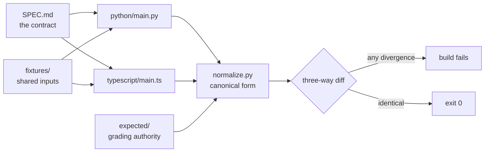

# Harness Engineering

**A harness is the execution system around an AI coding agent: its
instructions, tools, environment, state, and feedback. This module is about
building one.**

You already build agents. The gap this module fills is what happens after
the model is good enough: durable state between sessions, an executable
definition of done, instructions an agent can navigate, and feedback it can
act on. Thirteen lectures, each defending one claim with a demo you run;
twenty-five exercises you complete until `verify.sh` exits 0; five projects
that compose the mechanisms into a working application.

Everything runs **offline**, in **two complete tracks** (Python and
TypeScript) against one shared specification. Pick a track; you never need
the other.

**Attending the four-hour session?** Read the
[session plan](docs/session-plan.md) first. It says what the four hours
cover, what they deliberately do not, and what to do afterwards.

**Just want to run something?** [Quick start](#quick-start), then
[lecture 01](lectures/lecture-01-why-capable-agents-still-fail/).

---

## Contents

- [Who this is for](#who-this-is-for)
- [The four-hour session](#the-four-hour-session)
- [Quick start](#quick-start)
- [Setup](#setup)
- [Lectures](#lectures)
- [Projects](#projects)
- [How a unit is built](#how-a-unit-is-built)
- [Architecture](#architecture)
- [Usage](#usage)
- [Command reference](#command-reference)
- [Demo](#demo)
- [Testing and validation](#testing-and-validation)
- [Design decisions](#design-decisions)
- [Repository structure](#repository-structure)
- [Troubleshooting](#troubleshooting)
- [Contributing, security, support](#contributing-security-support)
- [Acknowledgments and license](#acknowledgments-and-license)

## Who this is for

Experienced software engineers already fluent in agentic AI: LangChain,
LangGraph, MCP, A2A, Google ADK, multi-agent systems, LangSmith. Nothing
here introduces agents, orchestration, or tool calling, and nothing defines
terms you use daily.

The material assumes you have watched a capable model fail at multi-step
engineering work and suspected the model was not the problem. The primary
sources this module builds on:

- [OpenAI: Harness engineering: leveraging Codex in an agent-first world](https://openai.com/index/harness-engineering/)
- [Anthropic: Effective harnesses for long-running agents](https://www.anthropic.com/engineering/effective-harnesses-for-long-running-agents)
- [Anthropic: Harness design for long-running application development](https://www.anthropic.com/engineering/harness-design-long-running-apps)

Every figure in this module is generated from a committed fixture, cited to
one of those sources, or labeled a design heuristic. There are no invented
benchmarks, and a lint rule enforces it.

## The four-hour session

Four hours cannot cover thirteen lectures and five projects, so the
[session plan](docs/session-plan.md) does not try. It spends the time where
harness engineering adds something an agent builder does not already have,
and states the cut plainly.

| Block | Minutes | Mode |
| --- | --- | --- |
| Why the harness, not the model | 15 | Live |
| The repository as the system of record | 20 | Live |
| Starting from a known state | 10 | Demo |
| Scope the workspace enforces | 30 | Live |
| Verification: the claim and the check | 40 | Live |
| What the harness records | 20 | Live |
| What a session owes the next one | 20 | Live |
| Loops and graphs, briefly | 15 | Demo |
| The controlled experiment (project 01) | 20 | Live |
| Who checks the work (project 05) | 15 | Demo |
| Questions and buffer | 35 | |

Not covered in the room: all twenty-five exercises, projects 02 through 04,
and lectures 01 and 03 as reading. Those are the self-study path, and the
[session plan](docs/session-plan.md) gives the order.

## Quick start

Clone with `git clone https://github.com/ANI-IN/harness-engineering-session`
and `cd harness-engineering-session`, then:

```sh
make setup TRACK=python   # or TRACK=typescript, or plain `make setup` for both
make doctor TRACK=python  # confirm exactly what your track requires
```

Then run `make status`: every gate, with counts, green on a fresh clone.
Then start with [lecture 01](lectures/lecture-01-why-capable-agents-still-fail/),
or read [choosing your track](docs/choosing-your-track.md) first.

## Setup

**Both tracks need Python 3.12 and [uv](https://docs.astral.sh/uv/)**, even
if you write TypeScript: the verification machinery (conformance runner,
linters, gates) is Python tooling. The TypeScript track additionally needs
Node.js 20 LTS and pnpm.

### Python track

```sh
make setup TRACK=python
make doctor TRACK=python
```

`uv sync` installs the pinned interpreter and dependencies. Nothing else is
required; `make doctor TRACK=python` will not ask for Node.

### TypeScript track

```sh
corepack enable pnpm      # corepack ships with Node 20 but starts disabled
make setup TRACK=typescript
make doctor TRACK=typescript
```

Node 20 is pinned by `.nvmrc`. The Makefile resolves the pinned Node
absolutely, so a newer Node elsewhere on your PATH cannot shadow it.

### Both

```sh
make setup                # equivalent to TRACK=both
make doctor
```

## Lectures

Each lecture defends one claim and proves it with a demo you run. The
`In the session` column is from the [session plan](docs/session-plan.md).

| # | Lecture | The claim | In the session |
| --- | --- | --- | --- |
| 01 | [Why capable agents still fail](lectures/lecture-01-why-capable-agents-still-fail/) | Failures are harness defects, not capability defects | read |
| 02 | [What a harness actually is](lectures/lecture-02-what-a-harness-actually-is/) | A harness is five subsystems working as one system | 15 min live |
| 03 | [Why the repository must become the system of record](lectures/lecture-03-why-the-repository-must-become-the-system-of-record/) | What is not in the repository does not exist for the agent | read |
| 04 | [Why one giant instruction file fails](lectures/lecture-04-why-one-giant-instruction-file-fails/) | Instructions must be a map, not a manual | 20 min live |
| 05 | [Why initialization needs its own phase](lectures/lecture-05-why-initialization-needs-its-own-phase/) | Sessions that start by improvising end by guessing | 10 min demo |
| 06 | [Why agents overreach and under-finish](lectures/lecture-06-why-agents-overreach-and-under-finish/) | Overreach and under-finish are one budget seen from two sides | 30 min live |
| 07 | [Why feature lists are harness primitives](lectures/lecture-07-why-feature-lists-are-harness-primitives/) | A feature list is a data structure the harness executes against | 30 min live |
| 08 | [Why agents declare victory too early](lectures/lecture-08-why-agents-declare-victory-too-early/) | A completion claim stands until something re-executes the checks | 40 min live |
| 09 | [Why end-to-end testing changes results](lectures/lecture-09-why-end-to-end-testing-changes-results/) | Unit checks can all pass while the assembled path fails at a seam | 40 min live |
| 10 | [Why observability belongs inside the harness](lectures/lecture-10-why-observability-belongs-inside-the-harness/) | A session can only resume work whose history something recorded | 20 min live |
| 11 | [Why every session must leave a clean state](lectures/lecture-11-why-every-session-must-leave-a-clean-state/) | What a session leaves behind decides what the next one can do | 20 min live |
| 12 | [Loop engineering](lectures/lecture-12-loop-engineering/) | A loop is only as good as the signal its stopping condition reads | 15 min demo |
| 13 | [Graph engineering](lectures/lecture-13-graph-engineering/) | Routing and rollback are declared structure, not hoped-for control flow | 15 min demo |

## Projects

Each project's starter is the previous project's solution, so the
application accretes across five versions rather than restarting.

| # | Project | You build | Lectures |
| --- | --- | --- | --- |
| 01 | [Baseline vs minimal harness](projects/project-01-baseline-vs-minimal-harness/) | A controlled experiment: the same task with and without a harness | 01, 02 |
| 02 | [Agent-readable workspace](projects/project-02-agent-readable-workspace/) | A repository an agent can navigate and resume | 03, 04 |
| 03 | [Multi-session continuity](projects/project-03-multi-session-continuity/) | State files and an init script that survive session boundaries | 05, 11 |
| 04 | [Runtime feedback and scope control](projects/project-04-runtime-feedback-and-scope-control/) | Structured logs, corrupt-state recovery, an executable architecture guard, WIP=1 | 06, 07 |
| 05 | [Self-verification and role separation](projects/project-05-self-verification-and-role-separation/) | Maker, checker and planner roles graded by executable predicates | 08, 09 |

## How a unit is built

Every runnable unit (a lecture demo, an exercise, a project) has one shape:

```text
<unit>/
  SPEC.md              the contract both tracks implement
  cases.json           conformance cases, run against both tracks
  fixtures/            shared inputs
  expected/            shared expected outputs, the grading authority
  python/              Python implementation
  typescript/          TypeScript implementation
  verify.sh            --stack=python|typescript|both
```

Exercises replace the implementation directories with `starter/` and
`solution/`, each in both tracks. [docs/conventions.md](docs/conventions.md)
is the standard every folder follows, and it is machine-enforced.

## Architecture

One specification, two implementations, one grading authority:



The conformance runner diffs three ways: Python against `expected/`,
TypeScript against `expected/`, and Python against TypeScript. A divergence
the normalizer cannot absorb is a specification bug in the unit, never a
runner setting. That is the same discipline the module teaches: the check
is executable and its verdict is an exit code.

## Usage

Work a lecture, then its exercises, then the project that composes them.

Read the lecture, then run its demo:

```sh
uv run python lectures/lecture-02-what-a-harness-actually-is/code/python/main.py \
  lectures/lecture-02-what-a-harness-actually-is/code/fixtures/workspace
```

Do the exercise: edit `starter/<your track>/`, then run its verifier. It
exits 1 until you have finished, which is the point of a starter:

<!-- fence-exit: 1 -->
```sh
bash lectures/lecture-02-what-a-harness-actually-is/exercises/exercise-01-subsystem-auditor/verify.sh --stack=python
```

Compare against the committed solution when you are done:

```sh
bash lectures/lecture-02-what-a-harness-actually-is/exercises/exercise-01-subsystem-auditor/verify.sh --stack=python --target=solution
```

Every lecture and project README carries its own runnable commands for both
tracks, and a gate executes those commands literally, so a command printed
in this repository is a command that works.

## Command reference

| Command | What it does |
| --- | --- |
| `make help` | List every target |
| `make setup TRACK=…` | Install the toolchain for `python`, `typescript`, or `both` |
| `make doctor TRACK=…` | Check installed versions against the pins |
| `make status` | Every gate, with counts against the floors. The commit gate |
| `make verify` | Every unit's `verify.sh` (both stacks) plus all test suites |
| `make conformance` | Three-way diff over every unit |
| `make check-fresh` | Verify every unit from tracked content only |
| `make lint` | ruff, eslint, tsc, markdownlint, shellcheck, prose rules |
| `make lint-links` | Every relative link and anchor resolves |
| `make lint-links-external` | Also fetch external URLs (needs network) |
| `make lint-mermaid` | Every diagram parses |
| `make lint-structure` | Unit completeness and README section order |
| `make lint-shared-helpers` | Duplicated lecture helpers stay identical or declare why not |
| `make quick U=<unit>` | Inner loop for one unit. Not the commit gate |
| `make resume` | Print the session handoff, HEAD, and tree state |

Unit-level:

```sh
./<unit>/verify.sh --stack=python|typescript|both
./<exercise>/verify.sh --stack=both --target=starter|solution|ci
```

## Demo

Each lecture's demo lives in `code/` and runs from the repository root. The
lecture README shows both tracks with real output; the same commands are
executed by `make verify`, so what is printed is what runs. For example,
lecture 09's demo runs the same session under two definitions of done, and
the exit code is the verdict:

Under a definition of done that admits only unit checks, every component
passes its own case and the session declares done:

```sh
L=lectures/lecture-09-why-end-to-end-testing-changes-results
uv run python $L/code/python/main.py session $L/code/fixtures/workspaces/workspace-seam-gap \
  $L/code/fixtures/definitions/unit-only.json
```

The same session, the same workspace, one more kind of check. The record
built by one component reaches the next component that will not accept it,
and the run is blocked at the seam (exit 1):

<!-- fence-exit: 1 -->
```sh
L=lectures/lecture-09-why-end-to-end-testing-changes-results
uv run python $L/code/python/main.py session $L/code/fixtures/workspaces/workspace-seam-gap \
  $L/code/fixtures/definitions/through-e2e.json
```

## Testing and validation

This module practices what it teaches: every claim of working is backed by
an executable check.

```sh
make status            # the whole gate set, the one command that matters
```

What that runs, and why each exists:

- **conformance**: the two tracks must produce identical observable output
  after normalization. Divergence is a failing test, not a cosmetic
  difference.
- **verify**: every unit's own `verify.sh`, plus every test suite, plus the
  four acceptance runs for each exercise (starter fails for its recorded
  reason, solution passes, in both tracks).
- **check-fresh**: exports `HEAD` and runs conformance inside the export, so
  a fixture that exists on disk but is not committed fails here rather than
  in someone's clone.
- **lint-structure**: unit completeness, README section order, and the
  genuine-partial standard for exercise starters.
- **lint-links** and **lint-mermaid**: every relative link, anchor, and
  diagram.
- **lint-prose**: punctuation, banned roadmap language, and module
  terminology.

CI runs the full set on every push (Python 3.12, Node 20).

## Design decisions

The choices most likely to surprise a reader, and why:

- **One root toolchain, no per-unit manifests.** With about forty runnable
  units, per-unit manifests mean eighty dependency files that must stay in
  lockstep. Version pins live in one place and unit directories stay pure
  source.
- **Standard library only, offline, deterministic.** No network after setup,
  no API keys, no wall clock, no randomness. Where a model would sit, a
  deterministic stand-in sits instead, and every unit names that plug point.
- **`expected/` is the grading authority.** One set of expected outputs
  grades both tracks, so there is no duplicated test logic and no way for
  one track to drift into its own truth.
- **Lecture demos are behavioral.** A demo shows the claimed failure
  happening, with the outcome in the exit code. A metric may support a
  demo; it cannot be one.
- **Helpers are duplicated across lecture demos on purpose**, so each demo
  is one file you can read end to end and copy out, and a lint holds the
  copies identical or makes the difference declare itself.

## Repository structure

```text
docs/           conventions, glossary, curriculum map, track chooser, session plan
lectures/       lecture-NN-<slug>/ - README, demo (code/), exercises/
projects/       project-NN-<slug>/ - README, SPEC, fixtures/, expected/, harness/, starter/, solution/, tests
library/        copy-ready harness templates, single-sourced
tools/          conformance runner, gates, linters
```

- [docs/conventions.md](docs/conventions.md): the standard every folder
  follows, and what the gates check.
- [docs/glossary.md](docs/glossary.md#core-model): every term, defined once.
- [docs/curriculum-map.md](docs/curriculum-map.md): how the units connect.
- [docs/choosing-your-track.md](docs/choosing-your-track.md): Python or
  TypeScript, what differs, what is shared.

## Troubleshooting

- **`make doctor` reports a pin mismatch.** Install the pinned versions.
  Python 3.12 comes from `uv sync`; Node 20 from your version manager
  (`.nvmrc` is present); pnpm with `corepack enable pnpm`.
- **pnpm not found after installing Node.** corepack ships with Node but
  starts disabled: `corepack enable pnpm`, once.
- **An exercise's `verify.sh` fails and you have not edited anything.** That
  is expected. A starter is meant to fail for one recorded reason; run it
  with `--target=solution` to see the passing implementation.
- **A demo or project `verify.sh` fails on a fresh clone.** That is a bug
  here, not in your setup. Please open an issue with the output.
- **`make status` is slow.** It runs every gate, including a fresh-checkout
  export. Use `make quick U=<unit>` while working, and `make status` before
  committing.

## Contributing, security, support

- [CONTRIBUTING.md](CONTRIBUTING.md): how changes are made and verified.
- [CODE_OF_CONDUCT.md](CODE_OF_CONDUCT.md): expected behavior here.
- [SECURITY.md](SECURITY.md): reporting security issues.
- Questions and bug reports:
  [GitHub issues](https://github.com/ANI-IN/harness-engineering-session/issues).

### Reading the history

The commit history is kept whole rather than squashed, because several
commits are the evidence for rules this module now enforces. Worth reading:

- [`f27d6d5`](https://github.com/ANI-IN/harness-engineering-session/commit/f27d6d5)
  caught a `.gitignore` rule that had silently withheld four fixtures from
  version control: every gate stayed green because gates read the working
  tree, and only a fresh checkout failed. `make check-fresh` exists because
  of it.
- [`76cf6bd`](https://github.com/ANI-IN/harness-engineering-session/commit/76cf6bd)
  caught a one-ulp divergence between Python's compensated `sum()` and
  JavaScript's naive `reduce`, which is why the specification now pins
  plain left-to-right accumulation.
- [`d755127`](https://github.com/ANI-IN/harness-engineering-session/commit/d755127)
  caught a race in the gate that executes README commands: one fence died
  because a concurrent `pnpm install` removed the binary it was launching,
  while sixty-one fences of the identical form passed in the same run.

Some intermediate commits do not pass their own gates. That is deliberate
and it is the point: the tip is the only commit guaranteed green, and the
failures on the way there are why the gates exist.

## Acknowledgments and license

Modeled on the public reference course
[walkinglabs/learn-harness-engineering](https://github.com/walkinglabs/learn-harness-engineering):
the same subject and unit structure, with all content written fresh, every
exercise made verifiable, and full dual-track parity. Licensed under the
[MIT License](LICENSE).
