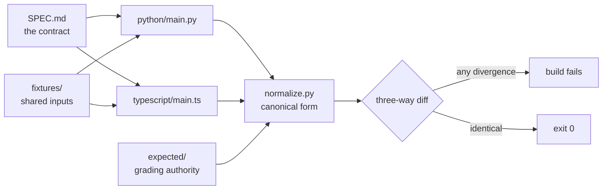
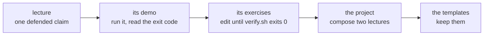

# Harness Engineering

**Build the execution system around a coding agent, not a better prompt for it.**

[](https://github.com/ANI-IN/harness-engineering-session/actions/workflows/ci.yml)

Python 3.12 with uv · Node 20 with pnpm · runs offline · two complete tracks · [MIT](LICENSE)

You hand a capable model a real task: add an export endpoint to a service
you know well. It wires the route, then notices the delete handler is
missing and starts that, then reworks two error shapes while it is in the
file. Two hours later five things are touched, none finished, and the
endpoint's own tests were never run. You come back the next day and the
session has no idea what it did. It reports done on work nothing verified.

None of that is a capability ceiling. The model could do each of those
steps; what it lacked was a system that told it what was already true, what
it was allowed to touch, and what would count as finished. That system is
the harness: the instructions the agent reads, the tools it can run, the
environment it works in, the state that outlives its context window, and
the feedback that tells it whether the work holds. This module is about
engineering those five things, one at a time, as a system around the model
rather than a prompt for it.

What separates this from reading about it is that nothing here is only
described. Every concept has a demo you run and read the exit code of.
Every exercise ships a starter that fails for one recorded reason and a
solution that passes, both in Python and TypeScript against one shared
specification. It all runs offline, with no API keys and no model calls:
where a model would sit, a deterministic stand-in replays a scripted
decision sequence, so the same input always produces the same output.

It is written for engineers who already build with agents and have watched
this failure happen. Start with [what this is not](#what-this-is-not),
which is probably your first question.

## Why this exists

Capable models still fail at multi-step engineering work: they lose state
between sessions, declare done without running anything, and drift outside
the task they were given. The cause is usually not the model but the system
around it, which has no durable state, no executable definition of done, and
no feedback the agent can act on. This module builds that system one
mechanism at a time, with a runnable demo for every claim.

## What this is not

You already run LangGraph, MCP, ADK, LangChain and multi-agent systems. This
is not another orchestration layer and it does not compete with any of them.

Orchestration decides **what the agent does next**. A harness decides **what
is true**: what the agent can know, what it may touch, and what counts as
finished. Those are different problems, and the second is where long-running
agent work actually fails.

| You already have | What a harness adds |
| --- | --- |
| A graph or chain routing work between steps | A repository the next session can read, so step N+1 does not restart step N |
| Tool calls, MCP servers, function schemas | A definition of done that is a command with an exit code, not a model's opinion |
| Retries, guardrails, structured output | Scope enforced by the workspace, so the agent cannot start five things and finish none |
| Tracing and evals over runs | A record the agent itself reads to repair its own half-finished work |
| Prompt and context engineering | State that survives the context window entirely, because it is on disk |

Also not: a prompt library, a framework, a benchmark, or an introduction to
agents. Nothing here explains what a tool call is.

## How this differs from context engineering

Context engineering asks what to put in the window. Harness engineering asks
what should never need to be in the window, because it is a file the agent
can read on demand, a command it can run, or a check that will stop it.
Context engineering is a strategy for one invocation; a harness is what makes
the next hundred invocations converge.

## What you will be able to do

- Attribute a failed agent run to a specific subsystem from its transcript,
  by rule rather than by intuition.
- Write a `feature_list.json` whose statuses only an executed command can
  change, and the gate that enforces it.
- Build a doctor that refuses to start a session on a repository that is not
  ready, and an exit protocol that refuses to end one that is not clean.
- Tell a premature completion claim from an earned one by re-execution, and
  say why re-execution beats review.
- Instrument the difference between a check that passes and a system that
  works.

## 30 seconds

Clone with `git clone https://github.com/ANI-IN/harness-engineering-session`
then `cd harness-engineering-session`. That command and `make status` below
are the only two in this file the build cannot execute for you: one would
clone the repository inside itself, the other would re-enter the gate that
runs it. Everything else here is executed.

```sh
make setup TRACK=python
make doctor TRACK=python
```

Then run `make status`. It runs every gate and prints exit codes, discovered
counts, and the floors those counts must meet. On a fresh clone it ends with
`status: OK (0 problem(s))`.

## Before the session

If you are attending the four-hour session, do this beforehand. It takes a
few minutes and it is the difference between watching and following along.

- [ ] Clone the repository and run `make setup` for your track.
- [ ] Run `make doctor` and get a green line for every pin.
- [ ] Run `make status` once. It takes a few minutes and you want it done
      before, not during.
- [ ] Skim [lecture 01](lectures/lecture-01-why-capable-agents-still-fail/)
      and [lecture 03](lectures/lecture-03-why-the-repository-must-become-the-system-of-record/);
      both are reading rather than teaching in the session.
- [ ] Do not clone this into iCloud Drive, Dropbox, OneDrive or Google
      Drive. A synced folder races the working tree. `make doctor` detects
      this and warns you by name, so read its output.

## Contents

- [Who this is for](#who-this-is-for)
- [The four-hour session](#the-four-hour-session)
- [Choose your path](#choose-your-path)
- [Setup](#setup)
- [Lectures](#lectures)
- [Exercises](#exercises)
- [Projects](#projects)
- [Walkthrough](#walkthrough)
- [Just want the templates](#just-want-the-templates)
- [Using this with a real agent](#using-this-with-a-real-agent)
- [How a unit is built](#how-a-unit-is-built)
- [Architecture](#architecture)
- [The floors](#the-floors)
- [Documentation index](#documentation-index)
- [Design decisions](#design-decisions)
- [FAQ](#faq)
- [Troubleshooting](#troubleshooting)
- [Reading the history](#reading-the-history)
- [Contributing, security, support](#contributing-security-support)
- [Attribution, author, license](#attribution-author-license)

## Who this is for

Experienced software engineers already fluent in agentic AI. Assumed
familiar: LangChain, LangGraph, MCP, A2A, Google ADK, multi-agent systems,
LangSmith. Nothing here introduces agents, orchestration, or tool calling,
and nothing defines a term you use daily.

The three sources the module's own framing is built on:

- [OpenAI: Harness engineering: leveraging Codex in an agent-first world](https://openai.com/index/harness-engineering/)
- [Anthropic: Effective harnesses for long-running agents](https://www.anthropic.com/engineering/effective-harnesses-for-long-running-agents)
- [Anthropic: Harness design for long-running application development](https://www.anthropic.com/engineering/harness-design-long-running-apps)

Individual lectures cite further primary sources where they make a
specific claim, each with a `Source:` line at the point of use.

Every figure in this module is generated from a committed fixture, cited
to a primary source, or labeled a heuristic. Two mechanisms carry that:
generated output blocks, re-executed and diffed by `make verify`, and
each exercise's recorded starter divergence, re-asserted on every run. A
figure typed into prose outside those is held by review, not by a gate.

## The four-hour session

The **live agenda**: what happens in the room, in order, on the clock. The
full plan, including what is deliberately cut, is in
[docs/session-plan.md](docs/session-plan.md).

| Block | Minutes | Units | Mode |
| --- | --- | --- | --- |
| Why the harness, not the model | 15 | Lecture 01 (read), 02 | Live |
| The repository as the system of record | 20 | Lecture 03 (read), 04 | Live |
| Starting from a known state | 10 | Lecture 05 | Demo |
| Scope the workspace enforces | 30 | Lectures 06, 07 | Live |
| Verification: the claim and the check | 40 | Lectures 08, 09 | Live |
| What the harness records | 20 | Lecture 10 | Live |
| What a session owes the next one | 20 | Lecture 11 | Live |
| Loops and graphs, briefly | 15 | Lectures 12, 13 | Demo |
| The controlled experiment | 20 | Project 01 | Live |
| Who checks the work | 15 | Project 05 | Demo |
| Questions and buffer | 35 | | |

The Minutes column is the budget for the whole block. Four blocks cover
two lectures each, so the two share the block's minutes rather than each
getting them; the lecture table below marks those.

Not covered in the room: all 25 exercises, projects 02 through 04, and
lectures 01 and 03 as reading.

## Choose your path

The **self-directed route**, for reading on your own time. It ignores the
clock and skips nothing.

| If you want | Start here | Then |
| --- | --- | --- |
| The argument, fastest | [Lecture 02](lectures/lecture-02-what-a-harness-actually-is/) | [Project 01](projects/project-01-baseline-vs-minimal-harness/), the controlled experiment |
| To build the mechanisms | [Lecture 01](lectures/lecture-01-why-capable-agents-still-fail/), in order | Every exercise, then the projects in order |
| Only the verification material | [Lecture 08](lectures/lecture-08-why-agents-declare-victory-too-early/) | [Lecture 09](lectures/lecture-09-why-end-to-end-testing-changes-results/), then [Project 05](projects/project-05-self-verification-and-role-separation/) |
| Artifacts for your own repository | [library/](library/) | [Using this with a real agent](#using-this-with-a-real-agent) |

## Setup

Both tracks need **Python 3.12 and [uv](https://docs.astral.sh/uv/)**, even
if you write TypeScript: the verification machinery is Python. Only the
TypeScript track needs Node and pnpm.

| Platform | Python 3.12 and uv | Node 20 and pnpm |
| --- | --- | --- |
| macOS | `brew install uv` | `brew install node@20`, then `corepack enable pnpm` |
| Debian or Ubuntu | uv install script from astral.sh | `nvm install 20`, then `corepack enable pnpm` |
| Windows, WSL2 | as Debian, inside WSL | as Debian, inside WSL |
| Windows, native | `winget install astral-sh.uv` | `winget install OpenJS.NodeJS.LTS`, then `corepack enable pnpm` |
| GitHub Codespaces | preinstalled | preinstalled, then `corepack enable pnpm` |

Python track:

```sh
make setup TRACK=python
make doctor TRACK=python
```

TypeScript track, or both:

```sh
make setup
make doctor
```

If a pin moves under you, or an install is interrupted, re-run `make setup`.
It is idempotent, and `make doctor` names what is still wrong rather than
guessing.

## Lectures

What the module contains, regenerated by the build so it cannot drift from
the tree:

<!-- generated-block: uv run python tools/report_status.py --counts-only -->
```text
lectures                    13
exercises                   25
projects                     5
conformance units           44
verify scripts              44
executed README commands   105
```
<!-- /generated-block -->

Each lecture defends one claim and proves it with a demo you run.

| # | Lecture | The claim | Session |
| --- | --- | --- | --- |
| 01 | [Why capable agents still fail](lectures/lecture-01-why-capable-agents-still-fail/) | Failures are harness defects, not capability defects | read |
| 02 | [What a harness actually is](lectures/lecture-02-what-a-harness-actually-is/) | A harness is five subsystems working as one system | 15 min live |
| 03 | [Why the repository must become the system of record](lectures/lecture-03-why-the-repository-must-become-the-system-of-record/) | What is not in the repository does not exist for the agent | read |
| 04 | [Why one giant instruction file fails](lectures/lecture-04-why-one-giant-instruction-file-fails/) | Instructions must be a map, not a manual | 20 min live |
| 05 | [Why initialization needs its own phase](lectures/lecture-05-why-initialization-needs-its-own-phase/) | Sessions that start by improvising end by guessing | 10 min demo |
| 06 | [Why agents overreach and under-finish](lectures/lecture-06-why-agents-overreach-and-under-finish/) | Overreach and under-finish are one budget seen from two sides | 30 min live, shared with 07 |
| 07 | [Why feature lists are harness primitives](lectures/lecture-07-why-feature-lists-are-harness-primitives/) | A feature list is a data structure the harness executes against | 30 min live, shared with 06 |
| 08 | [Why agents declare victory too early](lectures/lecture-08-why-agents-declare-victory-too-early/) | A completion claim stands until something re-executes the checks | 40 min live, shared with 09 |
| 09 | [Why end-to-end testing changes results](lectures/lecture-09-why-end-to-end-testing-changes-results/) | Unit checks can all pass while the assembled path fails at a seam | 40 min live, shared with 08 |
| 10 | [Why observability belongs inside the harness](lectures/lecture-10-why-observability-belongs-inside-the-harness/) | A session can only resume work whose history something recorded | 20 min live |
| 11 | [Why every session must leave a clean state](lectures/lecture-11-why-every-session-must-leave-a-clean-state/) | What a session leaves behind decides what the next one can do | 20 min live |
| 12 | [Loop engineering](lectures/lecture-12-loop-engineering/) | A loop is only as good as the signal its stopping condition reads | 15 min demo, shared with 13 |
| 13 | [Graph engineering](lectures/lecture-13-graph-engineering/) | Routing and rollback are declared structure, not hoped-for control flow | 15 min demo, shared with 12 |

## Exercises

Twenty-five: two per lecture, except three for lecture 11 and one each for
lectures 12 and 13. Each ships a starter that runs and fails for exactly one
recorded reason, plus a committed solution in both tracks.

A starter is a genuine partial implementation, never a stub: its first
divergence is a value that names the concept. The defects are spread on
purpose so you meet more than one shape of bug: a substring that matches too
much, a mention treated as a fact, an off-by-one in a carried index, a
malformed line, an empty input, a wrong tie-break.

## Projects

Each project's starter is the previous project's solution, so one
application accretes across five versions rather than restarting.

| # | Project | You build | Lectures |
| --- | --- | --- | --- |
| 01 | [Baseline vs minimal harness](projects/project-01-baseline-vs-minimal-harness/) | A controlled experiment: the same task with and without a harness | 01, 02 |
| 02 | [Agent-readable workspace](projects/project-02-agent-readable-workspace/) | A repository an agent can navigate and resume | 03, 04 |
| 03 | [Multi-session continuity](projects/project-03-multi-session-continuity/) | State files and an init script that survive session boundaries | 05, 11 |
| 04 | [Runtime feedback and scope control](projects/project-04-runtime-feedback-and-scope-control/) | Structured logs, corrupt-state recovery, an executable architecture guard, WIP=1 | 06, 07 |
| 05 | [Self-verification and role separation](projects/project-05-self-verification-and-role-separation/) | Maker, checker and planner roles graded by executable predicates | 08, 09 |

## Walkthrough

One lecture and one exercise, end to end. Every command and every output
below is executed by the build, so what you read is what you get.

Both tracks are shown throughout. Pick one and read only its stanzas; the
conformance suite is what holds the two identical, so either is complete.

### Run the demo

Lecture 02 runs one loop through the five subsystems:

#### Python

```sh
uv run python lectures/lecture-02-what-a-harness-actually-is/code/python/main.py \
  lectures/lecture-02-what-a-harness-actually-is/code/fixtures/workspace
```

#### TypeScript

```sh
pnpm exec tsx lectures/lecture-02-what-a-harness-actually-is/code/typescript/main.ts \
  lectures/lecture-02-what-a-harness-actually-is/code/fixtures/workspace
```

Now ablate one subsystem. Remove the instruction file and the agent guesses
the date convention; the check reads the convention the workspace declares,
catches the violation, and the run is no longer verified:

<!-- generated-block: uv run python lectures/lecture-02-what-a-harness-actually-is/code/python/main.py lectures/lecture-02-what-a-harness-actually-is/code/fixtures/workspace --disable=instructions | uv run python -c "import json,sys; r=json.load(sys.stdin); print('convention:', r['convention']); print('artifact  :', r['artifact']['content']); print('outcome   :', r['outcome']); print('issue     :', r['issues'][0])" -->
```text
convention: MM/DD/YYYY (guessed)
artifact  : date: 08/27/2026
outcome   : failed-verification
issue     : convention violation: wrote 08/27/2026 where ISO 8601 UTC is required (caught by run_check)
```
<!-- /generated-block -->

### The exercise

Its starter runs and fails for one reason. This is the four-run acceptance
transcript the build performs on every change, both tracks:

<!-- generated-block: uv run python tools/run_acceptance.py lectures/lecture-02-what-a-harness-actually-is/exercises/exercise-01-subsystem-auditor -->
```text
starter/python: exit 1 (as intended: diverges at $.repos[0].subsystems.feedback.evidence: 'Verification line in AGENTS.md' != 'Verification line in AGENTS.md: ./verify.sh')
starter/typescript: exit 1 (as intended: diverges at $.repos[0].subsystems.feedback.evidence: 'Verification line in AGENTS.md' != 'Verification line in AGENTS.md: ./verify.sh')
solution/python: exit 0 (PASS: pass (1 check))
solution/typescript: exit 0 (PASS: pass (1 check))
4/4 acceptance runs performed
```
<!-- /generated-block -->

The starter treats the `- Verification:` tag as the fact and never reads what
follows it, so a line naming no command reads as verified. You edit
`starter/<your track>/`, and this is what you run until it exits 0:

#### Python

<!-- fence-exit: 1 -->
```sh
bash lectures/lecture-02-what-a-harness-actually-is/exercises/exercise-01-subsystem-auditor/verify.sh --stack=python
```

#### TypeScript

<!-- fence-exit: 1 -->
```sh
bash lectures/lecture-02-what-a-harness-actually-is/exercises/exercise-01-subsystem-auditor/verify.sh --stack=typescript
```

Both exit 1 above because the committed starter is unfinished, which is the
point of a starter.

### Compare with the solution

Whenever you want, in either track:

#### Python

```sh
bash lectures/lecture-02-what-a-harness-actually-is/exercises/exercise-01-subsystem-auditor/verify.sh --stack=python --target=solution
```

#### TypeScript

```sh
bash lectures/lecture-02-what-a-harness-actually-is/exercises/exercise-01-subsystem-auditor/verify.sh --stack=typescript --target=solution
```

## Just want the templates

[library/](library/) is the copy-ready pack: `AGENTS.md`, `CLAUDE.md`,
`init.sh`, `feature_list.json` and its schema, `claude-progress.md`,
`session-handoff.md`, `clean-state-checklist.md`, `evaluator-rubric.md`.
Each is a filled-in exemplar rather than a skeleton, each links to the
lecture that motivates it, and every project here instantiates them, so they
are exercised rather than merely published.

Copy the file, replace the example content, keep the structure.

## Using this with a real agent

This repository is harnessed with the artifacts it teaches, so it is also a
worked example. Point your agent at [AGENTS.md](AGENTS.md), the entry file
that routes to depth rather than containing it, or at
[CLAUDE.md](CLAUDE.md), the same contract for Claude Code.

Both are deliberately short. The startup workflow, working rules,
verification commands and definition of done are all there, and every rule
in them is enforced by a gate rather than trusted.

## How a unit is built

Every runnable unit (a lecture demo, an exercise, a project) has one shape:

```text
<unit>/
  SPEC.md              the contract both tracks implement
  cases.json           conformance cases, run against both tracks
  fixtures/            shared inputs
  expected/            shared expected outputs, the grading authority
  python/              Python implementation
  typescript/          TypeScript implementation
  verify.sh            --stack=python|typescript|both
```

Exercises replace the implementation directories with `starter/` and
`solution/`, each in both tracks.

## Architecture

One specification, two implementations, one grading authority:



The flow the units are arranged along:



## The floors

This module's own executable definition of done.
`tools/expected_counts.json` records the minimum number of units the tree
must contain, and discovery finding fewer is a build failure rather than a
quiet pass. A broken glob cannot look like success.

Every commit that lands a unit raises the relevant floor in the same commit,
and the gates must be green against the raised floor before it lands. The
current counts sit exactly on their floors, which is the generated block
under [Lectures](#lectures).

## Documentation index

| Document | What it is |
| --- | --- |
| [docs/conventions.md](docs/conventions.md) | The standard every folder follows, and what each gate checks. Authoritative |
| [docs/glossary.md](docs/glossary.md#core-model) | Every term, defined once |
| [docs/curriculum-map.md](docs/curriculum-map.md) | How the units connect |
| [docs/choosing-your-track.md](docs/choosing-your-track.md) | Python or TypeScript: what differs, what is shared |
| [docs/session-plan.md](docs/session-plan.md) | The four hours, and what they cut |
| [session-handoff.md](session-handoff.md) | Current state, open concerns, standing conventions |

Terms this module gives specific meanings to: a **harness** is the execution
system around the agent; a **plug point** is where a real model would sit and
a deterministic stand-in sits instead; a **seam** is the boundary between two
components in an assembled path; **WIP=1** means at most one feature in
progress, enforced by the workspace rather than requested in a prompt. The
rest are in the [glossary](docs/glossary.md#core-model).

## Design decisions

The choices that shape everything else, and the reasoning behind them.

**The application is a knowledge-base CLI, not an Electron app.** The
reference course this is modeled on builds a desktop application, which
drags in a GUI toolchain, a packaging step, and a class of failure that has
nothing to do with harnesses. The projects here build a small document CLI
instead: the same harness lessons, no toolchain tax, and identical behavior
on every platform and in CI.

**One specification, two implementations.** Every unit has a `SPEC.md` that
both tracks implement, and `expected/` grades both. A learner uses one track
and never needs the other. The cost is writing each feature twice; the
benefit is that the specification cannot quietly mean whatever one
implementation happens to do.

**Normalization is part of the contract.** Two runtimes cannot produce
byte-identical output (line endings, key order, float representation), so
identical is defined by a normalization pass: LF endings, stripped trailing
whitespace, canonical JSON with sorted keys, POSIX separators, integral
floats unified with integers. Any divergence the normalizer cannot absorb is
a specification bug in the unit, never a runner setting. Not theoretical:
the conformance gate once caught a one-ulp difference between Python's
compensated `sum()` and JavaScript's naive `reduce`, and the specification
now pins plain left-to-right accumulation.

**Deterministic stand-ins where a model would sit.** No unit calls a model.
Every demo replays a scripted decision sequence, so the same input always
produces the same output, everything runs offline, and CI is not billed.
Each unit names its plug point, the exact place a real agent would attach.

**Every documented command is executed.** Every `sh` fence in this README
and in every lecture and project README is run literally by the build, from
the repository root, and its exit code is checked against what the prose
claims. A command printed here is a command that runs. The two exceptions
are stated where they appear: cloning the repository, which would check it
out inside itself, and the repo-wide gate, which would re-enter the gate
running it.

**No invented numbers.** Every figure is generated from a committed fixture,
cited to a primary source, or labeled a heuristic. Generated blocks and
recorded starter divergences are gated; a figure typed into prose outside
them is held by review. This audience recognises a fabricated benchmark on
sight, and one would cost the module its credibility for everything else it
claims.

**Demos are behavioral.** A lecture demo shows the claimed failure actually
happening, with the outcome in an exit code. A metric may support a demo; it
cannot be one. Counting a problem is not demonstrating it.

**One root toolchain.** With about forty runnable units, per-unit manifests
would mean eighty dependency files kept in lockstep. Pins live in one place
and unit directories stay pure source.

**Helpers are duplicated across lecture demos on purpose**, so each demo is
one file you can read end to end and copy out. A lint holds the copies
byte-identical, or makes the difference declare itself in that unit's
specification.

**The history is kept whole**, because several commits are the evidence for
rules this module now enforces. See
[Reading the history](#reading-the-history).

<details>
<summary><strong>Command reference</strong></summary>

| Command | What it does |
| --- | --- |
| `make help` | List every target |
| `make setup TRACK=...` | Install the toolchain for python, typescript, or both |
| `make doctor TRACK=...` | Check installed versions against the pins |
| `make status` | Every gate, with counts against the floors. The commit gate |
| `make verify` | Every unit's verify script (both tracks) plus all test suites |
| `make conformance` | Three-way diff over every unit |
| `make check-fresh` | Verify every unit from tracked content only |
| `make lint` | ruff, eslint, tsc, markdownlint, shellcheck, prose rules |
| `make lint-links` | Every relative link and anchor resolves |
| `make lint-links-external` | Also fetch external URLs (needs network) |
| `make lint-mermaid` | Every diagram parses |
| `make lint-structure` | Unit completeness and README section order |
| `make lint-shared-helpers` | Duplicated lecture helpers stay identical or declare why not |
| `make quick U=<unit>` | Inner loop for one unit. Not the commit gate |
| `make resume` | Print the session handoff, HEAD, and tree state |

Unit level: every `verify.sh` accepts `--stack=python`, `--stack=typescript`
or `--stack=both`, and an exercise's also accepts `--target=starter`,
`--target=solution` or `--target=ci`.

</details>

<details>
<summary><strong>Testing and validation</strong></summary>

`make status` is the one command that matters. What it runs, and why each
exists:

- **conformance**: the two tracks must produce identical observable output
  after normalization. Divergence is a failing test, not a cosmetic
  difference.
- **verify**: every unit's own verify script, every test suite, and the four
  acceptance runs per exercise (starter fails for its recorded reason,
  solution passes, in both tracks).
- **check-fresh**: exports `HEAD` and runs conformance inside the export, so
  a fixture that exists on disk but was never committed fails here rather
  than in someone's clone.
- **lint-structure**: unit completeness, README section order, and the
  genuine-partial standard for starters.
- **lint-shared-helpers**: duplicated demo helpers stay identical or declare
  their divergence.
- **lint-links** and **lint-mermaid**: every relative link, anchor and
  diagram.
- **lint-prose**: punctuation, banned roadmap language, module terminology.

CI runs the full set on every push to `main`, on every pull request, and on
demand.

</details>

<details>
<summary><strong>Repository structure</strong></summary>

```text
docs/           conventions, glossary, curriculum map, track chooser, session plan
lectures/       lecture-NN-<slug>/ - README, demo (code/), exercises/
projects/       project-NN-<slug>/ - README, SPEC, fixtures/, expected/, harness/,
                starter/, solution/, tests
library/        copy-ready harness templates, single-sourced
tools/          conformance runner, gates, linters
```

</details>

## FAQ

**Do I need both languages?** No. Pick one track. Python and uv are needed
either way because the verification machinery is written in Python, but you
never read or write the other track's code.

**Does anything call a model, or the network?** No. After `make setup`,
everything runs offline. Where a model would sit, a deterministic stand-in
replays a scripted decision sequence.

**Can I use this on my own repository?** That is what [library/](library/)
is for. Copy the templates, then read
[Using this with a real agent](#using-this-with-a-real-agent).

**Why is `make status` slow?** It runs every gate, including a fresh-checkout
export that re-runs conformance from tracked content only. Use
`make quick U=<unit>` while working, and `make status` before committing.

**An exercise fails and I have not touched it.** That is correct. A starter
is meant to fail for one recorded reason. Run it with `--target=solution` to
see the passing implementation.

## Troubleshooting

- **`make doctor` reports a pin mismatch.** Install the pinned versions.
  Python 3.12 comes from `uv sync`; Node 20 from your version manager
  (`.nvmrc` is present); pnpm with `corepack enable pnpm`.
- **pnpm not found after installing Node.** corepack ships with Node but
  starts disabled: run `corepack enable pnpm` once.
- **Gates fail intermittently, or empty directories appear.** You are almost
  certainly running inside a synced folder. iCloud Drive, Dropbox, OneDrive
  and Google Drive race the working tree, recreate directories the gates
  have just removed, edit files mid-run including `.git/index`, and leave
  numbered conflict copies such as `kb-data 2`. `make doctor` detects this
  and names the client; the fix is to move the clone to an unsynced path
  such as `~/src`.
- **A demo or project verify script fails on a fresh clone.** That is a bug
  here, not in your setup. Please open an issue with the output.

## Reading the history

The history is kept whole rather than squashed, because several commits are
the evidence for rules this module now enforces. Each is a gate catching
something real:

- [`f27d6d5`](https://github.com/ANI-IN/harness-engineering-session/commit/f27d6d5):
  an ignore rule had silently withheld four fixtures from version control.
  Every gate stayed green because gates read the working tree; only a fresh
  checkout failed. `make check-fresh` exists because of it.
- [`76cf6bd`](https://github.com/ANI-IN/harness-engineering-session/commit/76cf6bd):
  the conformance gate caught a one-ulp divergence between Python's
  compensated `sum()` and JavaScript's naive `reduce`, and the specification
  now pins plain left-to-right accumulation.
- [`d755127`](https://github.com/ANI-IN/harness-engineering-session/commit/d755127):
  a race in the gate that executes README commands. One fence died because a
  concurrent `pnpm install` removed the binary it was launching, while
  sixty-one fences of the identical form passed in the same run.
- [`00afcfb`](https://github.com/ANI-IN/harness-engineering-session/commit/00afcfb):
  bringing this README into that gate executed its `git clone` fence on the
  first run and left a complete copy of the repository inside the working
  tree. Cloning and repo-wide gates are now refused by name.

Intermediate commits may be red by design. Only the tip is guaranteed green.

## Contributing, security, support

- [CONTRIBUTING.md](CONTRIBUTING.md): how changes are made and verified.
- [CODE_OF_CONDUCT.md](CODE_OF_CONDUCT.md): expected behavior here.
- [SECURITY.md](SECURITY.md): reporting security issues.
- Questions and bug reports:
  [GitHub issues](https://github.com/ANI-IN/harness-engineering-session/issues).

## Attribution, author, license

Modeled on the public reference course
[walkinglabs/learn-harness-engineering](https://github.com/walkinglabs/learn-harness-engineering):
the same subject and unit structure, with all content written fresh, every
exercise made verifiable, and full dual-track parity.

Written by Animesh Kumar ([ANI-IN](https://github.com/ANI-IN)). Licensed
under the [MIT License](LICENSE).
