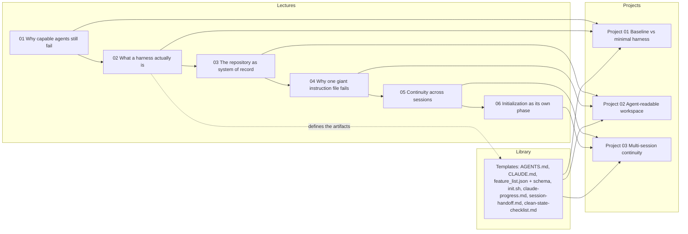

# Curriculum map

How the pieces of the course connect: each lecture teaches one mechanism,
its exercises make you build that mechanism, and each project composes the
mechanisms of two lectures into a working system. The library holds the
copy-ready templates those systems are built from.

This map covers the curriculum's **first pass**: lectures 01-06 and projects
01-03, the foundation sequence. Later lectures (scope control, feature lists,
verification, observability, clean state, loops, graphs) and their projects
extend this graph in the same pattern.

Reading the graph:

- The **top row** is the lecture sequence; each lecture assumes the previous
  ones. Every lecture directory also contains 2 exercises that verify its
  learning objectives; they sit between the lecture and its project in the
  learning flow (lecture → exercises → project).
- A **solid arrow into a project** means the project is the hands-on
  composition of that lecture's mechanism:
  [project 01](../projects/project-01-baseline-vs-minimal-harness/) runs the
  harness-vs-no-harness experiment (lectures 01-02),
  [project 02](../projects/project-02-agent-readable-workspace/) makes a
  workspace agent-readable (lectures 03-04),
  [project 03](../projects/project-03-multi-session-continuity/) makes work
  survive session boundaries (lectures 05-06).
- The **library feeds every project**: projects instantiate the same
  templates the library ships, and lecture 02 is where those artifacts are
  defined, which is why it points at the library.

The same flow in learner terms: read the lecture → do its exercises until
`verify.sh` exits 0 → build the project → keep the templates for your own
repositories.
