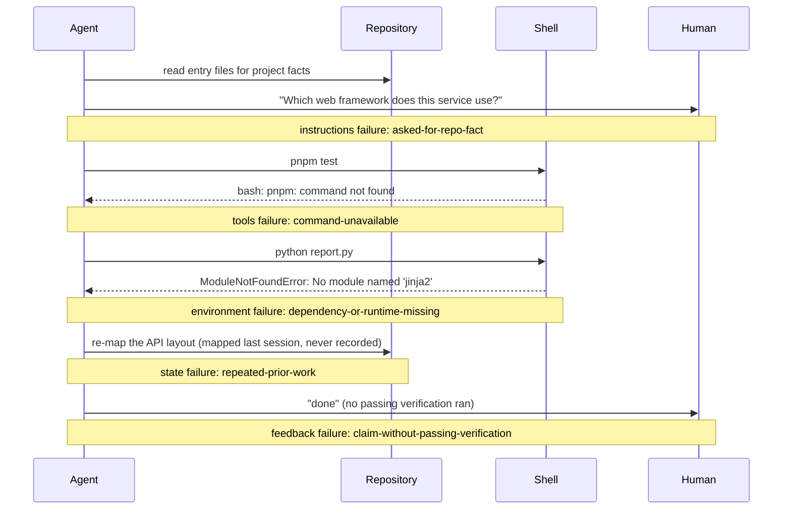

# Lecture 01: Why capable agents still fail

When an agent fails a task, the defect is almost always in the harness, not
in the model. This lecture defends that single claim, and replaces "the
model isn't good enough" with a mechanical habit: attribute every failure to
one of the five subsystems, from evidence in the run itself.

## Learning objectives

After this lecture and its exercises you can:

- Attribute an agent-run failure to one of the five subsystems by applying
  mechanical rules to observable events, not judgment about the model.
- Extend a triage tool with new attribution rules and prove them correct in
  both language tracks against shared expected output.
- Measure a verification gap: the fraction of "done" claims not backed by a
  passing check.
- Explain why the same model produces fundamentally different results in a
  bare environment versus a harnessed one.

## Prerequisites

- A working toolchain: run `make setup` and `make doctor` from the repo root
  ([choosing your track](../../docs/choosing-your-track.md) covers both
  stacks; you only need yours).
- The [glossary](../../docs/glossary.md#core-model) definitions of
  [harness](../../docs/glossary.md#core-model) and the five subsystems.
  This is the first lecture; nothing else is assumed.

## The problem

You hand an agent a clear-sounding task. Twenty minutes later it reports
"all done." The code adds the feature but breaks two tests, or follows a
convention your team abandoned a year ago, or works until the first restart.
The next session starts by re-discovering everything the last one learned.

The reflex is to blame the model and reach for a bigger one. The evidence
says otherwise. Anthropic ran the comparison directly: one prompt ("create a
2D retro game maker..."), run solo and run inside a full harness. Solo: 20
minutes, $9, and the output didn't hold up. Full harness: 6 hours, $200, and
"the difference in output quality was immediately apparent." The model was
identical in both runs; only the system around it changed.

> Source: [Anthropic: Harness design for long-running application development](https://www.anthropic.com/engineering/harness-design-long-running-apps)

OpenAI reports the same shape of result at production scale: a five-month
internal experiment in which agents wrote roughly one million lines of a
shipped beta product, with zero lines written by hand, and where early
slowness traced to an underspecified environment, not to model capability.

> Source: [OpenAI: Harness engineering: leveraging Codex in an agent-first world](https://openai.com/index/harness-engineering/)

## Concepts

- **Capability is not execution reliability.** Benchmarks measure what a
  model can do on well-posed tasks; your repository poses tasks badly by
  default. The gap between the two is where agents fail.
- **The five subsystems** ([glossary](../../docs/glossary.md#core-model)):
  instructions, tools, environment, state, feedback. Every harness failure
  is a defect in one of them, and each produces a recognizably different
  symptom in a run transcript.
- **Harness-induced failure**: the model had sufficient capability, but the
  execution system had a structural defect. The design heuristic of this
  whole module: when things fail, check the harness first; swapping models
  is the most expensive fix and usually the wrong one.
- **Verification gap**: the distance between an agent's confidence ("done")
  and verified correctness. It is the most common failure mode, and it is
  measurable (exercise 02 makes you measure it).
- **Diagnostic loop**: run, observe the failure, attribute it to a
  subsystem, fix that subsystem, run again. Attribution must come from
  evidence in the transcript, which is exactly what this lecture's demo
  mechanizes.

## Architecture

The demo treats an agent run as what it observably is: a sequence of events.
Each of the five subsystems fails in a way that leaves a distinct event
signature, so triage is a rules job. One composite timeline shows where each
signature appears:



Reading the timeline: the agent asking a *human* for a fact the *repository*
should answer is an instructions defect, whatever the agent's capability. A
shell refusing a command is a tools defect; a missing dependency is an
environment defect. Re-doing mapped-but-unrecorded work is a state defect.
And a completion claim with no passing verification before it is a feedback
defect, regardless of whether the code happens to work. The demo's
[SPEC.md](./code/SPEC.md) turns each note into an exact rule.

## Demo

`code/` contains **failure-triage**: it reads a JSONL transcript of agent-run
events ([fixtures/runs.jsonl](./code/fixtures/runs.jsonl), six runs: one
failure per subsystem plus one healthy run) and applies the SPEC's
attribution rules. Run it from the repo root:

### Python

```sh
L=lectures/lecture-01-why-capable-agents-still-fail
uv run python $L/code/python/main.py $L/code/fixtures/runs.jsonl
```

### TypeScript

```sh
L=lectures/lecture-01-why-capable-agents-still-fail
pnpm exec tsx $L/code/typescript/main.ts $L/code/fixtures/runs.jsonl
```

Both tracks print the same report. The block below is generated from the
Python run by `make verify` (the TypeScript run is held identical to it by
`make conformance`), so it cannot drift from the committed fixtures:

<!-- generated-block: uv run python lectures/lecture-01-why-capable-agents-still-fail/code/python/main.py lectures/lecture-01-why-capable-agents-still-fail/code/fixtures/runs.jsonl -->
```json
{
  "runs": [
    {
      "id": "run-1",
      "task": "add a search endpoint to the API",
      "subsystem": "instructions",
      "rule": "asked-for-repo-fact",
      "evidence": "agent_question: \"Which web framework does this service use?\""
    },
    {
      "id": "run-2",
      "task": "fix the flaky login test",
      "subsystem": "tools",
      "rule": "command-unavailable",
      "evidence": "shell_error: \"bash: pnpm: command not found\""
    },
    {
      "id": "run-3",
      "task": "regenerate the weekly report",
      "subsystem": "environment",
      "rule": "dependency-or-runtime-missing",
      "evidence": "shell_error: \"ModuleNotFoundError: No module named 'jinja2'\""
    },
    {
      "id": "run-4",
      "task": "continue the pagination work from yesterday",
      "subsystem": "state",
      "rule": "repeated-prior-work",
      "evidence": "rework: \"re-mapped the API layout that the previous session had already documented\""
    },
    {
      "id": "run-5",
      "task": "add CSV export",
      "subsystem": "feedback",
      "rule": "claim-without-passing-verification",
      "evidence": "claim: \"export implemented and working\""
    },
    {
      "id": "run-6",
      "task": "rename the config key",
      "subsystem": "unattributed",
      "rule": null,
      "evidence": null
    }
  ],
  "summary": {
    "instructions": 1,
    "tools": 1,
    "environment": 1,
    "state": 1,
    "feedback": 1,
    "unattributed": 1
  },
  "total_runs": 6,
  "harness_failure_rate": 0.8333333333333334
}
```
<!-- /generated-block -->

The interpretation is the lecture's claim in miniature: five of these six
"agent failures" never touch model capability. Each one names the subsystem
to fix, and `run-6` shows what a healthy run looks like: a passing
verification *before* the claim. To check both implementations against the
shared expected output (and each other):

```sh
./lectures/lecture-01-why-capable-agents-still-fail/code/verify.sh --stack=both
```

## Implementation notes

Applying this in a real repository:

- **Log runs as events, not impressions.** A line per observable event
  (question asked, command failed, claim made, check run) is enough; the
  demo's transcript format is deliberately minimal. Without a log, failure
  attribution degrades into memory and mood.
- **The wrong version of this practice** is attribution by vibes: "the
  model felt off today", followed by a model upgrade. It is more expensive
  than any rule and fixes nothing structural, because next month's failure
  has the same unaddressed cause. The contrast is the point: the right
  version is boring, mechanical, and cumulative.
- **Rule order is load-bearing.** In `run-4`, a rework event precedes an
  unverified claim; first-match attribution charges the run to state, not
  feedback. If your rules can match the same run twice, define precedence
  in the spec, or two analysts (or two implementations) will disagree.
- **Fix the top of the histogram.** After a week of triage, the summary
  table tells you which subsystem is your bottleneck. Fix that one; re-run
  the same tasks; watch the histogram move. That loop is the module.
- Track note: the two implementations are idiomatic, not mirrored line by
  line; parity is enforced on observable output by
  [the conformance contract](../../docs/conventions.md#the-parity-contract).

## Key takeaways

- Model capability and execution reliability are different properties;
  benchmarks measure the first, your repository experiences the second.
- Failures leave evidence. Attribution is a rules job over observable
  events, and each subsystem has a distinct signature.
- A claim of "done" without a passing verification is a feedback failure
  even when the code works: unverifiable success does not compound.
- When things fail, check the harness first. Swapping models is the most
  expensive option and usually addresses nothing structural.

## Exercises

| Exercise | You build | Difficulty | Time |
| --- | --- | --- | --- |
| [01: failure-triage](./exercises/exercise-01-failure-triage/) | The three missing attribution rules, until the triage of a fresh transcript matches expected output | Medium | ~45 min |
| [02: verification-gap](./exercises/exercise-02-verification-gap/) | A claims auditor that classifies every run and computes the verification gap | Medium | ~30 min |

Both are graded by shared expected output: `./verify.sh --stack=<yours>`
exits 0 when your track's implementation is correct. The related project
for this lecture is
[Project 01: baseline vs minimal harness](../../projects/project-01-baseline-vs-minimal-harness/),
which turns this lecture's failure transcript into a controlled
experiment.

## Further exploration

- [OpenAI: Harness engineering: leveraging Codex in an agent-first world](https://openai.com/index/harness-engineering/)
- [Anthropic: Harness design for long-running application development](https://www.anthropic.com/engineering/harness-design-long-running-apps)
- [Anthropic: Effective harnesses for long-running agents](https://www.anthropic.com/engineering/effective-harnesses-for-long-running-agents)
- [SWE-bench](https://www.swebench.com/), the benchmark whose scores make
  the capability-vs-execution gap concrete
- [Claude Code documentation](https://docs.claude.com/en/docs/claude-code/overview)
  and [Codex documentation](https://developers.openai.com/codex/), the two
  harnesses this module most often references
