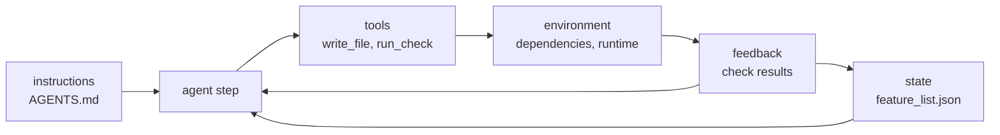

# Lecture 02: What a harness actually is

A prompt file is not a harness. A harness is five subsystems (instructions,
tools, environment, state, feedback) working as one system, and its
artifacts are language-neutral files, a claim this repository demonstrates
about itself: every runnable unit here drives two implementation languages
from one set of shared artifacts.

## Learning objectives

After this lecture and its exercises you can:

- Name the five subsystems and the minimal artifact that carries each one.
- Audit a repository for subsystem presence using only language-neutral
  file signals, in either track.
- Run a controlled-variable ablation: remove one subsystem, hold everything
  else fixed, and read the characteristic degradation from the output.
- Explain why the same harness artifacts serve a Python and a TypeScript
  implementation without modification.

## Prerequisites

- [Lecture 01](../lecture-01-why-capable-agents-still-fail/): the five
  subsystems as failure-attribution targets; this lecture builds them as a
  working system.
- A working toolchain (`make setup`, `make doctor`;
  [choosing your track](../../docs/choosing-your-track.md)).
- Glossary entries for the [five subsystems](../../docs/glossary.md#core-model)
  and [controlled-variable ablation](../../docs/glossary.md#working-discipline).

## The problem

Drop a competent new engineer into a project with no README, no test
instructions, and no record of what's done, and they will eventually write
code, after spending most of their time reconstructing what the project
even is. An agent in the same repository is worse off: it cannot corner a
colleague at lunch. It sees exactly the files you put in front of it and
the commands it can run.

Now watch what teams call the fix: they write one prompt file and call it a
harness. The observable symptom of that mistake is a familiar mix from
lecture 01's triage: the agent knows the convention (the prompt said so)
but redoes last session's work (no state), can't run the checker (no
tools), trips on a missing dependency (no environment), and ends with
"done" that nobody verified (no feedback). Four of five subsystems absent,
and the prompt file was never going to carry them.

## Concepts

- **Harness**: everything in the execution system outside the model weights
  ([glossary](../../docs/glossary.md#core-model)). If it's not weights,
  it's harness.
- **The five subsystems and their minimal artifacts**: instructions
  (`AGENTS.md`/`CLAUDE.md`), tools (runnable commands such as `verify.sh`),
  environment (a dependency manifest plus a runtime pin), state
  (`feature_list.json` plus `claude-progress.md`), feedback (an executable
  verification command the agent is told about). Missing any one produces
  that subsystem's characteristic failure, not a general malaise.
- **Harness artifacts are language-neutral.** Every artifact above is
  markdown, JSON, or shell. This repository is the worked example: each
  unit keeps one `SPEC.md`, one `fixtures/`, one `expected/`, and two
  implementations (`python/`, `typescript/`) held to identical output by
  the [conformance contract](../../docs/conventions.md#the-parity-contract).
  The repo's own root [`AGENTS.md`](../../AGENTS.md) governs work in both
  languages without mentioning either.
- **Controlled-variable ablation**
  ([glossary](../../docs/glossary.md#working-discipline)): remove exactly
  one subsystem, re-run the same task, compare against the baseline. This
  course's method for proving a component earns its place, and this
  lecture's demo in miniature.
- Real harnesses wear these shapes: Claude Code loads `CLAUDE.md` from your
  repository as its project instructions
  ([docs](https://docs.claude.com/en/docs/claude-code/overview)); OpenAI's
  harness-engineering account pairs `AGENTS.md`-driven repositories with
  isolated per-task environments and verification
  ([source](https://openai.com/index/harness-engineering/)); Anthropic's
  harness-design write-up separates planning, generating, and evaluating
  into distinct roles
  ([source](https://www.anthropic.com/engineering/harness-design-long-running-apps)).

## Architecture

The five subsystems form a loop, so the diagram is a flow with a feedback
edge rather than a hierarchy: instructions and state feed the agent's next
decision, the agent acts through tools inside an environment, and checks
feed the result back.



Walkthrough: the two arrows *into* the agent are what it knows before
acting (the convention it must follow, the feature that is actually next).
The chain *out* of the agent is how work becomes real: a tool call runs
inside an environment and produces something checkable. The two arrows out
of feedback close the system: results return to the agent (retry, fix) and
to state (record what is now true). Cut any arrow and the loop degrades in
a way you can name, which is precisely what the demo does on command.

## Demo

`code/` contains **minimal-harness-loop**: one deterministic loop iteration
whose five subsystems are fed by ordinary files in
[`fixtures/workspace/`](./code/fixtures/workspace/): `AGENTS.md`,
`feature_list.json` (a valid instance of the
[library schema](../../library/templates/feature_list.schema.json), checked
by `make verify`), `tools.json`, `environment.json`, and an injected clock.
`--disable=<subsystem>` removes exactly one. Run it from the repo root:

### Python

```sh
L=lectures/lecture-02-what-a-harness-actually-is
uv run python $L/code/python/main.py $L/code/fixtures/workspace
```

### TypeScript

```sh
L=lectures/lecture-02-what-a-harness-actually-is
pnpm exec tsx $L/code/typescript/main.ts $L/code/fixtures/workspace
```

Both tracks read the same artifact bytes and print the same report. The
block below is generated from the Python run by `make verify` (the
TypeScript run is held identical by `make conformance`):

<!-- generated-block: uv run python lectures/lecture-02-what-a-harness-actually-is/code/python/main.py lectures/lecture-02-what-a-harness-actually-is/code/fixtures/workspace -->
```json
{
  "disabled": null,
  "feature": "format-dates",
  "convention": "ISO 8601 UTC",
  "steps": [
    {
      "subsystem": "instructions",
      "ok": true,
      "note": "read convention from AGENTS.md: dates are ISO 8601 UTC (YYYY-MM-DDTHH:MM:SSZ)"
    },
    {
      "subsystem": "state",
      "ok": true,
      "note": "feature_list.json: next feature is format-dates"
    },
    {
      "subsystem": "environment",
      "ok": true,
      "note": "formatter dependency installed"
    },
    {
      "subsystem": "tools",
      "ok": true,
      "note": "write_file: artifact written"
    },
    {
      "subsystem": "feedback",
      "ok": true,
      "note": "run_check date-format: pass"
    }
  ],
  "artifact": {
    "written": true,
    "content": "date: 2026-08-27T00:00:00Z"
  },
  "outcome": "completed-verified",
  "issues": []
}
```
<!-- /generated-block -->

The ablation table runs all six configurations (append `--ablation-table`
to either command above); one line per removed subsystem, each with its
characteristic degradation:

<!-- generated-block: uv run python lectures/lecture-02-what-a-harness-actually-is/code/python/main.py lectures/lecture-02-what-a-harness-actually-is/code/fixtures/workspace --ablation-table -->
```text
disabled | outcome | issues
(none) | completed-verified | 0
instructions | failed-verification | 1
state | completed-redundant | 1
environment | error | 1
tools | blocked | 1
feedback | claimed-unverified | 1
```
<!-- /generated-block -->

Interpretation: the baseline completes and verifies. Remove instructions
and the work is *done wrong, but caught*, because feedback still runs.
Remove state and the work is *done right, but redundant*. Remove
environment or tools and nothing ships at all. Remove feedback and you get
the most dangerous row: correct-looking work, declared done, verified by
nobody. Full per-configuration reports are pinned in
[`code/expected/`](./code/expected/), and the details live in
[`code/SPEC.md`](./code/SPEC.md).

## Implementation notes

- **The wrong version of this lecture** is a `harness.md` that describes
  all five subsystems in prose. Describing feedback is not having feedback:
  the demo's `claimed-unverified` row exists precisely because a check that
  isn't executed contributes nothing. Build the artifact, not the essay
  about the artifact.
- **Language-neutrality is a load-bearing property, not trivia.** Because
  the workspace artifacts are markdown and JSON, this repo's two tracks
  consume them without adapters, and your team's mixed-language services
  can share one harness dialect. The moment someone encodes state in a
  pickle or instructions in a docstring, one track (or one team) drops out.
- **Ablate before you adopt and after you upgrade.** The demo ablates to
  teach the method; in a real repository you ablate to justify components:
  remove one, run your fixed task set, compare. A component whose removal
  changes nothing is overhead until proven otherwise, a heuristic this
  course applies to its own harness.
- **Ecosystem note.** Environment pinning differs by track in mechanism,
  not in role: `pyproject.toml` + `.python-version` + `uv.lock` on the
  Python side, `package.json` + `.nvmrc` + `pnpm-lock.yaml` on the
  TypeScript side. This repository carries both, one of each pair per
  toolchain ([choosing your track](../../docs/choosing-your-track.md)
  tabulates them).

## Key takeaways

- Harness = instructions + tools + environment + state + feedback, as one
  loop. A prompt file carries one fifth of it.
- Each subsystem's absence has a signature: wrong-but-caught, redundant,
  blocked, error, or unverified. If you can name the signature, you know
  what to build next.
- Harness artifacts are language-neutral files; one set of artifacts can
  govern implementations in any language, which this repository does on
  every unit.
- Prove components earn their place by controlled-variable ablation against
  a fixed baseline, not by intuition.

## Exercises

| Exercise | You build | Difficulty | Time |
| --- | --- | --- | --- |
| [01: subsystem-auditor](./exercises/exercise-01-subsystem-auditor/) | The tools, environment, and state audits of a five-subsystem repository auditor | Medium | ~40 min |
| [02: ablation-report](./exercises/exercise-02-ablation-report/) | The comparison logic that turns six loop reports into one ablation table | Easy | ~25 min |

Both are graded by shared expected output: `./verify.sh --stack=<yours>`
exits 0 when your track's implementation is correct. The related project
for this lecture is Project 01 (baseline vs minimal harness), which lands
with the projects phase of this course.

## Further exploration

- [OpenAI: Harness engineering: leveraging Codex in an agent-first world](https://openai.com/index/harness-engineering/)
- [Anthropic: Effective harnesses for long-running agents](https://www.anthropic.com/engineering/effective-harnesses-for-long-running-agents)
- [Anthropic: Harness design for long-running application development](https://www.anthropic.com/engineering/harness-design-long-running-apps)
- [SWE-agent](https://github.com/SWE-agent/SWE-agent), whose agent-computer
  interface work is the research face of the tools subsystem
- [Claude Code documentation](https://docs.claude.com/en/docs/claude-code/overview)
  and [Codex documentation](https://developers.openai.com/codex/)
