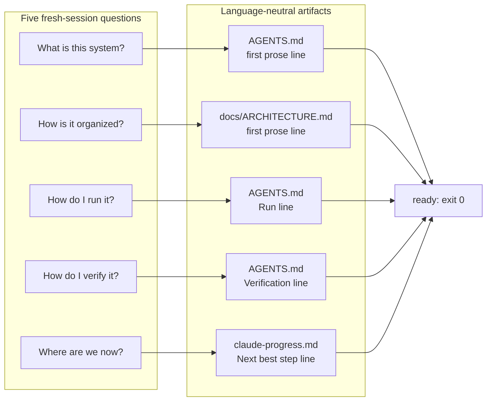

# Lecture 03: Why the repository must become the system of record

An agent has exactly three inputs: its instructions, the repository's
files, and the output of commands it runs. Knowledge anywhere else, in
chat threads, wikis, tickets, or heads, does not exist for it. This
lecture defends one claim: the repository must be the authoritative record
of what the system is, how it runs, how it is verified, and where work
stands, because for the agent there is nowhere else.

## Learning objectives

After this lecture and its exercises you can:

- Run the fresh-session test: decide mechanically whether a repository
  answers the five questions a new session must answer to start work.
- Extract each answer from its designated language-neutral artifact, and
  fix extractors that answer from the wrong place.
- Measure a knowledge visibility gap from a decision inventory and name
  the critical decisions living outside the repository.
- Explain why proximity and structure (a tagged line, a doc beside the
  code) beat volume in agent-facing documentation.

## Prerequisites

- [Lecture 01](../lecture-01-why-capable-agents-still-fail/) (failure
  attribution; instructions defects) and
  [Lecture 02](../lecture-02-what-a-harness-actually-is/) (the five
  subsystems; language-neutral artifacts).
- A working toolchain (`make setup`, `make doctor`;
  [choosing your track](../../docs/choosing-your-track.md)).
- Glossary entries for
  [system of record](../../docs/glossary.md#working-discipline) and the
  [harness artifacts](../../docs/glossary.md#harness-artifacts).

## The problem

Your team knows the API versioning rule. It lives in a Confluence page,
half a Slack thread, and two senior engineers. A human colleague asks
around and finds it; the agent cannot ask. The observable symptom is
lecture 01's `asked-for-repo-fact` failure at scale: sessions that open
with questions, guesses that violate constraints "everyone knows", and the
next session guessing again, because nothing was written where the agent
looks.

OpenAI's harness-engineering account states the principle this course
builds on: the repository is the system of record, with the context an
agent needs delivered through structured files in the repo itself.
Anthropic's guidance on long-running agents makes the state half of the
same point: progress must persist in files the next session can read.

> Sources: [OpenAI: Harness engineering: leveraging Codex in an agent-first world](https://openai.com/index/harness-engineering/) ·
> [Anthropic: Effective harnesses for long-running agents](https://www.anthropic.com/engineering/effective-harnesses-for-long-running-agents)

## Concepts

- **System of record**
  ([glossary](../../docs/glossary.md#working-discipline)): the repository
  as the single authoritative source of decisions, constraints, state, and
  verification standards. If it is not in the repo, it does not exist for
  the agent.
- **The fresh-session test**: can a brand-new session, given only the
  repository, answer five questions: what is this system, how is it
  organized, how do I run it, how do I verify it, where are we now? Every
  unanswered question is a blank spot the agent will fill by guessing.
- **Knowledge visibility gap**: the fraction of the team's
  decision-relevant knowledge that lives outside the repository. Exercise
  02 makes you compute it; the design heuristic this course uses is to
  keep it at or below 10%, externalizing critical decisions first.
- **Proximity and structure beat volume.** A tagged line
  (`- Verification: ./verify.sh`) is extractable and executable; a page of
  prose about verifying is neither. A short architecture doc beside the
  code gets read and updated; a distant encyclopedia rots. Stale
  documentation is worse than none: it sends the agent confidently in the
  wrong direction.
- **The map is language-neutral.** Every artifact the fresh-session test
  consults is markdown or JSON, the same files
  [the library ships as templates](../../library/templates/). This unit's
  own layout is the worked example again: one set of fixture repositories,
  one expected report, two implementations reading identical bytes.

## Architecture

The demo's mechanism is a mapping: each question has one designated
artifact and one extraction rule, so "is the repo a system of record?"
becomes a checkable function of files, not an impression.



Walkthrough: the left column is what a session needs to know before its
first edit; the right column is where each answer must live and the exact
line that carries it. Every edge is an extraction rule in the demo's
[SPEC.md](./code/SPEC.md); a missing artifact or line breaks its edge, the
question reports unanswered, and the run exits non-zero, because a repo
that cannot answer these questions is not ready to host a session. The
rules are deliberately strict about structure: tagged lines, not prose, so
that answering and executing are the same motion.

## Demo

`code/` contains **fresh-session-reader**: it runs the test against two
fixture repositories, `repo-mapped` (answers everything) and
`repo-blank-spots` (a Run line and an overview, nothing else). Run it from
the repo root:

### Python

```sh
L=lectures/lecture-03-why-the-repository-must-become-the-system-of-record
uv run python $L/code/python/main.py $L/code/fixtures/repos/repo-blank-spots
```

### TypeScript

```sh
L=lectures/lecture-03-why-the-repository-must-become-the-system-of-record
pnpm exec tsx $L/code/typescript/main.ts $L/code/fixtures/repos/repo-blank-spots
```

Both tracks print the same report and exit 1 (the fresh-session verdict:
this repository cannot host a new session without guessing). The block
below is generated from the Python run by `make verify` (the TypeScript
run is held identical by `make conformance`):

<!-- generated-block: uv run python lectures/lecture-03-why-the-repository-must-become-the-system-of-record/code/python/main.py lectures/lecture-03-why-the-repository-must-become-the-system-of-record/code/fixtures/repos/repo-blank-spots || true -->
```json
{
  "questions": [
    {
      "id": "what-is-this",
      "question": "What is this system?",
      "answered": true,
      "answer": "ledger-tool: a local double-entry ledger CLI for one user.",
      "source": "AGENTS.md"
    },
    {
      "id": "how-organized",
      "question": "How is it organized?",
      "answered": false,
      "answer": null,
      "source": null
    },
    {
      "id": "how-to-run",
      "question": "How do I run it?",
      "answered": true,
      "answer": "./ledger --help",
      "source": "AGENTS.md (Run line)"
    },
    {
      "id": "how-to-verify",
      "question": "How do I verify it?",
      "answered": false,
      "answer": null,
      "source": null
    },
    {
      "id": "where-are-we",
      "question": "Where are we now?",
      "answered": false,
      "answer": null,
      "source": null
    }
  ],
  "answered": 2,
  "total": 5,
  "visibility_gap": 0.6,
  "ready": false
}
```
<!-- /generated-block -->

Interpretation: two questions answer cleanly, and the three
`answered: false` entries are the map's blank spots, each naming the
artifact that should exist (`docs/ARCHITECTURE.md`, a `- Verification:`
line, a progress log). Against `repo-mapped` the same command reports
5/5, `visibility_gap: 0`, `ready: true`, exit 0; that report is pinned in
[`code/expected/mapped.json`](./code/expected/mapped.json).

## Implementation notes

- **Draw the map where the agent walks.** Module constraints belong in a
  short doc inside the module's directory; run and verification commands
  belong on tagged lines in the entry file. The rule of thumb: when the
  agent reaches the code, the constraint should already be in view.
- **The wrong version of this practice** is the documentation drive: a
  sprint of wiki-writing that leaves the repo unchanged. It raises the
  team's word count and the agent's visibility not at all. Externalization
  means moving decisions *into repository files*, and exercise 02's
  measurement counts only that.
- **Bind knowledge updates to code changes.** Docs that live beside the
  code they constrain get touched in the same commits; a stale map fails
  the fresh-session test the moment its answers stop matching reality, so
  re-run the test after structural changes.
- **State discipline, as heuristics**: commit verified wholes rather than
  fragments (atomic), keep an executable definition of "consistent" and
  run it before recording state, give concurrent agents separate state
  files, and treat only git-tracked files as durable. Session memory is
  not storage; what is written down is what happened.
- Track note: nothing in this lecture's artifacts mentions Python or
  TypeScript. The fixtures serve both implementations unmodified, and the
  same five questions govern this very repository's root
  [`AGENTS.md`](../../AGENTS.md).

## Key takeaways

- The agent's world is the repository. Knowledge elsewhere is invisible,
  and invisible knowledge becomes guessed knowledge, then bugs.
- The fresh-session test makes "is the repo a good map?" checkable: five
  questions, five designated artifacts, exit code as verdict.
- Structure is what makes knowledge extractable: tagged lines and
  designated files, not prose that mentions the right words.
- Measure the visibility gap and externalize critical decisions first;
  keeping the gap at or below 10% is this course's working heuristic.

## Exercises

| Exercise | You build | Difficulty | Time |
| --- | --- | --- | --- |
| [01: fresh-session-answers](./exercises/exercise-01-fresh-session-answers/) | The three broken extractors of the fresh-session reader, against trap fixtures | Medium | ~40 min |
| [02: knowledge-gap-report](./exercises/exercise-02-knowledge-gap-report/) | The visibility rule of a knowledge-gap analyzer | Easy | ~20 min |

Both are graded by shared expected output: `./verify.sh --stack=<yours>`
exits 0 when your track's implementation is correct. The related project
for this lecture is
[Project 02: agent-readable workspace](../../projects/project-02-agent-readable-workspace/),
which turns this lecture's mechanism into a working, doctor-checked
workspace.

## Further exploration

- [OpenAI: Harness engineering: leveraging Codex in an agent-first world](https://openai.com/index/harness-engineering/)
- [Anthropic: Effective harnesses for long-running agents](https://www.anthropic.com/engineering/effective-harnesses-for-long-running-agents)
- [Architecture Decision Records](https://adr.github.io/), the standard
  form for externalizing the "why" behind decisions
- [The Twelve-Factor App](https://12factor.net/), the classic argument for
  declaring environment and configuration in the repository
- [Claude Code documentation](https://docs.claude.com/en/docs/claude-code/overview)
  on project instruction files
