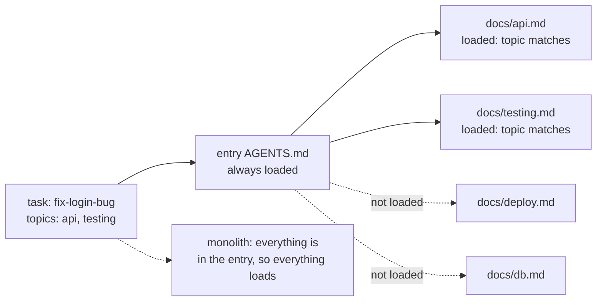

# Lecture 04: Why one giant instruction file fails

The natural response to every agent mistake is "add a rule", and the
natural home for every rule is the one file the agent always reads. Follow
that gradient for a few months and you get a long entry file that costs
every task context, buries its own hard constraints, and contradicts
itself. This lecture defends one claim: instructions must be a map, not a
manual, a short entry file routing to topic documents loaded only when a
task needs them.

## Learning objectives

After this lecture and its exercises you can:

- Demonstrate, not just assert, that a monolith loses hard constraints: a
  budgeted reader misses a rule the same reader finds under a router.
- Measure an instruction architecture as supporting evidence: per-task
  signal-to-noise under an explicit loading rule, and the zone of every
  hard constraint.
- Keep a router-shaped tree honest with executable checks: entry length,
  resolvable routes, hard constraints in the entry only, no duplicated
  rule text.
- Distinguish instruction signal from topic-word mentions when computing
  relevance.

## Prerequisites

- [Lecture 03](../lecture-03-why-the-repository-must-become-the-system-of-record/):
  the repository as the agent's world; this lecture is about the shape of
  the instructions inside it. [Lecture 02](../lecture-02-what-a-harness-actually-is/)
  for the instructions subsystem.
- A working toolchain (`make setup`, `make doctor`;
  [choosing your track](../../docs/choosing-your-track.md)).
- The glossary's [progressive disclosure](../../docs/glossary.md#working-discipline)
  entry; the entry-file size heuristic lives with the
  [`AGENTS.md`](../../docs/glossary.md#harness-artifacts) definition.

## The problem

You wrote an `AGENTS.md` and it worked, so it grew: style debates, API
history, deploy incident notes, all appended where they would surely be
seen. The observable symptoms arrive gradually. A bug-fix task loads
deploy procedures it will never use. A security rule sits in the middle
third of the file. Two eras of style guidance coexist, and the agent obeys
whichever it read last.

The middle-of-the-file problem is not folklore: Liu et al. measured that
language models use information at the beginning and end of long contexts
substantially better than information in the middle.

> Source: [Lost in the Middle: How Language Models Use Long Contexts (Liu et al., 2023)](https://arxiv.org/abs/2307.03172)

## Concepts

- **Map, not manual**: the entry file is a router: what the system is, the
  hard constraints, and where the topic documents are. Depth loads on
  demand ([progressive disclosure](../../docs/glossary.md#working-discipline)).
  The module's working heuristic for entry-file size is roughly 100 lines
  (the split rule matters more than the number).
- **Instruction signal-to-noise (SNR)**: for one task, relevant
  instruction lines over loaded lines. The demo computes it under an
  explicit loading rule; exercise 02 makes you implement the relevance
  half honestly (a line *mentioning* a topic is cost, not signal).
- **Buried hard constraint**: a non-negotiable rule in the middle zone of
  a long file, where recall is weakest. Routers avoid burial structurally:
  the entry stays short, and hard constraints stay in it.
- **Instruction debt**: rules accumulate because adding feels free and
  deleting feels risky, so trees need the same discipline as code: audits,
  deletion, and executable shape checks (exercise 01's validator).
- **This unit's artifacts are language-neutral**, like every instruction
  file in this module: the same fixture trees drive both tracks, and the
  format under measurement is the format this repository's own
  [`AGENTS.md`](../../AGENTS.md) practices, short entry, linked depth.

## Architecture

The mechanism under study is the loading rule: what does a given task pull
into context under each architecture?



The router's cost for this task is the short entry plus two matching topic
files. The monolith's cost for the same task is the whole file, every
time, for every task, which is also what pushes its hard constraints into
the middle zone where they get lost. The demo's
[SPEC.md](./code/SPEC.md) pins the loading rule, the SNR formula, and the
zone/burial rules the diagram summarizes.

## Demo

`code/` contains **instruction-walk**: two fixture trees carry the same
rules, `monolith` (one 45-line file) and `router` (a 15-line entry plus
five topic docs), including the identical `security!` hard constraint.
The demo is behavioral: a deterministic reader with a 24-line context
budget works the task `tighten-csv-import` against each tree, reading
top-down and following only routes it has actually read. Run it from the
repo root; **the exit code is the verdict** (1 = a hard constraint was
never read).

### The monolith misses it

#### Python

<!-- fence-exit: 1 -->
```sh
L=lectures/lecture-04-why-one-giant-instruction-file-fails
uv run python $L/code/python/main.py walk $L/code/fixtures/trees/monolith $L/code/fixtures/tasks.json tighten-csv-import --budget 24
```

#### TypeScript

<!-- fence-exit: 1 -->
```sh
L=lectures/lecture-04-why-one-giant-instruction-file-fails
pnpm exec tsx $L/code/typescript/main.ts walk $L/code/fixtures/trees/monolith $L/code/fixtures/tasks.json tighten-csv-import --budget 24
```

The monolith run, generated from the Python run by `make verify` (the
TypeScript run is held identical by `make conformance`):

<!-- generated-block: uv run python lectures/lecture-04-why-one-giant-instruction-file-fails/code/python/main.py walk lectures/lecture-04-why-one-giant-instruction-file-fails/code/fixtures/trees/monolith lectures/lecture-04-why-one-giant-instruction-file-fails/code/fixtures/tasks.json tighten-csv-import --budget 24 || true -->
```json
{
  "tree": "monolith",
  "task": "tighten-csv-import",
  "budget": 24,
  "files_visited": [
    {
      "file": "AGENTS.md",
      "lines_read": 24,
      "lines_total": 45
    }
  ],
  "lines_spent": 24,
  "hard_constraints": [
    {
      "text": "Every database query must be parameterized.",
      "file": "AGENTS.md",
      "line": 28,
      "read": false
    }
  ],
  "missed": 1
}
```
<!-- /generated-block -->

### The router finds it

The same reader, same task, same budget (exit 0):

#### Python

```sh
L=lectures/lecture-04-why-one-giant-instruction-file-fails
uv run python $L/code/python/main.py walk $L/code/fixtures/trees/router $L/code/fixtures/tasks.json tighten-csv-import --budget 24
```

#### TypeScript

```sh
L=lectures/lecture-04-why-one-giant-instruction-file-fails
pnpm exec tsx $L/code/typescript/main.ts walk $L/code/fixtures/trees/router $L/code/fixtures/tasks.json tighten-csv-import --budget 24
```

<!-- generated-block: uv run python lectures/lecture-04-why-one-giant-instruction-file-fails/code/python/main.py walk lectures/lecture-04-why-one-giant-instruction-file-fails/code/fixtures/trees/router lectures/lecture-04-why-one-giant-instruction-file-fails/code/fixtures/tasks.json tighten-csv-import --budget 24 -->
```json
{
  "tree": "router",
  "task": "tighten-csv-import",
  "budget": 24,
  "files_visited": [
    {
      "file": "AGENTS.md",
      "lines_read": 15,
      "lines_total": 15
    },
    {
      "file": "docs/db.md",
      "lines_read": 4,
      "lines_total": 4
    }
  ],
  "lines_spent": 19,
  "hard_constraints": [
    {
      "text": "Every database query must be parameterized.",
      "file": "AGENTS.md",
      "line": 7,
      "read": true
    }
  ],
  "missed": 0
}
```
<!-- /generated-block -->

Interpretation: the monolith spent its whole budget on the file's first 24
lines and never reached the security constraint at line 28; the router
read its entire 15-line entry (constraint at line 7, read) plus the one
routed topic file, with budget to spare. A third pinned case gives the
monolith a 60-line budget and it recovers (`walk-monolith-big-budget`),
which states the claim precisely: the failure is the architecture's
interaction with a finite budget, not the file's content. A route below
the budget line is lost exactly like a rule, which is the map-not-manual
argument made mechanical.

### Supporting evidence: the numbers

`stats` is the metric, not the demo: it computes
per-task signal-to-noise and the constraint zones across both trees. The
comparison section is generated from the Python run by `make verify`:

<!-- generated-block: uv run python lectures/lecture-04-why-one-giant-instruction-file-fails/code/python/main.py stats lectures/lecture-04-why-one-giant-instruction-file-fails/code/fixtures/trees lectures/lecture-04-why-one-giant-instruction-file-fails/code/fixtures/tasks.json | uv run python -c "import json,sys; print(json.dumps(json.load(sys.stdin)['comparison'], indent=2))" -->
```json
{
  "mean_snr": {
    "monolith": 0.08444444444444443,
    "router": 0.17071929824561405
  },
  "buried_hard_constraints": {
    "monolith": 1,
    "router": 0
  }
}
```
<!-- /generated-block -->

Same rules, same tasks: the router roughly doubles the fraction of loaded
context that is for the task, and its one hard constraint sits at the top
of a file too short to have a middle. The full stats report is pinned in
[`code/expected/stats-report.json`](./code/expected/stats-report.json);
no figure in this lecture was typed by hand.

## Implementation notes

- **Split by escaping the vicious cycle, not by ceremony.** The failure
  loop is: mistake → add a rule to the entry → repeat. The escape is a
  routing question at add-time: which tasks need this rule? If the answer
  names a topic, the rule goes in that topic's document and the entry
  gains at most a route line.
- **The wrong version of the split** is a short entry followed by
  neglect: routes to files that no longer exist, hard constraints leaking
  into topic docs, the same rule filed under two tags. That is why
  exercise 01's validator exists; a shape you do not check is a shape you
  do not have.
- **Position is a budget too.** What must live in the entry goes at its
  top or bottom; the middle of any long file is the weak zone (sourced
  above). Better: keep the entry too short to have a meaningful middle.
- **A real cross-track catch from building this demo**: averaging the
  per-task SNRs diverged between the tracks by one ulp, because Python's
  `sum()` applies Neumaier-compensated summation to floats (3.12+) while
  JavaScript's `reduce` is a naive fold. The conformance gate caught it,
  and the fix was a SPEC rule pinning plain left-to-right accumulation,
  the parity contract working as designed.
- Ecosystem note: instruction trees are markdown in both tracks; only the
  measuring tools differ per language, and they are held to identical
  output.

## Key takeaways

- Instructions are a map, not a manual: short routing entry, topic depth
  on demand, hard constraints where every task will see them.
- Demonstrate, then measure: the budgeted reader shows the failure
  behaviorally; SNR and zone numbers support the demonstration, and
  neither replaces the other.
- "Add a rule" has a routing step; skipping it is how entries balloon.
- A router stays a router only under executable checks: entry length,
  resolvable routes, hard-in-entry, no duplicated rule text.

## Exercises

| Exercise | You build | Difficulty | Time |
| --- | --- | --- | --- |
| [01: router-validator](./exercises/exercise-01-router-validator/) | Three structural checks that keep a router-shaped tree honest | Medium | ~40 min |
| [02: snr-calculator](./exercises/exercise-02-snr-calculator/) | The honest relevance rule behind the SNR metric | Easy | ~20 min |

Both are graded by shared expected output: `./verify.sh --stack=<yours>`
exits 0 when your track's implementation is correct. The related project
for this lecture is
[Project 02: agent-readable workspace](../../projects/project-02-agent-readable-workspace/),
which turns this lecture's mechanism into a working, doctor-checked
workspace.

## Further exploration

- [Lost in the Middle: How Language Models Use Long Contexts](https://arxiv.org/abs/2307.03172)
- [OpenAI: Harness engineering: leveraging Codex in an agent-first world](https://openai.com/index/harness-engineering/)
- [Anthropic: Effective harnesses for long-running agents](https://www.anthropic.com/engineering/effective-harnesses-for-long-running-agents)
- [Nielsen Norman Group: Progressive Disclosure](https://www.nngroup.com/articles/progressive-disclosure/),
  the interaction-design principle the router shape borrows
- [Claude Code documentation](https://docs.claude.com/en/docs/claude-code/overview)
  on project instruction files
