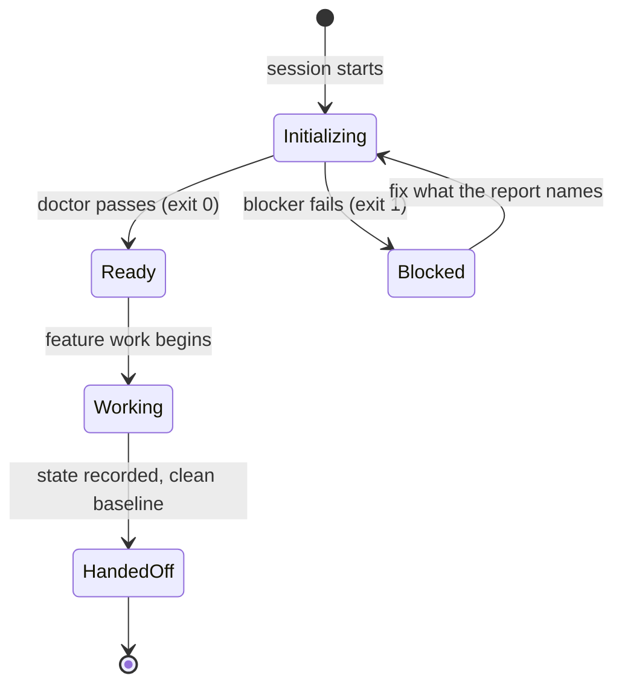

# Lecture 05: Why initialization needs its own phase

A session that starts by improvising its environment ends by guessing
about its work. This lecture defends one claim: initialization is a phase
of its own, with its own outputs (a runnable environment, a working
verification path, recorded state, a committed baseline), and mixing it
into feature work shortchanges both.

## Learning objectives

After this lecture and its exercises you can:

- Name the outputs an initialization phase owes the sessions after it, and
  audit a repository for them mechanically.
- Distinguish artifacts that exist from artifacts that do their job (a
  pinned environment vs a manifest; a strict init script vs a file named
  `init.sh`).
- Build a readiness gate whose verdict is machine-consumable, with
  blockers and advice tiered through exit codes.
- Explain the single-file `init.sh` exception to this module's dual-track
  rules and why it exists.

## Prerequisites

- [Lecture 03](../lecture-03-why-the-repository-must-become-the-system-of-record/):
  the continuity artifacts initialization must leave behind live in
  the repository or nowhere;
  [Lecture 02](../lecture-02-what-a-harness-actually-is/) for the
  environment subsystem.
- A working toolchain (`make setup`, `make doctor`;
  [choosing your track](../../docs/choosing-your-track.md)).
- The library's [`init.sh` template](../../library/templates/init.sh).

## The problem

You open a session and say "add the search feature." The agent starts
eagerly, then discovers mid-task that the test runner was never
configured, fixes that, then hits a dependency mismatch, fixes that, and
finally writes some feature code with whatever context budget is left.
The next session inherits none of the fixes' reasoning and re-derives the
project from scratch. Anthropic's write-up on long-running agents reaches
the same design conclusion this lecture teaches: their two-part harness
begins with "an initializer agent that sets up the environment on the
first run", separate from the coding agent that does feature work.

> Source: [Anthropic: Effective harnesses for long-running agents](https://www.anthropic.com/engineering/effective-harnesses-for-long-running-agents)

## Concepts

- **Initialization is a phase, not a chore list.** Its outputs are
  infrastructure: dependencies installed *and pinned*, a verification
  command that runs, state files that answer where-are-we, a clean
  baseline. Feature code is explicitly not among them.
- **Two different optimization targets.** Implementation maximizes
  verified features now; initialization maximizes the reliability of
  every session after it. An agent asked to do both at once favors the
  visible one, which is how infrastructure ends up hollow.
- **Existence is not readiness.** The demo's broken fixture has an
  `init.sh`, a manifest, and instructions, and still cannot host a
  session: the script isn't strict, the interpreter isn't pinned, the
  progress log doesn't exist. Readiness checks must test substance.
- **The startup gate**: run the doctor at session start (from `init.sh`
  or by hand); blockers stop the session before it wastes budget, advice
  stays visible without stopping it (exercise 02's tier rule).
- **`init.sh` is the declared single-file exception** to this module's
  two-track presentation (see
  [conventions](../../docs/conventions.md#command-blocks)): initialization
  is one language-neutral artifact, so one script shows both ecosystems'
  install paths side by side, guarded by manifest checks, instead of
  existing twice. The demo's ready fixture carries a live instance.

## Architecture

Initialization is a lifecycle stage with entry and exit conditions, so the
diagram is a state machine:



`Initializing` is the phase this lecture separates out; its
only exits are a passing doctor or a named blocker, so a session cannot
drift into `Working` with an unpinned interpreter or an unrecorded state
file. The `Blocked` loop is cheap precisely because the doctor's report
names what to fix, and every later stage assumes the invariants `Ready`
certifies. The demo's [SPEC.md](./code/SPEC.md) pins the four checks
behind that `Ready` edge.

## Demo

`code/` contains **init-check**: two fixture repositories, `repo-ready`
(fully initialized, including the dual-ecosystem `init.sh`) and
`repo-broken` (three seeded gaps), plus two surfaces over the same four
readiness checks. The demo is behavioral: `replay` sends a scripted
session with a 12-step budget after the same feature task in each
repository, and every failing check injects its cost at the exact moment
it bites. Run it from the repo root.

### The session that collapses

#### Python

<!-- fence-exit: 1 -->
```sh
L=lectures/lecture-05-why-initialization-needs-its-own-phase
uv run python $L/code/python/main.py replay $L/code/fixtures/repos/repo-broken
```

#### TypeScript

<!-- fence-exit: 1 -->
```sh
L=lectures/lecture-05-why-initialization-needs-its-own-phase
pnpm exec tsx $L/code/typescript/main.ts replay $L/code/fixtures/repos/repo-broken
```

The transcript, generated from the Python run by `make verify` (the
TypeScript run is held identical by `make conformance`):

<!-- generated-block: uv run python lectures/lecture-05-why-initialization-needs-its-own-phase/code/python/main.py replay lectures/lecture-05-why-initialization-needs-its-own-phase/code/fixtures/repos/repo-broken || true -->
```json
{
  "repo": "repo-broken",
  "budget": 12,
  "events": [
    {
      "step": 1,
      "action": "read the progress log",
      "outcome": "missing; the session starts by guessing"
    },
    {
      "step": 2,
      "action": "re-derive project state",
      "outcome": "scan the repository structure"
    },
    {
      "step": 3,
      "action": "re-derive project state",
      "outcome": "reconstruct decisions already made once"
    },
    {
      "step": 4,
      "action": "install dependencies",
      "outcome": "wrong interpreter; ModuleNotFoundError mid-install"
    },
    {
      "step": 5,
      "action": "pin and reinstall",
      "outcome": "environment rebuilt by hand"
    },
    {
      "step": 6,
      "action": "run init.sh",
      "outcome": "exited 0 over a half-built environment (no strict mode)"
    },
    {
      "step": 7,
      "action": "feature step 1",
      "outcome": "progress on the export feature"
    },
    {
      "step": 8,
      "action": "feature step 2",
      "outcome": "progress on the export feature"
    },
    {
      "step": 9,
      "action": "feature test fails mysteriously",
      "outcome": "traced back to the half-built environment init.sh hid"
    },
    {
      "step": 10,
      "action": "rebuild the environment",
      "outcome": "the loud failure init.sh owed us"
    },
    {
      "step": 11,
      "action": "feature step 3",
      "outcome": "progress on the export feature"
    },
    {
      "step": 12,
      "action": "feature step 4",
      "outcome": "progress on the export feature"
    }
  ],
  "steps_spent": 12,
  "setup_overhead": 5,
  "feature_completed": false,
  "verified": false
}
```
<!-- /generated-block -->

Interpretation: the missing progress log costs three steps of
re-derivation before any work starts; the unpinned interpreter fails
mid-install; the non-strict `init.sh` exits 0 over a half-built
environment whose failure surfaces two feature steps later and costs two
more steps to trace. Twelve steps are gone at feature step four of five:
`feature_completed: false`, exit 1. Nothing in the transcript is
narrated; every event is derived from the same four checks the doctor
runs.

### The same session on a ready repository

#### Python

```sh
L=lectures/lecture-05-why-initialization-needs-its-own-phase
uv run python $L/code/python/main.py replay $L/code/fixtures/repos/repo-ready
```

#### TypeScript

```sh
L=lectures/lecture-05-why-initialization-needs-its-own-phase
pnpm exec tsx $L/code/typescript/main.ts replay $L/code/fixtures/repos/repo-ready
```

Nine steps: no re-derivation, a clean install, a strict init, five
feature steps, and a passing verification run. The difference between
the two transcripts is the entire budget initialization buys back.

### The doctor that predicts it

The `doctor` surface runs the same four checks up front, which is why a
gate at session start can prevent the collapse above (both tracks print
the same report and exit 1 on the broken repository):

#### Python

<!-- fence-exit: 1 -->
```sh
L=lectures/lecture-05-why-initialization-needs-its-own-phase
uv run python $L/code/python/main.py $L/code/fixtures/repos/repo-broken
```

#### TypeScript

<!-- fence-exit: 1 -->
```sh
L=lectures/lecture-05-why-initialization-needs-its-own-phase
pnpm exec tsx $L/code/typescript/main.ts $L/code/fixtures/repos/repo-broken
```

<!-- generated-block: uv run python lectures/lecture-05-why-initialization-needs-its-own-phase/code/python/main.py lectures/lecture-05-why-initialization-needs-its-own-phase/code/fixtures/repos/repo-broken || true -->
```json
{
  "checks": [
    {
      "id": "dependencies-pinned",
      "passed": false,
      "detail": "package.json present but .nvmrc missing"
    },
    {
      "id": "init-script",
      "passed": false,
      "detail": "init.sh does not enable strict mode (set -euo pipefail)"
    },
    {
      "id": "verification-command",
      "passed": true,
      "detail": "AGENTS.md: ./verify.sh"
    },
    {
      "id": "progress-artifact",
      "passed": false,
      "detail": "claude-progress.md missing"
    }
  ],
  "ready": false
}
```
<!-- /generated-block -->

Three failures, each naming its exact gap, and one passing check, because
a broken repo is rarely broken everywhere and a doctor must report
per-check. Against `repo-ready` the same command reports four passes and
exit 0; that report is pinned in
[`code/expected/ready.json`](./code/expected/ready.json), and the
fixture's [`init.sh`](./code/fixtures/repos/repo-ready/init.sh) is the
single-file dual-ecosystem exception, labeled as such in its header.

## Implementation notes

- **Give the first session an initialization-only goal.** Its definition
  of done is the doctor passing plus a committed baseline, not a feature.
  The library's [`init.sh` template](../../library/templates/init.sh) is
  the artifact it should leave behind.
- **The wrong version of initialization** is the checklist in prose:
  "make sure tests run" ages into untruth the first week nobody re-runs
  it. The doctor is the checklist as a program, and wiring it into
  `init.sh` means it re-runs every session start by construction.
- **Strict mode is the difference between loud and quiet failure.** An
  init script without `set -euo pipefail` keeps going past its first
  error and hands the session a half-built environment with a green
  banner. The doctor checks for it because the failure mode it prevents
  is invisible by definition.
- **Record decisions made during initialization** (test framework,
  layout, dependency choices) in the progress log's decision lines.
- Track note: everything the doctor inspects is language-neutral, and the
  environment check is deliberately dual-ecosystem: it validates
  whichever manifest pairs exist, which is also how this repository's own
  `make doctor` treats its two toolchains.

## Key takeaways

- Initialization has outputs; if a session cannot name them, it is not
  initializing, it is stalling feature work with setup debris.
- Audit substance, not existence: pinned pairs, strict executable
  scripts, progress logs with a next step.
- Gate the start of work on the doctor's exit code, with blockers and
  advice tiered so the gate stays credible.
- One `init.sh` serves both ecosystems by design; that exception is
  declared once and labeled where it lives.

## Exercises

| Exercise | You build | Difficulty | Time |
| --- | --- | --- | --- |
| [01: init-doctor](./exercises/exercise-01-init-doctor/) | The three substance checks behind the readiness doctor | Medium | ~35 min |
| [02: readiness-gate](./exercises/exercise-02-readiness-gate/) | The severity tiering that keeps the gate credible | Easy | ~20 min |

Both are graded by shared expected output: `./verify.sh --stack=<yours>`
exits 0 when your track's implementation is correct. The related project
for this lecture is
[Project 03: multi-session continuity](../../projects/project-03-multi-session-continuity/),
which proves this lecture's continuity claim across a real process
boundary.

## Further exploration

- [Anthropic: Effective harnesses for long-running agents](https://www.anthropic.com/engineering/effective-harnesses-for-long-running-agents)
- [OpenAI: Harness engineering: leveraging Codex in an agent-first world](https://openai.com/index/harness-engineering/)
- [The Twelve-Factor App](https://12factor.net/), build/release/run
  separation as the same phase discipline for services
- [Claude Code documentation](https://docs.claude.com/en/docs/claude-code/overview)
