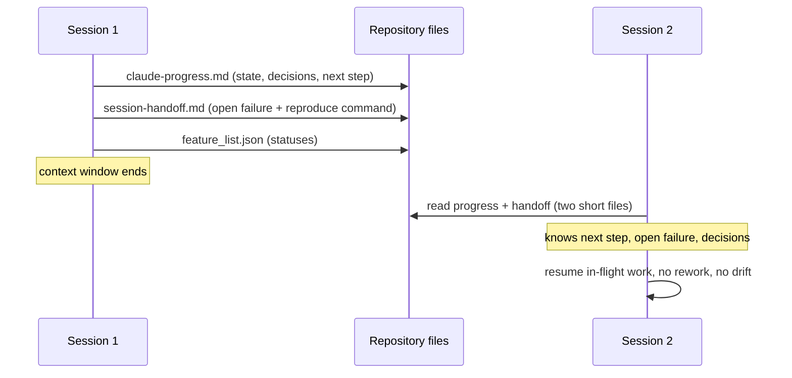

# Lecture 05: Why long-running tasks lose continuity

Context windows end; tasks don't. Every task longer than one session
crosses a boundary where the model's working memory is simply gone, and
this lecture defends one claim: continuity comes from externalized state
(progress, decisions, open failures, next step, written to files), not
from bigger windows or better recall.

## Learning objectives

After this lecture and its exercises you can:

- Trace what a fresh session loses at a boundary and what each continuity
  artifact restores.
- Compute rebuild cost, rework, and decision drift for the same task with
  and without handoff artifacts, from committed fixtures.
- Implement a handoff format that round-trips between markdown and JSON
  byte-identically, making the artifact machine-checkable.
- Orient a before/after comparison so its signs mean one declared thing.

## Prerequisites

- [Lecture 03](../lecture-03-why-the-repository-must-become-the-system-of-record/)
  (the repo as the agent's only memory) and its exercises;
  [Lecture 04](../lecture-04-why-one-giant-instruction-file-fails/) for
  what belongs where.
- A working toolchain (`make setup`, `make doctor`;
  [choosing your track](../../docs/choosing-your-track.md)).
- The glossary's [session](../../docs/glossary.md#working-discipline) and
  the [continuity artifacts](../../docs/glossary.md#harness-artifacts)
  (`claude-progress.md`, `session-handoff.md`).

## The problem

Session 1 runs half an hour, makes real progress, makes a real decision
(dates as ISO strings, not mtimes), and hits a real failure it knows how
to reproduce. Session 2 opens onto a repository and none of that: it
re-reads the tree, cannot tell that a feature was mid-flight, and
re-decides the settled question, sometimes differently. Anthropic's
engineering write-ups name both halves of this problem: agents need "a way
to bridge the gap between coding sessions" because most projects exceed
one context window, and models under a shrinking window can exhibit
"context anxiety", wrapping up prematurely as they approach what they
believe is their limit.

> Sources: [Anthropic: Effective harnesses for long-running agents](https://www.anthropic.com/engineering/effective-harnesses-for-long-running-agents) ·
> [Anthropic: Harness design for long-running application development](https://www.anthropic.com/engineering/harness-design-long-running-apps)

## Concepts

- **Sessions end; the boundary is a data-loss event** unless state is
  externalized. Compaction summarizes what was done but tends to lose
  *why*; the durable form of "why" is a written decision.
- **The continuity artifacts**
  ([glossary](../../docs/glossary.md#harness-artifacts)):
  `claude-progress.md` (verified state, session log, next best step) and
  `session-handoff.md` (verified now, changed, broken or unverified, next
  step, commands). Together with `feature_list.json` they answer the
  where-are-we question a fresh session cannot.
- **Rebuild cost**: what a session spends reacquiring context before doing
  work. The demo measures it in lines read: two short files with the
  artifacts, the whole repository without.
- **Rework and decision drift**: the quieter costs. Without state, a
  session restarts in-flight work; without recorded decisions, it re-makes
  them, sometimes differently, and drift compounds at every boundary.
- **Write the handoff before the window forces a summary**, a design
  heuristic this course applies to its own build: the handoff is cheap
  while you still know everything and expensive after compaction has
  chosen what to keep.

## Architecture

State crossing a session boundary is a handoff between actors over time,
so the diagram is a sequence:



Walkthrough: the three writes are session 1's last obligation and the only
channel that survives the boundary. Session 2's reads are the entire
rebuild: reacquisition cost is the line count of two short files, and the
recovered facts are exactly the four things it cannot otherwise know (next
step, open failure, decisions, statuses). Delete the writes and session
2's only channel is the repository's source tree: expensive to scan and
silent about intent, which is the no-handoff row in the demo below. The
demo's [SPEC.md](./code/SPEC.md) pins the timeline and every cost rule.

## Demo

`code/` contains **session-simulator**: a deterministic three-session
replay over a fixture workspace whose continuity artifacts are real files
(the progress file, the handoff, a schema-valid feature list, and a repo
map for the scan cost). Run it from the repo root:

### Python

```sh
L=lectures/lecture-05-why-long-running-tasks-lose-continuity
uv run python $L/code/python/main.py $L/code/fixtures/workspace --compare
```

### TypeScript

```sh
L=lectures/lecture-05-why-long-running-tasks-lose-continuity
pnpm exec tsx $L/code/typescript/main.ts $L/code/fixtures/workspace --compare
```

Both tracks print the same table; the per-session JSON reports (drop
`--compare`, add `--no-handoff` for the degraded mode) are pinned in
[`code/expected/`](./code/expected/). The block below is generated from
the Python run by `make verify` (the TypeScript run is held identical by
`make conformance`):

<!-- generated-block: uv run python lectures/lecture-05-why-long-running-tasks-lose-continuity/code/python/main.py lectures/lecture-05-why-long-running-tasks-lose-continuity/code/fixtures/workspace --compare -->
```text
mode | reacquisition_lines | features_completed | rework_sessions | drift_events
with-handoff | 76 | 3 | 0 | 0
no-handoff | 960 | 2 | 1 | 2
```
<!-- /generated-block -->

Interpretation: same task, same three sessions. With the artifacts, later
sessions pay two short files' worth of reading and finish everything.
Without them, each later session re-scans the repository, one session
restarts work that was mid-flight, the settled decision gets re-made
twice, and the third feature is never reached. Every number is computed
from the fixture files; none is typed into prose.

## Implementation notes

- **The progress file is append-mostly.** Overwrite only the "current
  verified state" block; the session log accumulates. A rewritten history
  is a handoff you can no longer trust
  ([template](../../library/templates/claude-progress.md)).
- **Record failures with a reproduce command.** "Broken: sort assertion,
  reproduce with `./verify.sh format-dates`" is resumable; "some tests
  flaky" is archaeology. The handoff's value concentrates in its most
  mechanical lines.
- **The wrong version of continuity** is relying on compaction alone: the
  summary keeps the code's *what* and sheds the decision's *why*, and the
  next session "improves" a deliberate choice away. Write decisions as
  decisions.
- **Machine-checkable beats well-written.** Exercise 01's round-trip law
  is the cheap way to keep the handoff format honest; once it parses, your
  tools (and your simulator, and your agent's startup step) can rely on
  it.
- Track note: every artifact in this lecture is markdown or schema-valid
  JSON, and this repository's own build practices the discipline
  (`build_state.json` and the session log it keeps are the same idea
  pointed at itself).

## Key takeaways

- Session boundaries destroy working memory by design; continuity is an
  artifact property, not a model property.
- Four facts must cross the boundary: next step, open failures with
  reproduce commands, decisions, and statuses. Two short files carry all
  four.
- Rebuild cost, rework, and drift are measurable; measure them instead of
  arguing about them.
- A handoff that round-trips through a parser is state; one that only
  reads well is prose.

## Exercises

| Exercise | You build | Difficulty | Time |
| --- | --- | --- | --- |
| [01: handoff-roundtrip](./exercises/exercise-01-handoff-roundtrip/) | The parse and render halves of a byte-exact handoff round-trip | Medium | ~35 min |
| [02: rebuild-cost](./exercises/exercise-02-rebuild-cost/) | The correctly-oriented savings comparison over the demo's two runs | Easy | ~20 min |

Both are graded by shared expected output: `./verify.sh --stack=<yours>`
exits 0 when your track's implementation is correct. The related project
for this lecture is Project 03 (multi-session continuity), which lands
with the projects phase of this course.

## Further exploration

- [Anthropic: Effective harnesses for long-running agents](https://www.anthropic.com/engineering/effective-harnesses-for-long-running-agents)
- [Anthropic: Harness design for long-running application development](https://www.anthropic.com/engineering/harness-design-long-running-apps)
- [OpenAI: Harness engineering: leveraging Codex in an agent-first world](https://openai.com/index/harness-engineering/)
- [Claude Code documentation](https://docs.claude.com/en/docs/claude-code/overview)
  on sessions and project memory
