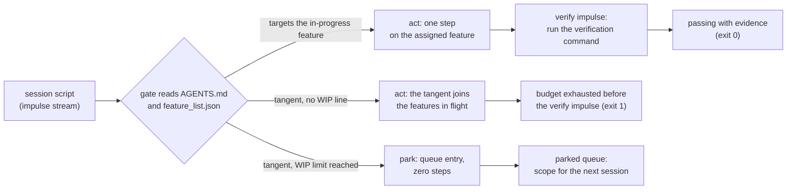

# Lecture 07: Why agents overreach and under-finish

Hand an agent one feature and it hands you back five started and none
finished. This lecture defends one claim: an agent given a task boundary
overreaches past it and under-finishes inside it, and the two are one
failure seen from two sides, because every step spent past the boundary
is a step the assigned feature's verification never gets. The boundary
that holds is the one the harness enforces: a WIP limit read from the
workspace, a queue that parks what the agent notices, and a `passing`
status that only evidence can set.

## Learning objectives

After this lecture and its exercises you can:

- Demonstrate, not assert, that the same worker with the same impulses
  and the same budget finishes nothing in an open workspace and one
  verified feature in a bounded one.
- Read a session report for both symptoms: features in flight past the
  boundary (overreach) and an assigned feature whose verification never
  ran (under-finish).
- Audit a session's change log against the scope surface, so drift into
  queued and invented features becomes a verdict with an exit code.
- Make `passing` an evidence transition: only the feature's own
  verification command, recorded as a passing run, backs the claim.
- Explain why parking an impulse (zero steps, provocation recorded)
  keeps a boundary credible where a bare refusal does not.

## Prerequisites

- [Lecture 05](../lecture-05-why-long-running-tasks-lose-continuity/):
  the feature list as the state that survives sessions; this lecture
  reads it as the scope surface.
- [Lecture 06](../lecture-06-why-initialization-needs-its-own-phase/):
  a gate at session start; this lecture's gate runs during the session,
  on every impulse.
- A working toolchain (`make setup`, `make doctor`;
  [choosing your track](../../docs/choosing-your-track.md)).
- The glossary's [WIP=1, scope surface, and evidence-based
  completion](../../docs/glossary.md#working-discipline) entries, and the
  [feature status](../../docs/glossary.md#harness-artifacts) state
  machine (`not-started`, `in-progress`, `blocked`, `passing`).

## The problem

You ask for the search endpoint. The agent wires the route, notices the
routes file has no delete handler and starts one, notices two handlers
return different error shapes and reworks both, adds a rate limiter
while it is in the router, moves the tests while it is in the tests.
Two hours later five features are touched, none passes end to end, and
the search endpoint's own tests were never run. Anthropic's write-up on
long-running agents reports both halves from their own harness: the
coding agent "tended to try to do too much at once", ran out of context
mid-implementation "leaving the next session to start with a feature
half-implemented and undocumented", and the fix that worked was to ask
it "to work on only one feature at a time", an incremental approach they
found "critical to addressing the agent's tendency to do too much at
once."

> Source: [Anthropic: Effective harnesses for long-running agents](https://www.anthropic.com/engineering/effective-harnesses-for-long-running-agents)

This lecture makes that observation reproducible on committed fixtures:
the same scripted worker, the same stream of impulses, one line of
difference in the workspace, and the outcome in the exit code.

## Concepts

- **Overreach** is a state, not a mood: more features `in-progress` than
  the boundary allows. The demo's open workspace reaches five, and each
  activation is an event in the report (`scope crossed: n features in
  flight`).
- **Under-finish** is the assigned feature ending the session without
  its verification having run. Code that looks complete is not the
  criterion; the recorded run is. In the demo the verify impulse is
  exactly the step the open workspace's budget runs out of.
- **One budget, two symptoms.** The tangents cost six steps; the
  verification needed one. That arithmetic is the whole mechanism, which
  is why a larger budget lets the open workspace finish (the pinned
  `open-scope-big-budget` case) and a finite one does not.
- **The WIP limit** ([glossary](../../docs/glossary.md#working-discipline))
  is a rule the harness reads, not a request the prompt makes: the demo
  derives its behavior from a `- WIP limit: 1` line in `AGENTS.md` and a
  feature list with one `in-progress` entry. Delete the line and the
  worker's behavior changes; rephrase the line and it does not.
- **Completion evidence** ([glossary](../../docs/glossary.md#working-discipline)):
  `passing` is reachable only by acting on the feature's verification
  command, and exercise 02 makes the gate check that the recorded
  evidence names that command and a passing run, not a typecheck and not
  a failing run.
- **The parked queue is the scope surface for the next session.** A
  boundary that only says no loses the idea; the demo's gate records the
  feature, the action, what provoked it, and how many times it came back,
  for zero steps. Refusal becomes handoff.

## Architecture

The mechanism under study is a gate applied to every impulse during the
session, so the diagram is the flow of one impulse through it:



Walkthrough: the script never changes; the gate's middle branch exists
only when `AGENTS.md` draws the boundary. Without it every tangent takes
the `act` branch, and the assigned feature's verify impulse, last in the
script by construction (you verify after you implement), is the first
thing a finite budget cannot afford. With it every tangent takes the
`park` branch, which costs nothing and writes the queue the next session
reads. The demo's [SPEC.md](./code/SPEC.md) pins the gate rule, the step
costs, and the event strings the diagram summarizes.

## Demo

`code/` contains **scope-run**: a deterministic scripted worker, one
session script (twelve step impulses, six on the assigned
`search-endpoint` and six tangents across four other features, then the
assigned feature's verify), and two workspaces whose `feature_list.json`
files are byte-identical and whose `AGENTS.md` files differ by exactly
one line. The worker has a twelve-step budget; **the exit code is the
verdict** (1 = the assigned feature never reached `passing`). Run it from
the repo root.

### The open workspace: everything starts, nothing lands

#### Python

<!-- fence-exit: 1 -->
```sh
L=lectures/lecture-07-why-agents-overreach-and-under-finish
uv run python $L/code/python/main.py $L/code/fixtures/workspaces/open-scope $L/code/fixtures/session-script.json
```

#### TypeScript

<!-- fence-exit: 1 -->
```sh
L=lectures/lecture-07-why-agents-overreach-and-under-finish
pnpm exec tsx $L/code/typescript/main.ts $L/code/fixtures/workspaces/open-scope $L/code/fixtures/session-script.json
```

The transcript, generated from the Python run by `make verify` (the
TypeScript run is held identical by `make conformance`):

<!-- generated-block: uv run python lectures/lecture-07-why-agents-overreach-and-under-finish/code/python/main.py lectures/lecture-07-why-agents-overreach-and-under-finish/code/fixtures/workspaces/open-scope lectures/lecture-07-why-agents-overreach-and-under-finish/code/fixtures/session-script.json || true -->
```json
{
  "workspace": "open-scope",
  "wip_limit": null,
  "assigned": "search-endpoint",
  "budget": 12,
  "events": [
    {
      "step": 1,
      "feature": "search-endpoint",
      "action": "wire the search route skeleton",
      "outcome": "progress on the assigned feature (step 1)"
    },
    {
      "step": 2,
      "feature": "search-endpoint",
      "action": "parse and validate the query parameters",
      "outcome": "progress on the assigned feature (step 2)"
    },
    {
      "step": 3,
      "feature": "delete-endpoint",
      "action": "start the delete route handler",
      "outcome": "scope crossed: 2 features in flight"
    },
    {
      "step": 4,
      "feature": "search-endpoint",
      "action": "implement result ranking",
      "outcome": "progress on the assigned feature (step 3)"
    },
    {
      "step": 5,
      "feature": "error-shapes",
      "action": "rework the error response shape",
      "outcome": "scope crossed: 3 features in flight"
    },
    {
      "step": 6,
      "feature": "delete-endpoint",
      "action": "add the delete confirmation flow",
      "outcome": "the tangent deepens; the assigned feature waits"
    },
    {
      "step": 7,
      "feature": "search-endpoint",
      "action": "add result pagination",
      "outcome": "progress on the assigned feature (step 4)"
    },
    {
      "step": 8,
      "feature": "rate-limiting",
      "action": "add a rate limiter to the router",
      "outcome": "scope crossed: 4 features in flight"
    },
    {
      "step": 9,
      "feature": "test-layout",
      "action": "move the route tests next to the routes",
      "outcome": "scope crossed: 5 features in flight"
    },
    {
      "step": 10,
      "feature": "search-endpoint",
      "action": "format the response payload",
      "outcome": "progress on the assigned feature (step 5)"
    },
    {
      "step": 11,
      "feature": "error-shapes",
      "action": "apply the new error shape to the search route",
      "outcome": "the tangent deepens; the assigned feature waits"
    },
    {
      "step": 12,
      "feature": "search-endpoint",
      "action": "add the search endpoint tests",
      "outcome": "progress on the assigned feature (step 6)"
    }
  ],
  "parked": [],
  "steps_spent": 12,
  "steps_on_assigned": 6,
  "steps_on_tangents": 6,
  "features_started": 5,
  "features_passing": 0,
  "in_progress_at_end": [
    "search-endpoint",
    "delete-endpoint",
    "error-shapes",
    "rate-limiting",
    "test-layout"
  ],
  "assigned_verified": false
}
```
<!-- /generated-block -->

Interpretation: every tangent is acted on the moment it is noticed, so
the boundary is crossed four times and five features are in flight by
step 9. The assigned feature's six implementation steps all happen, and
its last one lands on step 12, the last step there is; the verify impulse
is next in the script and never runs. `features_passing: 0`,
`assigned_verified: false`, exit 1. Nothing in this transcript is
narrated: every event is derived from the workspace files and the script
by the rules in the SPEC.

### The bounded workspace: the same impulses, one verified feature

Same worker, same script, same budget; the only change is the
`- WIP limit: 1` line in
[`bounded-scope/AGENTS.md`](./code/fixtures/workspaces/bounded-scope/AGENTS.md)
(exit 0):

#### Python

```sh
L=lectures/lecture-07-why-agents-overreach-and-under-finish
uv run python $L/code/python/main.py $L/code/fixtures/workspaces/bounded-scope $L/code/fixtures/session-script.json
```

#### TypeScript

```sh
L=lectures/lecture-07-why-agents-overreach-and-under-finish
pnpm exec tsx $L/code/typescript/main.ts $L/code/fixtures/workspaces/bounded-scope $L/code/fixtures/session-script.json
```

<!-- generated-block: uv run python lectures/lecture-07-why-agents-overreach-and-under-finish/code/python/main.py lectures/lecture-07-why-agents-overreach-and-under-finish/code/fixtures/workspaces/bounded-scope lectures/lecture-07-why-agents-overreach-and-under-finish/code/fixtures/session-script.json -->
```json
{
  "workspace": "bounded-scope",
  "wip_limit": 1,
  "assigned": "search-endpoint",
  "budget": 12,
  "events": [
    {
      "step": 1,
      "feature": "search-endpoint",
      "action": "wire the search route skeleton",
      "outcome": "progress on the assigned feature (step 1)"
    },
    {
      "step": 2,
      "feature": "search-endpoint",
      "action": "parse and validate the query parameters",
      "outcome": "progress on the assigned feature (step 2)"
    },
    {
      "step": 3,
      "feature": "search-endpoint",
      "action": "implement result ranking",
      "outcome": "progress on the assigned feature (step 3)"
    },
    {
      "step": 4,
      "feature": "search-endpoint",
      "action": "add result pagination",
      "outcome": "progress on the assigned feature (step 4)"
    },
    {
      "step": 5,
      "feature": "search-endpoint",
      "action": "format the response payload",
      "outcome": "progress on the assigned feature (step 5)"
    },
    {
      "step": 6,
      "feature": "search-endpoint",
      "action": "add the search endpoint tests",
      "outcome": "progress on the assigned feature (step 6)"
    },
    {
      "step": 7,
      "feature": "search-endpoint",
      "action": "run the verification command (./verify.sh --feature search-endpoint)",
      "outcome": "pass: search-endpoint moves to passing with evidence"
    }
  ],
  "parked": [
    {
      "feature": "delete-endpoint",
      "action": "start the delete route handler",
      "noticed": "the routes file has no delete handler",
      "noticed_at_step": 2,
      "times_provoked": 2
    },
    {
      "feature": "error-shapes",
      "action": "rework the error response shape",
      "noticed": "two handlers return different error shapes",
      "noticed_at_step": 3,
      "times_provoked": 2
    },
    {
      "feature": "rate-limiting",
      "action": "add a rate limiter to the router",
      "noticed": "nothing throttles repeated queries",
      "noticed_at_step": 4,
      "times_provoked": 1
    },
    {
      "feature": "test-layout",
      "action": "move the route tests next to the routes",
      "noticed": "test files sit in three different places",
      "noticed_at_step": 4,
      "times_provoked": 1
    }
  ],
  "steps_spent": 7,
  "steps_on_assigned": 7,
  "steps_on_tangents": 0,
  "features_started": 1,
  "features_passing": 1,
  "in_progress_at_end": [],
  "assigned_verified": true
}
```
<!-- /generated-block -->

The same six tangent impulses arrived; the gate parked all of them, two
of them twice, and recorded what provoked each. The assigned feature
finishes verified at step 7 with five steps unspent, and the parked
queue is the next session's scope, already written down. The worker did
not become more disciplined between the two runs; the workspace did.

### Supporting evidence: what the boundary is worth

The metric, after the behavior: give the open workspace a budget of 18
and it does finish (exit 0), which pins the claim precisely. The
failure is not that the task became impossible; it is that overreach
moved the finish line past a finite budget.

#### Python

```sh
L=lectures/lecture-07-why-agents-overreach-and-under-finish
uv run python $L/code/python/main.py $L/code/fixtures/workspaces/open-scope $L/code/fixtures/session-script.json --budget 18
```

#### TypeScript

```sh
L=lectures/lecture-07-why-agents-overreach-and-under-finish
pnpm exec tsx $L/code/typescript/main.ts $L/code/fixtures/workspaces/open-scope $L/code/fixtures/session-script.json --budget 18
```

The summary of that run, generated from the Python track by
`make verify` (the full report is pinned in
[`code/expected/open-scope-big-budget.json`](./code/expected/open-scope-big-budget.json)):

<!-- generated-block: uv run python lectures/lecture-07-why-agents-overreach-and-under-finish/code/python/main.py lectures/lecture-07-why-agents-overreach-and-under-finish/code/fixtures/workspaces/open-scope lectures/lecture-07-why-agents-overreach-and-under-finish/code/fixtures/session-script.json --budget 18 | uv run python -c "import json,sys; r=json.load(sys.stdin); print(json.dumps({k: r[k] for k in ('budget','steps_spent','steps_on_tangents','features_started','features_passing','in_progress_at_end','assigned_verified')}, indent=2))" -->
```json
{
  "budget": 18,
  "steps_spent": 13,
  "steps_on_tangents": 6,
  "features_started": 5,
  "features_passing": 1,
  "in_progress_at_end": [
    "delete-endpoint",
    "error-shapes",
    "rate-limiting",
    "test-layout"
  ],
  "assigned_verified": true
}
```
<!-- /generated-block -->

Thirteen steps to the first verified feature against the bounded
workspace's seven, and four half-built features left for the next
session to trip over. The boundary bought six steps on this script and
left nothing behind; no figure in this lecture was typed by hand.

## Implementation notes

- **Make the boundary a line the harness reads.** The demo's worker
  regex-matches `- WIP limit: N` in `AGENTS.md` and takes the assigned
  task from the feature list's single `in-progress` entry. That is also
  the shape a real harness needs: a rule a doctor can check, which is
  exactly what [Project 04](../../projects/project-04-runtime-feedback-and-scope-control/)'s
  `wip-limit` check does at scale.
- **Park, do not argue.** A gate that only refuses trains the model (and
  the humans behind it) to route around it, the same credibility lesson
  as lecture 06's advice tier. Parking costs zero steps and keeps the
  provocation, so the refused idea is deferred rather than lost, and the
  queue doubles as the handoff lecture 05 asked for.
- **Count the verification step.** Under-finish is invisible if "done"
  means the implementation steps completed; the open transcript looks
  finished at step 12 by that measure. The only honest counter is the
  recorded verification run, and exercise 02 makes the gate refuse
  substitutes for it.
- **The one-line ablation is the controlled-variable method**
  ([glossary](../../docs/glossary.md#working-discipline)) applied to a
  scope rule: byte-identical feature lists, one line of `AGENTS.md`
  difference, the same script, and every other difference in the reports
  follows from it.
- Cross-track note: `in_progress_at_end` and `parked` are emitted in
  feature-list and first-parked order in both tracks, because the
  normalizer canonicalizes keys and never sorts arrays; the SPEC carries
  that ordering obligation so the tracks cannot drift on it. The session
  script is the seam where a real model sits; the deterministic fake
  agent ([glossary](../../docs/glossary.md#core-model)) replays it so the
  demo is offline and reproducible.

## Key takeaways

- Overreach and under-finish are one budget seen from two sides: steps
  spent past the boundary are verification the assigned feature never
  gets.
- The boundary lives in the workspace (a WIP line and a feature list
  with one active entry), not in the tone of the prompt.
- `passing` is an evidence transition, reachable only through the
  feature's own verification command.
- Park what you notice: a queue entry costs nothing, keeps the idea, and
  becomes the next session's scope.
- Fewer things finished with evidence beat more things started; the
  demo's scoreboard is the argument.

## Exercises

| Exercise | You build | Difficulty | Time |
| --- | --- | --- | --- |
| [01: scope-auditor](./exercises/exercise-01-scope-auditor/) | The in-scope rule that separates work from drift | Medium | ~30 min |
| [02: completion-gate](./exercises/exercise-02-completion-gate/) | The evidence rule that makes passing mean verified | Easy | ~25 min |

Both are graded by shared expected output: `./verify.sh --stack=<yours>`
exits 0 when your track's implementation is correct. The related project
for this lecture is
[Project 04: runtime feedback and scope control](../../projects/project-04-runtime-feedback-and-scope-control/),
whose WIP=1 doctor check is this lecture's scope-control mechanism
industrialized.

## Further exploration

- [Anthropic: Effective harnesses for long-running agents](https://www.anthropic.com/engineering/effective-harnesses-for-long-running-agents),
  the one-feature-at-a-time finding this lecture reproduces
- [Anthropic: Harness design for long-running application development](https://www.anthropic.com/engineering/harness-design-long-running-apps)
- [OpenAI: Harness engineering: leveraging Codex in an agent-first world](https://openai.com/index/harness-engineering/)
- [Claude Code documentation](https://docs.claude.com/en/docs/claude-code/overview)
  on project instruction files, where a WIP rule lives in practice
