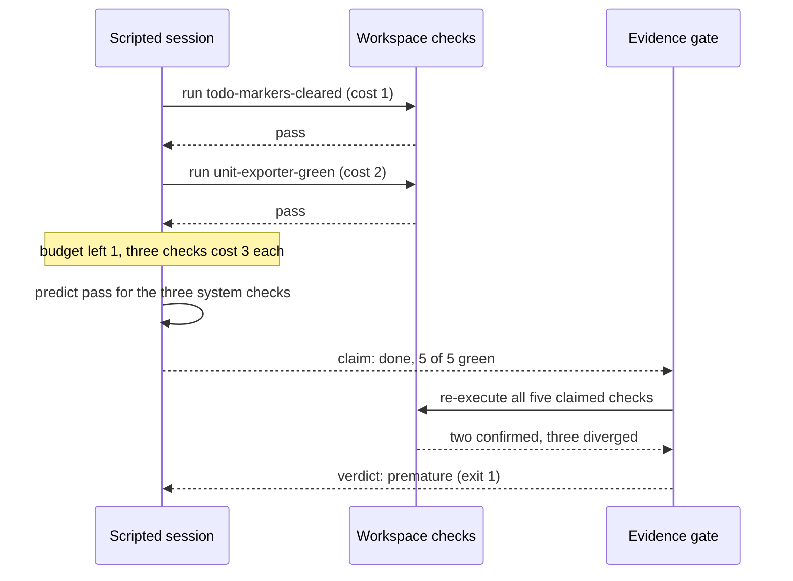

# Lecture 08: Why agents declare victory too early

A session declares done while checks it never ran still fail, and the
declaration stands until something outside the session re-executes those
checks. This lecture defends that single claim with a scripted session
caught in the act, and builds the gate that catches it: re-execution, not
review, is what separates an earned completion claim from a premature
one.

## Learning objectives

After this lecture and its exercises you can:

- Show behaviorally, not by assertion, how a locally honest session
  produces a false completion claim: it executes the checks it can
  afford and predicts the rest green.
- Build an evidence gate whose report is claim versus re-executed check
  and whose verdict is the exit code.
- Audit a recorded claim against the workspace as it is now, treating
  recorded evidence as input to the audit rather than proof.
- Run termination checks as a layered procedure that stops at the first
  failing layer and never prints unearned results.

## Prerequisites

- [Lecture 01](../lecture-01-why-capable-agents-still-fail/): the
  verification gap and the `claim-without-passing-verification` event;
  this lecture is that event at the moment it happens.
- [Lecture 05](../lecture-05-why-initialization-needs-its-own-phase/):
  the doctor pattern, a verdict carried by an exit code, which this
  lecture points at finished work instead of a starting repository.
- [Lecture 07](../lecture-07-why-feature-lists-are-harness-primitives/):
  the feature list whose `passing` status only evidence can set; this
  lecture is about the moment that evidence is claimed.
- A working toolchain (`make setup`, `make doctor`;
  [choosing your track](../../docs/choosing-your-track.md)).
- The glossary's
  [evidence-based completion](../../docs/glossary.md#working-discipline)
  and [maker/checker split](../../docs/glossary.md#working-discipline)
  entries.

## The problem

You ask for csv export in a small reporting tool. The session writes the
exporter, wires the config read, runs the linter and the unit suite, sees
green twice, and reports: done. You try it and nothing arrives.
Everything the session actually executed passed. Everything it did not
execute was where the work was unfinished.

The pattern has a measured basis outside of agents. Guo et al. showed
that modern neural networks are miscalibrated in one direction: the
confidence they report runs ahead of the accuracy they achieve.

> Source: [On Calibration of Modern Neural Networks (Guo et al., 2017)](https://arxiv.org/abs/1706.04599)

Anthropic's harness write-up reports the agent-scale version: a model
asked to evaluate its own output rated it more favorably than a human
would, and the harness that produced working software separated the
evaluator from the generator and had the evaluator exercise the
application instead of reading the code.

> Source: [Anthropic: Harness design for long-running application development](https://www.anthropic.com/engineering/harness-design-long-running-apps)

## Concepts

- **Premature completion declaration**: a done claim that stands while
  a declared check would fail if run. The demo's session makes one in
  step 9 of a 9-step transcript, and its exit code is 0, because the
  session's own loop contains nothing that disputes it.
- **Local honesty, global falsehood**: the session is not lying. Every
  check it ran passed; the claim is wrong about the checks it predicted.
  That is calibration bias in mechanical form: confidence extended from
  the executed to the unexecuted.
- **A claim is input, never a verdict**
  ([evidence-based completion](../../docs/glossary.md#working-discipline)):
  the gate reads the claim only to learn which checks were claimed. It
  does not weigh the session's reasoning; it runs the checks.
- **Re-execution over review**: reading a claim's evidence string is
  review, and it inherits the claim's blind spots. Running the check is
  re-execution, and it has none. Exercise 01 makes the difference cost
  something: the recorded evidence is byte-for-byte true at the time it
  was written.
- **Externalized termination criteria**: the workspace's `checks.json`
  is the definition of done, owned by the harness, not by the session.
  The session may skip a check; it may not remove one from the list the
  gate will run.
- **Layered termination**: static checks, then tests, then system-level
  runs, with nothing executed beyond the first failing layer. Exercise 02
  builds it; the demo's seeded gaps all sit in the layer the session
  never reached.
- **This unit's checks are language-neutral**: each check is an
  executable probe over workspace files, the deterministic stand-in for
  a shell command
  ([deterministic fake agent](../../docs/glossary.md#core-model)), and
  the same `checks.json` drives both tracks to identical reports.

## Architecture

The mechanism is an interaction over time between the session, the
checks it may run, and the gate that runs them again, so the diagram is a
sequence:



The session and the gate use the same checks and the same
engine; the only difference is who decides which checks run. The session
decides by budget and stops when the money runs out; the gate has no
budget and runs the claimed list. The three diverged rows are exactly the
three predicted ones, which is not a coincidence of this fixture but the
shape of the failure: prediction fills in wherever execution was
skipped. The demo's [SPEC.md](./code/SPEC.md) pins the session policy,
the check engine, and the seeded gaps behind each diverged row.

## Demo

`code/` contains **claim-gate**: two fixture workspaces that declare the
same five checks over the same task, `workspace-premature` (three
system-layer gaps) and `workspace-earned` (finished), and two surfaces
over them. `session` replays a deterministic scripted session that
reaches its completion decision with a 4-step check budget, executes what
it can afford, predicts the rest, and declares done. `gate` replays that
session to obtain the claim, then re-executes every claimed check. Run
both from the repo root; **the gate's exit code is the verdict**.

### The declaration that sticks

#### Python

```sh
L=lectures/lecture-08-why-agents-declare-victory-too-early
uv run python $L/code/python/main.py session $L/code/fixtures/workspaces/workspace-premature
```

#### TypeScript

```sh
L=lectures/lecture-08-why-agents-declare-victory-too-early
pnpm exec tsx $L/code/typescript/main.ts session $L/code/fixtures/workspaces/workspace-premature
```

The transcript, generated from the Python run by `make verify` (the
TypeScript run is held identical by `make conformance`):

<!-- generated-block: uv run python lectures/lecture-08-why-agents-declare-victory-too-early/code/python/main.py session lectures/lecture-08-why-agents-declare-victory-too-early/code/fixtures/workspaces/workspace-premature -->
```json
{
  "workspace": "workspace-premature",
  "task": "add csv export to the report tool",
  "check_budget": 4,
  "events": [
    {
      "step": 1,
      "action": "implement the export writer",
      "outcome": "src/export.txt updated"
    },
    {
      "step": 2,
      "action": "add the export unit test",
      "outcome": "tests/unit-export.txt updated"
    },
    {
      "step": 3,
      "action": "wire the config read",
      "outcome": "src/export.txt reads export_dir from config/app.conf"
    },
    {
      "step": 4,
      "action": "run check todo-markers-cleared (cost 1)",
      "outcome": "executed: pass (src/export.txt carries no TODO marker); budget left 3"
    },
    {
      "step": 5,
      "action": "run check unit-exporter-green (cost 2)",
      "outcome": "executed: pass (tests/unit-export.txt has a line starting with result=pass); budget left 1"
    },
    {
      "step": 6,
      "action": "consider check config-export-dir (cost 3)",
      "outcome": "cost exceeds budget left 1; predicted pass from the code just written"
    },
    {
      "step": 7,
      "action": "consider check migration-applied (cost 3)",
      "outcome": "cost exceeds budget left 1; predicted pass from the code just written"
    },
    {
      "step": 8,
      "action": "consider check e2e-export-ran (cost 3)",
      "outcome": "cost exceeds budget left 1; predicted pass from the code just written"
    },
    {
      "step": 9,
      "action": "declare done",
      "outcome": "claim: 5/5 checks green (2 executed, 3 predicted)"
    }
  ],
  "claim": {
    "done": true,
    "checks": [
      {
        "id": "todo-markers-cleared",
        "status": "pass",
        "basis": "executed"
      },
      {
        "id": "unit-exporter-green",
        "status": "pass",
        "basis": "executed"
      },
      {
        "id": "config-export-dir",
        "status": "pass",
        "basis": "predicted"
      },
      {
        "id": "migration-applied",
        "status": "pass",
        "basis": "predicted"
      },
      {
        "id": "e2e-export-ran",
        "status": "pass",
        "basis": "predicted"
      }
    ],
    "executed": 2,
    "predicted": 3
  }
}
```
<!-- /generated-block -->

Interpretation: steps 4 and 5 are real executions and both pass. Steps
6 through 8 are the mechanism under study: each check costs more than
the budget left, so the session extends its confidence from the code it
just wrote and records a pass it never observed. Step 9 declares done on
five green checks, and the command exits 0. Nothing in the transcript is
narrated; every check outcome comes from the same engine the gate uses,
and every prediction is a budget decision the SPEC pins. The session's
exit code is not a bug: it reports that the session ran to its
declaration, and there is nothing inside the session that could report
more.

### The gate that re-executes the claim

#### Python

<!-- fence-exit: 1 -->
```sh
L=lectures/lecture-08-why-agents-declare-victory-too-early
uv run python $L/code/python/main.py gate $L/code/fixtures/workspaces/workspace-premature
```

#### TypeScript

<!-- fence-exit: 1 -->
```sh
L=lectures/lecture-08-why-agents-declare-victory-too-early
pnpm exec tsx $L/code/typescript/main.ts gate $L/code/fixtures/workspaces/workspace-premature
```

<!-- generated-block: uv run python lectures/lecture-08-why-agents-declare-victory-too-early/code/python/main.py gate lectures/lecture-08-why-agents-declare-victory-too-early/code/fixtures/workspaces/workspace-premature || true -->
```json
{
  "workspace": "workspace-premature",
  "claim": {
    "done": true,
    "green": 5,
    "executed": 2,
    "predicted": 3
  },
  "reexecution": [
    {
      "id": "todo-markers-cleared",
      "layer": "static",
      "claimed": "pass",
      "basis": "executed",
      "actual": "pass",
      "detail": "src/export.txt carries no TODO marker",
      "verdict": "confirmed"
    },
    {
      "id": "unit-exporter-green",
      "layer": "tests",
      "claimed": "pass",
      "basis": "executed",
      "actual": "pass",
      "detail": "tests/unit-export.txt has a line starting with result=pass",
      "verdict": "confirmed"
    },
    {
      "id": "config-export-dir",
      "layer": "system",
      "claimed": "pass",
      "basis": "predicted",
      "actual": "fail",
      "detail": "config/app.conf has no line starting with export_dir=",
      "verdict": "diverged"
    },
    {
      "id": "migration-applied",
      "layer": "system",
      "claimed": "pass",
      "basis": "predicted",
      "actual": "fail",
      "detail": "db/schema.version version=3 but db/applied.txt applied=2",
      "verdict": "diverged"
    },
    {
      "id": "e2e-export-ran",
      "layer": "system",
      "claimed": "pass",
      "basis": "predicted",
      "actual": "fail",
      "detail": "logs/e2e-export.log missing",
      "verdict": "diverged"
    }
  ],
  "verdict": {
    "divergences": 3,
    "result": "premature"
  }
}
```
<!-- /generated-block -->

Interpretation: the same five checks, run by something with no budget
and no confidence to extend. The two executed rows confirm, which is
what the session's local honesty amounts to. The three predicted rows
diverge, and each detail names the exact gap: the missing config line,
the migration recorded through 2 against a schema at 3, the log the
end-to-end run would have written. The verdict is `premature` and the
exit code is 1; the divergence count is supporting detail, not the
finding. The claim did not change between the two commands. What
changed is that something re-ran the checks.

### The same session over finished work

#### Python

```sh
L=lectures/lecture-08-why-agents-declare-victory-too-early
uv run python $L/code/python/main.py gate $L/code/fixtures/workspaces/workspace-earned
```

#### TypeScript

```sh
L=lectures/lecture-08-why-agents-declare-victory-too-early
pnpm exec tsx $L/code/typescript/main.ts gate $L/code/fixtures/workspaces/workspace-earned
```

The verdict and the per-row outcomes, generated from the Python run by
`make verify` (the full report is pinned in
[`code/expected/gate-earned.json`](./code/expected/gate-earned.json)):

<!-- generated-block: uv run python lectures/lecture-08-why-agents-declare-victory-too-early/code/python/main.py gate lectures/lecture-08-why-agents-declare-victory-too-early/code/fixtures/workspaces/workspace-earned | uv run python -c "import json,sys; r=json.load(sys.stdin); print(json.dumps({'verdict': r['verdict'], 'rows': [[row['id'], row['basis'], row['verdict']] for row in r['reexecution']]}, indent=2))" -->
```json
{
  "verdict": {
    "divergences": 0,
    "result": "earned"
  },
  "rows": [
    [
      "todo-markers-cleared",
      "executed",
      "confirmed"
    ],
    [
      "unit-exporter-green",
      "executed",
      "confirmed"
    ],
    [
      "config-export-dir",
      "predicted",
      "confirmed"
    ],
    [
      "migration-applied",
      "predicted",
      "confirmed"
    ],
    [
      "e2e-export-ran",
      "predicted",
      "confirmed"
    ]
  ]
}
```
<!-- /generated-block -->

Interpretation: the session predicted the same three checks here, and
this time the predictions were right. That does not make the session's
claim evidence; it makes it lucky. The gate's confirmed rows are what
turned luck into evidence, and exit 0 is the first point in either run
where "done" was backed by execution.

### Supporting evidence: the claim is blind to the workspace

The `session` surface prints one transcript per workspace. The two
pinned transcripts, compared by `make verify`:

<!-- generated-block: diff lectures/lecture-08-why-agents-declare-victory-too-early/code/expected/session-premature.json lectures/lecture-08-why-agents-declare-victory-too-early/code/expected/session-earned.json || true -->
```text
2c2
<   "workspace": "workspace-premature",
---
>   "workspace": "workspace-earned",
```
<!-- /generated-block -->

One line differs, and it is the directory name. Every event, every
recorded outcome, and the whole claim are identical between the
workspace with three gaps and the workspace with none. This is the
precise sense in which a completion claim carries no information about
completion: from inside the session, the premature claim and the earned
one are the same object. Only re-execution tells them apart.

## Implementation notes

- **Own the definition of done outside the session.** The demo's
  `checks.json` belongs to the workspace, and the gate runs whatever it
  lists. The same discipline in an entry file is short; this module's
  own [AGENTS.md](../../AGENTS.md) carries it as a checklist that names
  commands, and a project-level version reads like:

  ```text
  ## Definition of done
  - Done means every listed check passed in this session, not "code is written".
  - Static checks, then the test suite, then the end-to-end run; stop at the first failure.
  - A check that was not run is not passing; say so in the claim.
  ```

- **Make failure details name the fix.** Every detail string in the
  engine names the file and the missing line or disagreeing value
  (`config/app.conf has no line starting with export_dir=`), so the
  session that reads the gate's report knows where to go next. A gate
  that says only "system layer failed" has verified something and taught
  nothing.
- **Cost is the mechanism, so spend it in the right order.** The demo's
  session skipped the expensive checks and predicted them; the seeded
  gaps live there because that is where skipping happens. Exercise 02's
  gate runs cheap layers first and stops at a failure, which puts the
  expensive checks behind the cheap ones instead of behind a prediction.
- **Any edit after a check invalidates the check.** Exercise 01's trap
  is a recorded pass that was true when written. Refactoring, cleanup,
  and "while I'm here" changes after the last verified run reopen every
  claim that run supported; the gate's answer is to re-execute, and the
  session's answer is to verify last.
- Track note: the check engine reads workspace files line by line in both
  tracks; the TypeScript track splits on `/\r?\n/` per the conventions'
  input line-ending rule, and the conformance runner holds the two
  reports byte-identical after normalization.

## Key takeaways

- A completion claim is a statement about the checks a session ran; it
  says nothing about the ones it skipped, and skipping is where the
  work is unfinished.
- The claim sticks by default: a session's exit code cannot dispute its
  own declaration. Something outside the session must re-run the checks.
- Re-execute, do not review: an evidence string is the session's belief
  written down, and the workspace may have moved since.
- Run termination in layers, cheap first, and print nothing beyond the
  first failure; unearned green rows are how premature claims get
  believed.

## Exercises

| Exercise | You build | Difficulty | Time |
| --- | --- | --- | --- |
| [01: claim-audit](./exercises/exercise-01-claim-audit/) | The audit that re-executes a recorded claim instead of trusting its evidence | Medium | ~30 min |
| [02: layered-gate](./exercises/exercise-02-layered-gate/) | The termination gate that stops at the first failing layer | Easy | ~20 min |

Both are graded by shared expected output: `./verify.sh --stack=<yours>`
exits 0 when your track's implementation is correct. The related project
for this lecture is
[Project 05: self-verification and role separation](../../projects/project-05-self-verification-and-role-separation/),
whose single-role transcript is this lecture's failure replayed under a
rubric.

## Further exploration

- [On Calibration of Modern Neural Networks (Guo et al., 2017)](https://arxiv.org/abs/1706.04599),
  the measured overconfidence this lecture's mechanism mirrors
- [Anthropic: Harness design for long-running application development](https://www.anthropic.com/engineering/harness-design-long-running-apps),
  the generator/evaluator separation and what it caught
- [Anthropic: Building effective agents](https://www.anthropic.com/engineering/building-effective-agents),
  on grounding an agent's loop in results from the environment
- [OpenAI: Harness engineering: leveraging Codex in an agent-first world](https://openai.com/index/harness-engineering/),
  on failure messages that tell the agent what to do next
