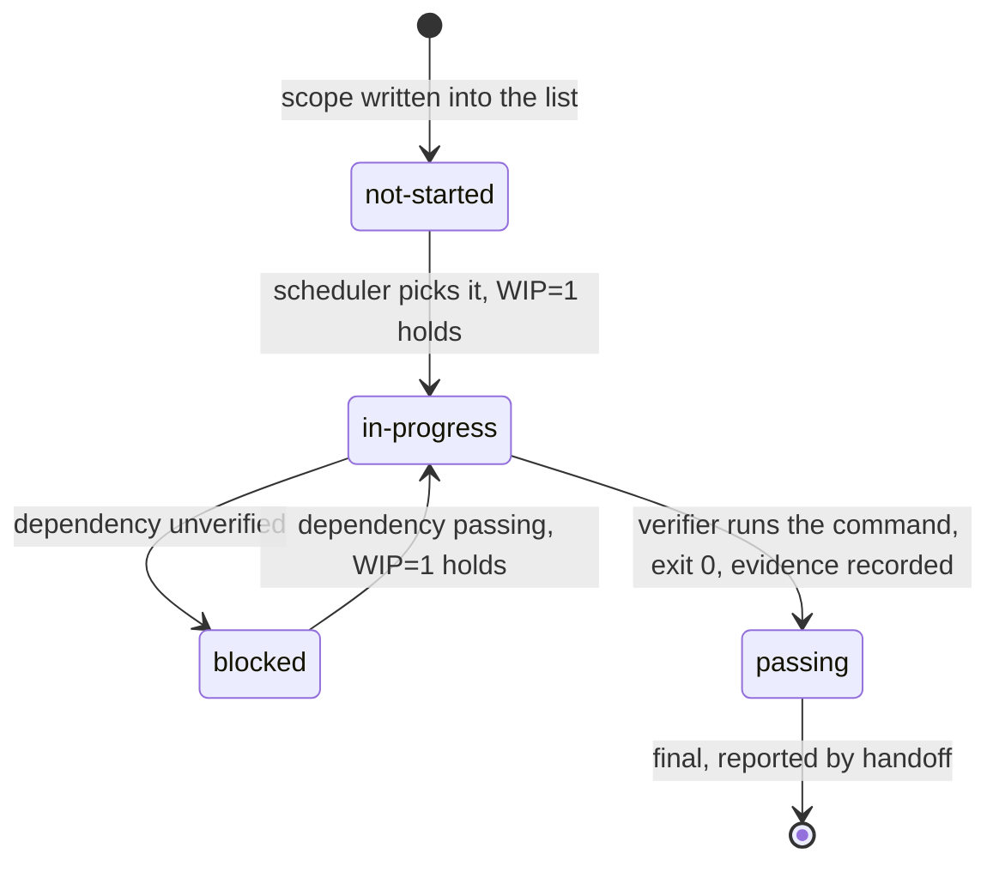

# Lecture 08: Why feature lists are harness primitives

An agent that tracks its work in prose ends by claiming done; an agent
whose work is tracked in a feature list with verification commands ends
by being done or saying precisely what is not. This lecture defends one
claim: `feature_list.json` is not a memo for humans, it is a data
structure the harness executes against, and the same session working the
same project ends differently depending on which of the two it was given.

## Learning objectives

After this lecture and its exercises you can:

- Show, with a deterministic replay, how a prose tracker turns a session's
  "done" into a false claim (a hedge read as a state, a stale line
  rebuilt, a feature silently dropped) while a feature list ends the same
  session verified.
- Name the triple every feature entry carries (behavior, verification
  command, status) and explain why an entry missing one of them cannot be
  scheduled, verified, or reported.
- Build the gate that makes `passing` mean "the verification command
  passed": evidence must name the feature's own command and record a
  passing run, and `passing` is final.
- Migrate a prose memo into the canonical dialect without promoting a
  single claim to `passing`, keeping scope in one file.

## Prerequisites

- [Lecture 03](../lecture-03-why-the-repository-must-become-the-system-of-record/):
  state that is not in the repository does not exist for the agent; this
  lecture gives that state its shape.
- [Lecture 05](../lecture-05-why-long-running-tasks-lose-continuity/):
  the continuity artifacts the feature list sits beside;
  [Lecture 02](../lecture-02-what-a-harness-actually-is/) for the state
  subsystem.
- A working toolchain (`make setup`, `make doctor`;
  [choosing your track](../../docs/choosing-your-track.md)).
- The glossary's [`feature_list.json` and feature status](../../docs/glossary.md#harness-artifacts)
  entries and its [evidence-based completion and WIP=1](../../docs/glossary.md#working-discipline)
  entries; the library's
  [`feature_list.json` template](../../library/templates/feature_list.json)
  and its [schema](../../library/templates/feature_list.schema.json).

## The problem

You ask an agent to finish a small shop: accounts, a cart, checkout, an
order export. It works for a while and reports "done". Accounts work.
The cart total is wrong on the second item. Checkout was rebuilt from
scratch even though it already worked. The export does not exist. Nobody
lied; the agent measured "done" against the only record it had, and that
record was a note written from memory at the end of the previous session:

```text
- auth: done, login and signup work
- cart: mostly done, totals still buggy
- payments: still need to do this
```

Read that as the next session must: is `cart` done? What would show it?
Is `payments` still open, or did someone finish it after writing the
note? Where is the export? Prose cannot answer, and a session that cannot
answer guesses. Both vendor write-ups on long-running agent work reach the
same design: the record of what is done lives in a machine-readable file
in the repository, not in conversation. Anthropic's harness has its
initializer write the feature list as JSON, every entry starting as
failing, and lets the coding agent flip an entry only after end-to-end
verification; OpenAI's account of harness engineering makes the
repository the system of record for everything the agent needs to know.

> Sources: [Anthropic: Effective harnesses for long-running agents](https://www.anthropic.com/engineering/effective-harnesses-for-long-running-agents) ·
> [OpenAI: Harness engineering: leveraging Codex in an agent-first world](https://openai.com/index/harness-engineering/)

## Concepts

- **The triple.** Every entry carries a behavior (what the user can do),
  a verification command (the executable whose exit 0 proves it), and a
  status. Drop the behavior and the agent builds the wrong thing; drop
  the command and "done" is an opinion; drop the status and nothing can
  schedule or report. The canonical dialect
  ([schema](../../library/templates/feature_list.schema.json)) requires
  all three.
- **A state machine the harness owns.** Statuses are exactly
  `not-started`, `in-progress`, `blocked`, `passing`. The agent requests
  a transition; the harness decides. The only road into `passing` runs
  through the verification command, and `passing` is final. Exercise 01
  builds this gate.
- **Evidence, not claims.** `passing` requires an `evidence` object
  (command, observed result, date), and the schema rejects a passing
  entry without one. Prose about the code is not evidence; a claim is an
  input to verification, never a substitute for it.
- **Single source of truth.** Scope lives in the list. A requirement that
  exists only in a conversation, a TODO comment, or a memo is not in
  scope, which is why exercise 02's migrator refuses a memo mention that
  the scope file does not contain instead of quietly adding it.
- **Back-pressure.** The number of entries not yet `passing` is the
  pressure the harness applies; zero is the definition of done. A count
  that can only fall through the gate is the difference between progress
  and the feeling of progress.
- **Primitive, not document.** A document can be skimmed or ignored; a
  primitive is what other components execute against. In this course the
  demo's `plan` derives the next feature from the list, exercise 01's
  gate decides transitions against it, and project 04's workspace doctor
  reads the same file for its evidence and WIP=1 checks.
- **Granularity is a heuristic**: one entry should be completable and
  verifiable in one session. "The cart" is too large to verify with one
  command; "the cart's name field" is too small to be a behavior.

## Architecture

A feature's life is a state machine whose edges belong to harness
components, so the diagram is the machine with its owners on the edges:



Walkthrough: nothing moves without a component. The scheduler (the
demo's `plan`, the `next` array) chooses among entries that are not
`passing`; the gate (exercise 01) admits an entry into `in-progress`
only while no other entry is there, and into `passing` only on evidence
from the entry's own verification command; the reporter (project 04's
doctor and the handoff note) reads final states rather than asking the
agent. There is no edge out of `passing` and no edge into it that skips
the command. The demo's [SPEC.md](./code/SPEC.md) pins how a session that
lacks this machine, because its tracker is prose, ends.

## Demo

`code/` contains **scope-replay**: two workspaces describing the same
project (a byte-identical `project.json` in each records the ground
truth the deterministic fake agent replays: `auth` passing, `cart` built
with a hidden defect, `payments` passing, `csv-export` not built), one
tracked by a prose `notes.md` and one by a canonical
`feature_list.json`. The demo is behavioral: `replay` sends the same
scripted session after "finish the project" in each workspace, taking
its beliefs only from the tracker, and a closing audit grades the
session's "done" claim by running every scope feature's real
verification outcome. Run it from the repo root; **the exit code is the
verdict** (1 = the session claimed done and was not).

### The memo session declares done and is wrong

#### Python

<!-- fence-exit: 1 -->
```sh
L=lectures/lecture-08-why-feature-lists-are-harness-primitives
uv run python $L/code/python/main.py replay $L/code/fixtures/workspaces/workspace-memo
```

#### TypeScript

<!-- fence-exit: 1 -->
```sh
L=lectures/lecture-08-why-feature-lists-are-harness-primitives
pnpm exec tsx $L/code/typescript/main.ts replay $L/code/fixtures/workspaces/workspace-memo
```

The transcript, generated from the Python run by `make verify` (the
TypeScript run is held identical by `make conformance`):

<!-- generated-block: uv run python lectures/lecture-08-why-feature-lists-are-harness-primitives/code/python/main.py replay lectures/lecture-08-why-feature-lists-are-harness-primitives/code/fixtures/workspaces/workspace-memo || true -->
```json
{
  "workspace": "workspace-memo",
  "tracker": "notes.md",
  "events": [
    {
      "step": 1,
      "action": "read notes.md",
      "outcome": "3 features mentioned; states are prose; no verification commands recorded"
    },
    {
      "step": 2,
      "action": "interpret 'auth'",
      "outcome": "'done, login and signup work' reads as done; skipped"
    },
    {
      "step": 3,
      "action": "interpret 'cart'",
      "outcome": "'mostly done, totals still buggy' reads as done; skipped"
    },
    {
      "step": 4,
      "action": "interpret 'payments'",
      "outcome": "'still need to do this' reads as remaining; planned"
    },
    {
      "step": 5,
      "action": "implement payments",
      "outcome": "code written; the workspace already had this feature built"
    },
    {
      "step": 6,
      "action": "self-check payments",
      "outcome": "looks complete; the memo records no verification command to run"
    },
    {
      "step": 7,
      "action": "update notes.md",
      "outcome": "payments marked done in prose"
    },
    {
      "step": 8,
      "action": "declare done",
      "outcome": "the memo shows nothing remaining"
    }
  ],
  "steps_spent": 8,
  "wasted_steps": 3,
  "claimed_done": true,
  "features_required": 4,
  "features_verified": 2,
  "audit": [
    {
      "id": "auth",
      "believed": "done",
      "verified": true,
      "note": "verification passes"
    },
    {
      "id": "cart",
      "believed": "done",
      "verified": false,
      "note": "verification fails: the code carries a defect no session run exposed"
    },
    {
      "id": "payments",
      "believed": "done",
      "verified": true,
      "note": "verification passes; the session rebuilt a feature that already passed"
    },
    {
      "id": "csv-export",
      "believed": "untracked",
      "verified": false,
      "note": "never attempted: absent from the tracker"
    }
  ],
  "done_claim_honest": false
}
```
<!-- /generated-block -->

Interpretation: three defects in one memo, each surfacing where the
SPEC's reading rule says it must. The hedge on `cart` is not a state, so
the session reads it as done and never runs the check that would have
caught the defect. The `payments` line is stale, so the session rebuilds
a feature that already passed (three wasted steps). `csv-export` was
never written down, so the session cannot plan it and the audit is the
first place it appears. The session then declares done, in good faith,
with two of four features verified: `done_claim_honest: false`, exit 1.
Nothing in the transcript is narrated; every event derives from the memo
text and the recorded ground truth by the rules in
[SPEC.md](./code/SPEC.md).

### The same session under the feature list

#### Python

```sh
L=lectures/lecture-08-why-feature-lists-are-harness-primitives
uv run python $L/code/python/main.py replay $L/code/fixtures/workspaces/workspace-tracked
```

#### TypeScript

```sh
L=lectures/lecture-08-why-feature-lists-are-harness-primitives
pnpm exec tsx $L/code/typescript/main.ts replay $L/code/fixtures/workspaces/workspace-tracked
```

Ten steps and exit 0, pinned in
[`code/expected/replay-tracked.json`](./code/expected/replay-tracked.json):
`auth` and `payments` are skipped on their recorded evidence, with no
rework; `cart` is resumed, its verification command fails inside the
session, the defect is fixed, the command passes; `csv-export` is built
and verified because the list named it. The tracked session spends more
steps than the memo session and is the only one whose "done" survives the
audit: four of four verified, `done_claim_honest: true`. Step count is
not the measure; verified features are.

### Supporting evidence: what a fresh session can ground

`plan` is the metric surface, not the demo: it reads only the tracker, as
a fresh session would, and reports what it can ground (an explicit status
plus a verification command per entry). On the memo it exits 1:

#### Python

<!-- fence-exit: 1 -->
```sh
L=lectures/lecture-08-why-feature-lists-are-harness-primitives
uv run python $L/code/python/main.py plan $L/code/fixtures/workspaces/workspace-memo
```

#### TypeScript

<!-- fence-exit: 1 -->
```sh
L=lectures/lecture-08-why-feature-lists-are-harness-primitives
pnpm exec tsx $L/code/typescript/main.ts plan $L/code/fixtures/workspaces/workspace-memo
```

<!-- generated-block: uv run python lectures/lecture-08-why-feature-lists-are-harness-primitives/code/python/main.py plan lectures/lecture-08-why-feature-lists-are-harness-primitives/code/fixtures/workspaces/workspace-memo || true -->
```json
{
  "workspace": "workspace-memo",
  "tracker": "notes.md",
  "entries": [
    {
      "id": "auth",
      "state": "done (interpreted from prose)",
      "verification": "none recorded",
      "grounded": false
    },
    {
      "id": "cart",
      "state": "done (interpreted from prose)",
      "verification": "none recorded",
      "grounded": false
    },
    {
      "id": "payments",
      "state": "remaining (interpreted from prose)",
      "verification": "none recorded",
      "grounded": false
    }
  ],
  "next": [
    "payments"
  ],
  "grounded": false
}
```
<!-- /generated-block -->

Three entries, none grounded, and no fourth: the tracker cannot even name
what it lost. Against `workspace-tracked` the same command reports four
grounded entries, `next: ["cart", "csv-export"]`, exit 0, pinned in
[`code/expected/plan-tracked.json`](./code/expected/plan-tracked.json).
That `next` array is the scheduler reading the primitive; nothing
comparable can be read from the memo.

## Implementation notes

- **One dialect.** Every `feature_list.json` in this course, fixtures
  included, validates against
  [`feature_list.schema.json`](../../library/templates/feature_list.schema.json),
  and a repository test enforces it. The schema carries the evidence law
  (`passing` requires `evidence`), so a list that promotes a claim is
  rejected at the file level before any gate runs.
- **The fake-agent seam.** `project.json` is where a model would sit: it
  records which features are built and which carry a defect the
  verification command would expose. The `implement`, `fix`, and `run`
  events are the steps a real agent performs; the recorded outcomes
  replace running the commands so the demo is offline and deterministic.
  The verification commands in the fixtures are data the replay quotes,
  never executed.
- **The memo reading rule is stated, not assumed.** Feature identity
  parses from a memo (`- <id>: ...`); state does not, so the SPEC fixes
  one interpretation (`need` or `todo` means remaining, everything else
  means done) and applies it uniformly. The hedge on `cart` is lost by
  rule, not by a careless reader; that loss is the medium's property, and
  the point.
- **Counts are evidence, not the demo.** `wasted_steps`,
  `features_verified`, and `plan`'s grounded flags support the argument;
  the demonstration is the false claim and its exit code. The memo
  session is shorter than the tracked one, which is what a false "done"
  looks like from the outside.
- **Keep scope in the list.** The library's
  [`CLAUDE.md` template](../../library/templates/CLAUDE.md) tells the
  agent to treat `feature_list.json` as the source of truth even when the
  conversation suggests otherwise; exercise 02's migrator is the same
  rule applied to a memo.
- Track note: everything here is file reading and string rules; the two
  tracks differ only in memo line splitting (Python `splitlines`,
  TypeScript `split(/\r?\n/)`), which the parity contract requires to
  treat CRLF and LF alike.

## Key takeaways

- A feature list is a primitive because components execute against it:
  a scheduler picks from it, a gate decides transitions on it, a reporter
  reads it. Prose supports none of those.
- Every entry is a triple; `passing` is reachable only through the
  entry's own verification command and is final.
- The same session ends differently under the two trackers: a false
  "done" with rework and lost scope versus a verified "done" that cost
  more steps. Measure verified features, never steps or claims.
- Scope has one home. Migrate prose into the list as unverified claims;
  refuse scope that arrives any other way.

## Exercises

| Exercise | You build | Difficulty | Time |
| --- | --- | --- | --- |
| [01: pass-gate](./exercises/exercise-01-pass-gate/) | The transition gate that makes `passing` mean the command passed | Medium | ~35 min |
| [02: memo-migrator](./exercises/exercise-02-memo-migrator/) | The migration of a prose memo into the canonical dialect, claims kept unverified | Easy | ~25 min |

Both are graded by shared expected output: `./verify.sh --stack=<yours>`
exits 0 when your track's implementation is correct. The related project
for this lecture is
[Project 04: runtime feedback and scope control](../../projects/project-04-runtime-feedback-and-scope-control/),
whose feature list carries fifteen command-verified features and whose
workspace doctor enforces WIP=1 against it.

## Further exploration

- [Anthropic: Effective harnesses for long-running agents](https://www.anthropic.com/engineering/effective-harnesses-for-long-running-agents)
- [Anthropic: Harness design for long-running application development](https://www.anthropic.com/engineering/harness-design-long-running-apps)
- [OpenAI: Harness engineering: leveraging Codex in an agent-first world](https://openai.com/index/harness-engineering/)
- [Claude Code documentation](https://docs.claude.com/en/docs/claude-code/overview)
