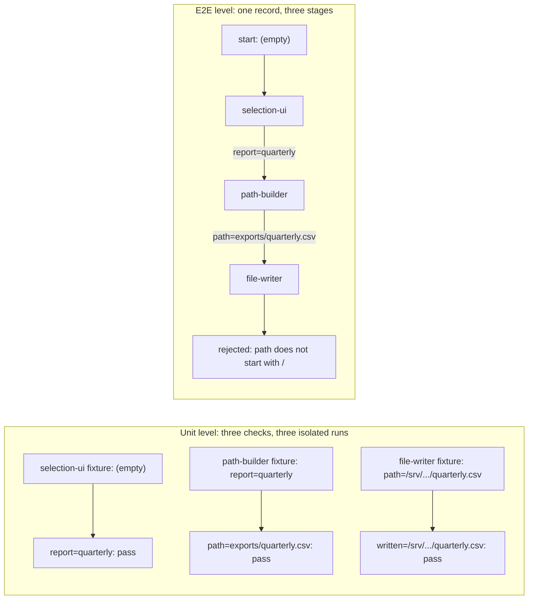

# Lecture 10: Why end-to-end testing changes results

The kind of check a harness runs decides the result it reports, because a
component that is correct against its own contract can still be wrong
against the component next to it. This lecture defends that single claim
with one scripted session run twice over one unchanged application: under
a definition of done made of unit checks it ships, and under a definition
that adds a run through the assembled system it is blocked, on a defect no
unit check can reach.

## Learning objectives

After this lecture and its exercises you can:

- Show behaviorally, not by assertion, that a definition of done built
  from component-level checks reports success on an application that
  cannot perform its task.
- Name the defect class end-to-end runs exist for: a contract mismatch
  between two components that are each individually correct.
- Build the assembled run itself, threading one record through the wired
  components, and tell it apart from an ordered batch of component runs.
- Turn a failing end-to-end run into an instruction that names the
  component which has to change, not the one that objected.

## Prerequisites

- [Lecture 09](../lecture-09-why-agents-declare-victory-too-early/): the
  premature completion claim, and the gate that catches it by re-executing
  the declared checks. That gate re-runs whatever the list says; this
  lecture is about what the list has to say.
- [Lecture 08](../lecture-08-why-feature-lists-are-harness-primitives/):
  the feature list, where each feature carries the verification command
  that decides its status.
- [Lecture 07](../lecture-07-why-agents-overreach-and-under-finish/): the
  scope surface, which names the components a task may touch; the seams
  between those components are what this lecture checks.
- A working toolchain (`make setup`, `make doctor`;
  [choosing your track](../../docs/choosing-your-track.md)).
- The glossary's
  [evidence-based completion](../../docs/glossary.md#working-discipline)
  and [seeded defect](../../docs/glossary.md#verification-machinery-this-repositorys-own)
  entries.

## The problem

A session adds csv export to a desktop report tool. Three components: the
ui picks a report, a service builds the export path, an io component
writes the file. Each one ships with a unit case, each unit case passes,
and the session reports done. You click export and nothing arrives, because
the service builds `exports/quarterly.csv` and the writer accepts only
paths that start with `/`. Both components are correct. Their unit cases
disagree with each other, and nothing in the definition of done ever put
them in the same room.

Lecture 09's gate would confirm this claim. It re-executes every check the
workspace declares, and every declared check passes, so the gate reports
`earned` and exits 0. Re-execution fixes claims about checks that were
skipped; it cannot fix a check list that never contained the assembled
run. The failure has moved from "the session did not run the check" to
"the check does not exist", and only the second one is the harness
author's problem.

The defect class has a name and a well-documented shape. OpenAI's harness
engineering write-up reports that architectural constraints on
agent-written codebases have to be established as prerequisites and
enforced mechanically, because agents copy whatever patterns the
repository already contains, and that failure messages should carry the
fix rather than only the complaint.

> Source: [OpenAI: Harness engineering: leveraging Codex in an agent-first world](https://openai.com/index/harness-engineering/)

Anthropic's harness write-up reports the same move from the verification
side: the harness that produced working software had its evaluator
exercise the running application rather than read the code.

> Source: [Anthropic: Harness design for long-running application development](https://www.anthropic.com/engineering/harness-design-long-running-apps)

## Concepts

- **Component boundary defect**: a defect that exists only in the
  relationship between two components, each of which satisfies its own
  contract. The demo's seeded defect is one: `path-builder` emits a
  relative path and `file-writer` accepts absolute ones, and both unit
  checks pass.
- **The isolation that makes unit checks fast is the isolation that makes
  them blind**: a unit check runs one component on an input the component's
  own fixture supplies. It crosses no seam, so no arrangement of unit
  checks can observe a seam. The `coverage` surface computes this rather
  than asserting it.
- **Definition of done as a harness artifact**
  ([evidence-based completion](../../docs/glossary.md#working-discipline)):
  the demo's definition files live outside the workspace, because the list
  of check kinds that count is the harness author's decision, not the
  session's. Lecture 09 owned *that the list is re-executed*; this lecture
  is about *what the list contains*.
- **Levels, cheapest first, stopping at the first failure**: the session
  runs the admitted levels in order and prints nothing past a failing one.
  A level with no checks passes with nothing executed, so a definition that
  names `e2e` and lists no flow is a green level that ran no assembled
  code; the demo's third run is that definition.
- **The assembled run threads one record**: stage 1 receives the flow's
  start record and every later stage receives what the previous stage
  produced. Running the same components in the same order on their own
  fixtures is not an end-to-end run; exercise 01 makes that difference
  cost a wrong verdict.
- **Remediation belongs to the producer**: the component that rejects the
  record states a contract; the value that broke it arrived from
  upstream. A failure message that tells the next session to relax the
  objecting component deletes the check that caught the defect. Exercise
  02 builds the instruction that points the other way.
- **This unit's components are language-neutral**: each component is a
  short list of declared ops over a record, the deterministic stand-in for
  a real module ([deterministic fake agent](../../docs/glossary.md#core-model)),
  and the same `app.json` drives both tracks to identical reports.

## Architecture

The two definitions of done differ in what they route the same session
through, so the diagram is the flow of one record against the two check
kinds:



Walkthrough: the left column is three runs that never meet. Each one is
fed a value some fixture author chose, and each one agrees with the
fixture it was given. The right column is one run, and the value that
reaches `file-writer` is not the one its fixture supplies; it is the one
`path-builder` actually produced. The arrow labels are the seam, and the
seam is where the defect lives. The demo's [SPEC.md](./code/SPEC.md) pins
the op vocabulary, the level semantics, and the seeded mismatch.

## Demo

`code/` contains **assembled-run**: two fixture workspaces describing the
same three-component export feature, `workspace-seam-gap` (the contract
mismatch) and `workspace-seam-closed` (agreed), plus three definitions of
done the workspaces are judged against. `unit-only` admits the component
checks; `through-e2e` admits those and the assembled flow;
`e2e-listed-empty` admits the flow's level and names no flow. The session,
the components, and the workspace never change between the first two runs;
only the definition file does. Run them from the repo root; **the session's
exit code is the result the definition produced**.

### The definition that ships the defect

#### Python

```sh
L=lectures/lecture-10-why-end-to-end-testing-changes-results
uv run python $L/code/python/main.py session $L/code/fixtures/workspaces/workspace-seam-gap $L/code/fixtures/definitions/unit-only.json
```

#### TypeScript

```sh
L=lectures/lecture-10-why-end-to-end-testing-changes-results
pnpm exec tsx $L/code/typescript/main.ts session $L/code/fixtures/workspaces/workspace-seam-gap $L/code/fixtures/definitions/unit-only.json
```

The report, generated from the Python run by `make verify` (the TypeScript
run is held identical by `make conformance`):

<!-- generated-block: uv run python lectures/lecture-10-why-end-to-end-testing-changes-results/code/python/main.py session lectures/lecture-10-why-end-to-end-testing-changes-results/code/fixtures/workspaces/workspace-seam-gap lectures/lecture-10-why-end-to-end-testing-changes-results/code/fixtures/definitions/unit-only.json -->
```json
{
  "workspace": "workspace-seam-gap",
  "task": "add csv export to the desktop report tool",
  "definition_of_done": {
    "id": "unit-only",
    "levels": [
      "unit"
    ],
    "e2e_runs": []
  },
  "events": [
    {
      "step": 1,
      "action": "write the ui component selection-ui",
      "outcome": "ops declared in app.json: set"
    },
    {
      "step": 2,
      "action": "write the service component path-builder",
      "outcome": "ops declared in app.json: format"
    },
    {
      "step": 3,
      "action": "write the io component file-writer",
      "outcome": "ops declared in app.json: require-prefix, copy"
    }
  ],
  "levels": [
    {
      "level": "unit",
      "checks": [
        {
          "id": "unit:selection-ui",
          "subject": "selection-ui",
          "result": "pass",
          "detail": "selection-ui unit case output matches its declaration: report=quarterly"
        },
        {
          "id": "unit:path-builder",
          "subject": "path-builder",
          "result": "pass",
          "detail": "path-builder unit case output matches its declaration: path=exports/quarterly.csv report=quarterly"
        },
        {
          "id": "unit:file-writer",
          "subject": "file-writer",
          "result": "pass",
          "detail": "file-writer unit case output matches its declaration: path=/srv/reports/exports/quarterly.csv report=quarterly written=/srv/reports/exports/quarterly.csv"
        }
      ],
      "result": "pass"
    }
  ],
  "verdict": {
    "declared": "done",
    "failing_level": null,
    "levels_not_admitted": [
      "e2e"
    ]
  }
}
```
<!-- /generated-block -->

Interpretation: three components, three green rows, exit 0. Every detail
string is a real comparison against a real declaration, and none of them
is wrong. `path-builder` really does produce `path=exports/quarterly.csv`
and that really is what its unit case declares. The only field in the
whole report that hints at a problem is `levels_not_admitted`, which names
the kind of check this definition left out. Nothing here is a lie, and
the feature does not work.

### The same session, the same code, one more kind of check

#### Python

<!-- fence-exit: 1 -->
```sh
L=lectures/lecture-10-why-end-to-end-testing-changes-results
uv run python $L/code/python/main.py session $L/code/fixtures/workspaces/workspace-seam-gap $L/code/fixtures/definitions/through-e2e.json
```

#### TypeScript

<!-- fence-exit: 1 -->
```sh
L=lectures/lecture-10-why-end-to-end-testing-changes-results
pnpm exec tsx $L/code/typescript/main.ts session $L/code/fixtures/workspaces/workspace-seam-gap $L/code/fixtures/definitions/through-e2e.json
```

<!-- generated-block: uv run python lectures/lecture-10-why-end-to-end-testing-changes-results/code/python/main.py session lectures/lecture-10-why-end-to-end-testing-changes-results/code/fixtures/workspaces/workspace-seam-gap lectures/lecture-10-why-end-to-end-testing-changes-results/code/fixtures/definitions/through-e2e.json || true -->
```json
{
  "workspace": "workspace-seam-gap",
  "task": "add csv export to the desktop report tool",
  "definition_of_done": {
    "id": "through-e2e",
    "levels": [
      "unit",
      "e2e"
    ],
    "e2e_runs": [
      "assembled-export-flow"
    ]
  },
  "events": [
    {
      "step": 1,
      "action": "write the ui component selection-ui",
      "outcome": "ops declared in app.json: set"
    },
    {
      "step": 2,
      "action": "write the service component path-builder",
      "outcome": "ops declared in app.json: format"
    },
    {
      "step": 3,
      "action": "write the io component file-writer",
      "outcome": "ops declared in app.json: require-prefix, copy"
    }
  ],
  "levels": [
    {
      "level": "unit",
      "checks": [
        {
          "id": "unit:selection-ui",
          "subject": "selection-ui",
          "result": "pass",
          "detail": "selection-ui unit case output matches its declaration: report=quarterly"
        },
        {
          "id": "unit:path-builder",
          "subject": "path-builder",
          "result": "pass",
          "detail": "path-builder unit case output matches its declaration: path=exports/quarterly.csv report=quarterly"
        },
        {
          "id": "unit:file-writer",
          "subject": "file-writer",
          "result": "pass",
          "detail": "file-writer unit case output matches its declaration: path=/srv/reports/exports/quarterly.csv report=quarterly written=/srv/reports/exports/quarterly.csv"
        }
      ],
      "result": "pass"
    },
    {
      "level": "e2e",
      "checks": [
        {
          "id": "e2e:assembled-export-flow",
          "subject": "assembled-export-flow",
          "result": "fail",
          "detail": "the assembled run stopped at file-writer: path=exports/quarterly.csv does not start with /; path was last written by path-builder",
          "trace": [
            {
              "component": "selection-ui",
              "outcome": "report=quarterly"
            },
            {
              "component": "path-builder",
              "outcome": "path=exports/quarterly.csv report=quarterly"
            },
            {
              "component": "file-writer",
              "outcome": "rejected: path=exports/quarterly.csv does not start with /"
            }
          ]
        }
      ],
      "result": "fail"
    }
  ],
  "verdict": {
    "declared": "blocked",
    "failing_level": "e2e",
    "levels_not_admitted": []
  }
}
```
<!-- /generated-block -->

Interpretation: the unit level is byte-for-byte the level from the first
run, still three green rows. The `e2e` level runs the same three
components in the same order over one record, and the trace shows the
record changing hands: `selection-ui` produces `report=quarterly`,
`path-builder` adds `path=exports/quarterly.csv`, and `file-writer`
refuses it. The detail names both sides of the seam, the objecting stage
and the component that wrote the offending field, so the next session
knows where to go. `declared` is `blocked`, `failing_level` is `e2e`, and
the exit code is 1. Nothing about the application changed between the two
commands. What changed is which kinds of check the definition of done
admits.

### The same end-to-end level over an agreed seam

#### Python

```sh
L=lectures/lecture-10-why-end-to-end-testing-changes-results
uv run python $L/code/python/main.py session $L/code/fixtures/workspaces/workspace-seam-closed $L/code/fixtures/definitions/through-e2e.json
```

#### TypeScript

```sh
L=lectures/lecture-10-why-end-to-end-testing-changes-results
pnpm exec tsx $L/code/typescript/main.ts session $L/code/fixtures/workspaces/workspace-seam-closed $L/code/fixtures/definitions/through-e2e.json
```

The verdict and the per-level outcomes, generated from the Python run by
`make verify` (the full report is pinned in
[`code/expected/through-e2e-closed.json`](./code/expected/through-e2e-closed.json)):

<!-- generated-block: uv run python lectures/lecture-10-why-end-to-end-testing-changes-results/code/python/main.py session lectures/lecture-10-why-end-to-end-testing-changes-results/code/fixtures/workspaces/workspace-seam-closed lectures/lecture-10-why-end-to-end-testing-changes-results/code/fixtures/definitions/through-e2e.json | uv run python -c "import json,sys; r=json.load(sys.stdin); print(json.dumps({'verdict': r['verdict'], 'levels': [[level['level'], level['result'], [check['id'] for check in level['checks']]] for level in r['levels']]}, indent=2))" -->
```json
{
  "verdict": {
    "declared": "done",
    "failing_level": null,
    "levels_not_admitted": []
  },
  "levels": [
    [
      "unit",
      "pass",
      [
        "unit:selection-ui",
        "unit:path-builder",
        "unit:file-writer"
      ]
    ],
    [
      "e2e",
      "pass",
      [
        "e2e:assembled-export-flow"
      ]
    ]
  ]
}
```
<!-- /generated-block -->

Interpretation: `workspace-seam-closed` gives `path-builder` the template
its neighbour accepts, and nothing else differs. The same end-to-end level
that blocked the first workspace clears this one, which is what keeps the
level honest: it is not a rule that always says no. Exit 0 here is the
first point in this lecture where "done" means the application performed
its task.

### The level that is named and runs nothing

A third definition, `e2e-listed-empty`, admits the `e2e` level and names no
flow. It is what a checklist looks like after someone adds the right line
and never wires it up.

#### Python

```sh
L=lectures/lecture-10-why-end-to-end-testing-changes-results
uv run python $L/code/python/main.py session $L/code/fixtures/workspaces/workspace-seam-gap $L/code/fixtures/definitions/e2e-listed-empty.json
```

#### TypeScript

```sh
L=lectures/lecture-10-why-end-to-end-testing-changes-results
pnpm exec tsx $L/code/typescript/main.ts session $L/code/fixtures/workspaces/workspace-seam-gap $L/code/fixtures/definitions/e2e-listed-empty.json
```

The definition, the per-level check counts, and the verdict, generated from
the Python run by `make verify` (the full report is pinned in
[`code/expected/e2e-listed-empty-gap.json`](./code/expected/e2e-listed-empty-gap.json)):

<!-- generated-block: uv run python lectures/lecture-10-why-end-to-end-testing-changes-results/code/python/main.py session lectures/lecture-10-why-end-to-end-testing-changes-results/code/fixtures/workspaces/workspace-seam-gap lectures/lecture-10-why-end-to-end-testing-changes-results/code/fixtures/definitions/e2e-listed-empty.json | uv run python -c "import json,sys; r=json.load(sys.stdin); print(json.dumps({'definition_of_done': r['definition_of_done'], 'levels': [[level['level'], level['result'], len(level['checks'])] for level in r['levels']], 'verdict': r['verdict']}, indent=2))" -->
```json
{
  "definition_of_done": {
    "id": "e2e-listed-empty",
    "levels": [
      "unit",
      "e2e"
    ],
    "e2e_runs": []
  },
  "levels": [
    [
      "unit",
      "pass",
      3
    ],
    [
      "e2e",
      "pass",
      0
    ]
  ],
  "verdict": {
    "declared": "done",
    "failing_level": null,
    "levels_not_admitted": []
  }
}
```
<!-- /generated-block -->

Interpretation: the `e2e` level passes on zero checks, `levels_not_admitted`
is empty because nothing was left out, and the session declares done on the
same broken workspace the second run blocked. Auditing the definition by the
names it contains would call this one complete. The check count is the only
field that separates it from the run that caught the defect, which is why a
definition of done has to say what each level runs, not only that the level
is required.

### Supporting evidence: what each kind of check touches

The counts below are evidence about the demo, not the demo. The behavior
is in the three runs above; this is the arithmetic underneath it, computed
from the same fixture by the `coverage` surface.

#### Python

```sh
L=lectures/lecture-10-why-end-to-end-testing-changes-results
uv run python $L/code/python/main.py coverage $L/code/fixtures/workspaces/workspace-seam-gap
```

#### TypeScript

```sh
L=lectures/lecture-10-why-end-to-end-testing-changes-results
pnpm exec tsx $L/code/typescript/main.ts coverage $L/code/fixtures/workspaces/workspace-seam-gap
```

<!-- generated-block: uv run python lectures/lecture-10-why-end-to-end-testing-changes-results/code/python/main.py coverage lectures/lecture-10-why-end-to-end-testing-changes-results/code/fixtures/workspaces/workspace-seam-gap -->
```json
{
  "workspace": "workspace-seam-gap",
  "components": [
    "selection-ui",
    "path-builder",
    "file-writer"
  ],
  "unit_checks": [
    "unit:selection-ui",
    "unit:path-builder",
    "unit:file-writer"
  ],
  "seams": [
    "selection-ui -> path-builder",
    "path-builder -> file-writer"
  ],
  "seams_exercised_by_unit_checks": [],
  "seams_exercised_by_the_assembled_run": [
    "selection-ui -> path-builder",
    "path-builder -> file-writer"
  ],
  "totals": {
    "components": 3,
    "unit_checks": 3,
    "seams": 2,
    "seams_exercised_by_unit_checks": 0,
    "seams_exercised_by_the_assembled_run": 2
  }
}
```
<!-- /generated-block -->

Every component is covered and no seam is. The zero is not a property of
this fixture: a unit check runs one component, a stage sequence of length
one has no adjacent pair, and the surface computes the empty list rather
than declaring it. Adding unit checks moves the first number and can never
move the second.

## Implementation notes

- **Write the definition of done as levels, and say what a level runs.**
  The demo's definitions name both the levels that count and the flows the
  `e2e` level executes, because a level that lists a name and runs nothing
  passes vacuously. The project-level version of the same discipline reads
  like:

  ```text
  ## Definition of done
  - Level 1 static checks, level 2 component tests, level 3 the assembled run.
  - A change touching more than one component is not done until level 3 passed.
  - A level that ran zero checks did not pass; it did not run.
  ```

- **Seed integration defects as contract mismatches, not missing files.**
  A missing artifact is caught by the cheapest possible check and teaches
  nothing about seams. `workspace-seam-gap` seeds two components that are
  each right, so the only way to observe the defect is to put a real value
  across the boundary between them.
- **The producer is the fix site.** Every failing run in this unit reports
  the objecting stage and the component that last wrote the offending
  field. That second name is what makes the message actionable: the
  objecting component is stating the contract, and a fix aimed at it
  deletes the check. Exercise 02 is that rule as code.
- **The trace is the argument.** A verdict of `fail` proves the run
  failed; the per-stage trace proves the record crossed a seam and shows
  where the value changed. When an end-to-end level cannot show its trace,
  it may be an ordered batch of component runs, which is exercise 01's
  starter and passes on the workspace where the fixtures happen to line
  up.
- Track note: both tracks compare records field by field with keys sorted,
  and render them the same way, so a report is byte-identical across the
  two after normalization; the TypeScript track builds a fresh regular
  expression per placeholder substitution rather than sharing a global one.

## Key takeaways

- A definition of done made only of component checks reports success on an
  application that cannot perform its task, and every individual check in
  that report is correct.
- Component boundary defects are invisible to component checks by
  construction, not by oversight: isolation is the design.
- An end-to-end level is one record threaded through the assembled system.
  Running the same components in the same order on their own fixtures
  looks similar and proves nothing about the seams.
- A level that lists a name and runs no flow is a green level that
  executed nothing; say what each level runs, not only that it exists.
- Report the failure with the producer named, so the next session changes
  the component that emitted the bad value instead of relaxing the one
  that caught it.

## Exercises

| Exercise | You build | Difficulty | Time |
| --- | --- | --- | --- |
| [01: assembled-run](./exercises/exercise-01-assembled-run/) | The end-to-end level that threads one record through the wired components | Medium | ~30 min |
| [02: seam-remediation](./exercises/exercise-02-seam-remediation/) | The fix instruction that names the producing side of the seam | Medium | ~25 min |

Both are graded by shared expected output: `./verify.sh --stack=<yours>`
exits 0 when your track's implementation is correct. The related project
for this lecture is
[Project 05: self-verification and role separation](../../projects/project-05-self-verification-and-role-separation/),
whose checker executes every feature's verification command against the
running application instead of reading the code.

## Further exploration

- [OpenAI: Harness engineering: leveraging Codex in an agent-first world](https://openai.com/index/harness-engineering/),
  on enforcing architectural boundaries mechanically and writing failure
  messages that carry the fix
- [Anthropic: Harness design for long-running application development](https://www.anthropic.com/engineering/harness-design-long-running-apps),
  on an evaluator that exercises the running application rather than
  reading the code
- [Anthropic: Effective harnesses for long-running agents](https://www.anthropic.com/engineering/effective-harnesses-for-long-running-agents),
  on the feedback an agent needs from the environment to finish work
- [Anthropic: Building effective agents](https://www.anthropic.com/engineering/building-effective-agents),
  on grounding an agent's loop in results rather than in its own plan
