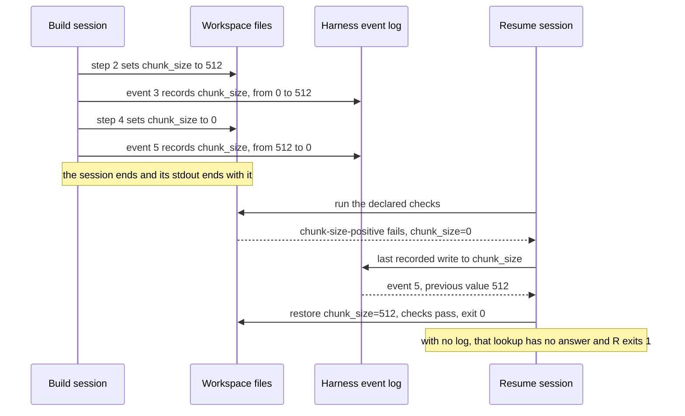

# Lecture 10: Why observability belongs inside the harness

A session's runtime facts end with the session unless the harness itself
records them, and the next session then cannot repair a defect it can
plainly see, because the evidence a repair needs is not in the final
state. This lecture defends that single claim with two sessions over one
workspace: the second finishes the first one's work when the harness kept
a structured event log, and gets stuck when it did not, with the
difference in the report and in the exit code.

## Learning objectives

After this lecture and its exercises you can:

- Show behaviorally, not by assertion, what a second session loses when
  the first one's harness kept no record: the workspace holds the final
  value, and the value it replaced is gone.
- Distinguish the agent's self-report (a session note it writes about
  itself) from the harness's record (events the harness emits as it
  acts), and say why only the second one survives as evidence.
- Design an event whose fields answer the question a later session will
  ask, rather than describing what just happened.
- Attribute a failing check to the write that caused it, matching on the
  key the check reads and not merely on the file it lives in.
- Order a log by sequence number instead of wall clock, so a trace is
  reproducible and comparable across runs.

## Prerequisites

- [Lecture 03](../lecture-03-why-the-repository-must-become-the-system-of-record/):
  the repository as the only thing that survives a session boundary;
  this lecture is about the record the harness writes there rather than
  the ones the session writes.
- [Lecture 08](../lecture-08-why-agents-declare-victory-too-early/): the
  workspace's declared checks and the gate that re-executes them. Here
  the checks are what the second session runs first, and the question
  starts where their verdict lands.
- A working toolchain (`make setup`, `make doctor`;
  [choosing your track](../../docs/choosing-your-track.md)).
- The glossary's [feedback subsystem](../../docs/glossary.md#core-model)
  and [evidence](../../docs/glossary.md#working-discipline) entries.

## The problem

A session implements a feature over five steps. Step 2 sets the chunk
size to 512, taken from a tuning note. Step 4 copies a block of defaults
out of a template, and the template's chunk size is 0, which is what
"unset" looks like in that file. Step 5 raises the retry count. The
session never runs the workspace's checks, writes itself a note saying
the plan was implemented end to end, and stops.

You open the next session. A check fails immediately and says exactly
what is wrong: `chunk_size=0 is not a positive integer`. The defect is
not hidden. What is missing is the fact that would let you fix it: the
value that 0 replaced. It is not in `config/app.conf`, because 0
overwrote it. It is not in the session note, which speaks in paragraphs
about the task. It was in the first session's terminal, and the terminal
is gone.

Anthropic's write-up on long-running application development reports the
same dependency at the level of a whole harness. The evaluator in their
three-role setup started out unreliable, identifying real problems and
then talking itself into approving anyway. The fix was not a better
prompt written from intuition: "The tuning loop was to read the
evaluator's logs, find examples where its judgment diverged from mine,
and update the QAs prompt." Logs were the input to the repair. Nothing
else in the system held the reasoning that had to change.

> Source: [Anthropic: Harness design for long-running application development](https://www.anthropic.com/engineering/harness-design-long-running-apps)

## Concepts

- **Observability is a harness property, not an agent habit.** An agent
  logs what it thinks is worth logging, in whatever shape it picks that
  session, and it cannot log a decision it does not notice making. The
  harness emits the same event for the same action every time, which is
  what makes two sessions comparable and a log parseable.
- **A self-report is not a record.** The demo's session writes
  `notes/session-note.md` under both conditions: same words, same
  claims. It is the constant, and the event log is the variable. The
  note is not dishonest; it simply answers "what did I do" in prose,
  and the next session's question is "what value did step 4 replace".
- **The final state is not the history.** A workspace holds the last
  value written to every key. Every earlier value is gone, and so is
  the order the writes happened in. A defect that is a *change* cannot
  be diagnosed from a snapshot, which is why the demo's failing check
  is legible and its repair is not.
- **An event is designed around the later question.** `to` is what a
  logger writes when it is describing the action. `from` is what a
  logger writes when it has thought about who reads the log. The demo's
  repair is `from` and nothing else; every other field only helps a
  reader find the right event. Exercise 02 is the one line that decides
  what `from` holds.
- **Attribution matches the key, not the file.** A session writes to one
  settings file many times. In the demo's trace the last write to
  `config/app.conf` is the harmless `retries` change at event 6, and the
  write that broke the check is event 5. Exercise 01 makes that
  distinction cost something.
- **Sequence numbers, not timestamps.** `seq` is one plus the number of
  events already recorded, exactly as in
  [project 04](../../projects/project-04-runtime-feedback-and-scope-control/)'s
  `log/events.jsonl`. Ordering is all a resume needs, and a log with no
  clock in it is byte-reproducible, diffable between two runs, and safe
  to pin in `expected/`. A real deployment adds a timestamp at this
  seam; nothing else about the event changes.
- **A log scoped to the wrong surface is not a log.** Exercise 01's
  second fixture is a real four-event trace from a harness that logged
  `src/` and `index/` only. For the question being asked it is worth
  exactly as much as no log at all, and the audit says so in the same
  word: `unattributed`.

## Architecture

The mechanism is two sessions separated in time and the artifacts that
cross between them, so the diagram is a sequence. The workspace crosses
by definition; whether the log crosses is the experiment:



The two sessions share the workspace and nothing else. The
build session's transcript is stdout, which is why the diagram shows it
ending with the session rather than crossing to the right. The lookup at
the fourth-from-last arrow is the whole lecture: it is one query against
one artifact, it has an answer under one condition, and the exit code
below it changes with the answer. The demo's [SPEC.md](./code/SPEC.md)
pins the plan, the check rules, the event shape, and the resume
procedure.

## Demo

`code/` contains **resume-trace**: one fixture workspace
(`workspace-ingest`) carrying a plan and four declared health checks, and
two surfaces over it. `build` replays the first session; `resume` replays
that build to obtain its leavings, then runs the second session against
them. Both take `--observability=structured|none`, which changes exactly
one thing: whether the harness appends events to `log/events.jsonl` while
the build runs. Everything else, plan included, is identical. Run from
the repo root; **the resume session's exit code is the outcome**.

### The build session that leaves the defect

#### Python

```sh
L=lectures/lecture-10-why-observability-belongs-inside-the-harness
uv run python $L/code/python/main.py build $L/code/fixtures/workspaces/workspace-ingest --observability=none
```

#### TypeScript

```sh
L=lectures/lecture-10-why-observability-belongs-inside-the-harness
pnpm exec tsx $L/code/typescript/main.ts build $L/code/fixtures/workspaces/workspace-ingest --observability=none
```

The transcript and what it leaves behind, generated from the Python run
by `make verify` (the TypeScript run is held identical by
`make conformance`):

<!-- generated-block: uv run python lectures/lecture-10-why-observability-belongs-inside-the-harness/code/python/main.py build lectures/lecture-10-why-observability-belongs-inside-the-harness/code/fixtures/workspaces/workspace-ingest --observability=none -->
```json
{
  "workspace": "workspace-ingest",
  "observability": "none",
  "task": "add chunked ingest to the report tool",
  "transcript": [
    {
      "step": 1,
      "action": "add the paragraph splitter",
      "outcome": "src/ingest.txt splitter=paragraph (was unset)"
    },
    {
      "step": 2,
      "action": "set the chunk size from the tuning note",
      "outcome": "config/app.conf chunk_size=512 (was 0)"
    },
    {
      "step": 3,
      "action": "record the ingest entry point",
      "outcome": "index/meta.conf entry=ingest.main (was unset)"
    },
    {
      "step": 4,
      "action": "copy the batch defaults from the template",
      "outcome": "config/app.conf chunk_size=0 (was 512)"
    },
    {
      "step": 5,
      "action": "raise the retry count",
      "outcome": "config/app.conf retries=3 (was 1)"
    }
  ],
  "handoff": {
    "files": [
      "notes/session-note.md"
    ],
    "session_note": [
      "# Session note",
      "",
      "Task: add chunked ingest to the report tool",
      "Implemented the plan end to end; 5 steps completed.",
      "No verification was run in this session."
    ],
    "events": []
  },
  "declared": "done"
}
```
<!-- /generated-block -->

Interpretation: step 4 destroys step 2's value, and the transcript says
so plainly. Read the two halves of this report against each other. The
`transcript` knows everything: it names the key, the new value, and the
old one. The `handoff` knows almost nothing: one prose file, no events.
The transcript is what scrolled past in the first session's terminal, and
`handoff` is what the second session will find on disk. This is the split
the lecture is about, and it is why a session that "explained what it
did" has not thereby recorded anything.

### The next session, with observability off

#### Python

<!-- fence-exit: 1 -->
```sh
L=lectures/lecture-10-why-observability-belongs-inside-the-harness
uv run python $L/code/python/main.py resume $L/code/fixtures/workspaces/workspace-ingest --observability=none
```

#### TypeScript

<!-- fence-exit: 1 -->
```sh
L=lectures/lecture-10-why-observability-belongs-inside-the-harness
pnpm exec tsx $L/code/typescript/main.ts resume $L/code/fixtures/workspaces/workspace-ingest --observability=none
```

<!-- generated-block: uv run python lectures/lecture-10-why-observability-belongs-inside-the-harness/code/python/main.py resume lectures/lecture-10-why-observability-belongs-inside-the-harness/code/fixtures/workspaces/workspace-ingest --observability=none || true -->
```json
{
  "workspace": "workspace-ingest",
  "observability": "none",
  "handoff": {
    "files": [
      "notes/session-note.md"
    ],
    "events_read": 0
  },
  "diagnosis": [
    {
      "check": "chunk-size-positive",
      "path": "config/app.conf",
      "key": "chunk_size",
      "observed": "0",
      "attribution": "unattributed: the handoff records no write to chunk_size in config/app.conf",
      "repair": "none"
    }
  ],
  "recheck": [
    {
      "id": "splitter-configured",
      "status": "pass",
      "detail": "src/ingest.txt splitter=paragraph is set"
    },
    {
      "id": "chunk-size-positive",
      "status": "fail",
      "detail": "config/app.conf chunk_size=0 is not a positive integer"
    },
    {
      "id": "retries-positive",
      "status": "pass",
      "detail": "config/app.conf retries=3 is a positive integer"
    },
    {
      "id": "entry-point-recorded",
      "status": "pass",
      "detail": "index/meta.conf entry=ingest.main is set"
    }
  ],
  "outcome": {
    "failing_before": 1,
    "repaired": 0,
    "failing_after": 1,
    "result": "stuck"
  }
}
```
<!-- /generated-block -->

Interpretation: the session diagnoses perfectly and repairs nothing. It
finds the failing check, names the file, the key, and the observed value,
and then stops at `unattributed`, because the one thing it needs was
never written down by anybody. Note what it does not do: it does not
invent a plausible chunk size. A number that satisfies
`positive-integer` is easy to produce and would turn this exit code
green, and it would still not be the value the index was built for. That
is the difference between repairing the work and silencing the check, and
with no record there is no way to tell which one you did. The exit code
is 1 and the result is `stuck`.

### The same session, with observability on

#### Python

```sh
L=lectures/lecture-10-why-observability-belongs-inside-the-harness
uv run python $L/code/python/main.py resume $L/code/fixtures/workspaces/workspace-ingest --observability=structured
```

#### TypeScript

```sh
L=lectures/lecture-10-why-observability-belongs-inside-the-harness
pnpm exec tsx $L/code/typescript/main.ts resume $L/code/fixtures/workspaces/workspace-ingest --observability=structured
```

<!-- generated-block: uv run python lectures/lecture-10-why-observability-belongs-inside-the-harness/code/python/main.py resume lectures/lecture-10-why-observability-belongs-inside-the-harness/code/fixtures/workspaces/workspace-ingest --observability=structured -->
```json
{
  "workspace": "workspace-ingest",
  "observability": "structured",
  "handoff": {
    "files": [
      "log/events.jsonl",
      "notes/session-note.md"
    ],
    "events_read": 7
  },
  "diagnosis": [
    {
      "check": "chunk-size-positive",
      "path": "config/app.conf",
      "key": "chunk_size",
      "observed": "0",
      "attribution": "event 5 recorded step 4 setting chunk_size in config/app.conf from 512 to 0",
      "repair": "restore chunk_size=512 in config/app.conf"
    }
  ],
  "recheck": [
    {
      "id": "splitter-configured",
      "status": "pass",
      "detail": "src/ingest.txt splitter=paragraph is set"
    },
    {
      "id": "chunk-size-positive",
      "status": "pass",
      "detail": "config/app.conf chunk_size=512 is a positive integer"
    },
    {
      "id": "retries-positive",
      "status": "pass",
      "detail": "config/app.conf retries=3 is a positive integer"
    },
    {
      "id": "entry-point-recorded",
      "status": "pass",
      "detail": "index/meta.conf entry=ingest.main is set"
    }
  ],
  "outcome": {
    "failing_before": 1,
    "repaired": 1,
    "failing_after": 0,
    "result": "resumed"
  }
}
```
<!-- /generated-block -->

Interpretation: same plan, same defect, same failing check, same
diagnosis down to the observed value. The line that differs is
`attribution`, and it differs because there was something to attribute
to. Event 5 names the step, the key, and the value that step replaced, so
the repair is a lookup rather than a judgement, and the recheck goes
green on a value the workspace no longer contained. The exit code is 0
and the result is `resumed`. Nothing about the second session's code
changed between this run and the last one.

### Supporting evidence: the one artifact that differs

The two resume reports, compared by `make verify`:

<!-- generated-block: diff lectures/lecture-10-why-observability-belongs-inside-the-harness/code/expected/resume-silent.json lectures/lecture-10-why-observability-belongs-inside-the-harness/code/expected/resume-instrumented.json || true -->
```text
3c3
<   "observability": "none",
---
>   "observability": "structured",
5a6
>       "log/events.jsonl",
8c9
<     "events_read": 0
---
>     "events_read": 7
16,17c17,18
<       "attribution": "unattributed: the handoff records no write to chunk_size in config/app.conf",
<       "repair": "none"
---
>       "attribution": "event 5 recorded step 4 setting chunk_size in config/app.conf from 512 to 0",
>       "repair": "restore chunk_size=512 in config/app.conf"
28,29c29,30
<       "status": "fail",
<       "detail": "config/app.conf chunk_size=0 is not a positive integer"
---
>       "status": "pass",
>       "detail": "config/app.conf chunk_size=512 is a positive integer"
44,46c45,47
<     "repaired": 0,
<     "failing_after": 1,
<     "result": "stuck"
---
>     "repaired": 1,
>     "failing_after": 0,
>     "result": "resumed"
```
<!-- /generated-block -->

Everything above the `attribution` line is the condition being declared,
and everything below it follows from that one lookup. And the artifact
itself, the seven lines the instrumented build appended to
`log/events.jsonl`:

<!-- generated-block: uv run python lectures/lecture-10-why-observability-belongs-inside-the-harness/code/python/main.py build lectures/lecture-10-why-observability-belongs-inside-the-harness/code/fixtures/workspaces/workspace-ingest --observability=structured | uv run python -c "import json,sys; [print(json.dumps(event, separators=(',', ':'))) for event in json.load(sys.stdin)['handoff']['events']]" -->
```text
{"seq":1,"level":"INFO","command":"build","event":"session/start","detail":{"task":"add chunked ingest to the report tool"}}
{"seq":2,"level":"INFO","command":"build","event":"workspace/write","detail":{"step":1,"path":"src/ingest.txt","key":"splitter","from":"","to":"paragraph"}}
{"seq":3,"level":"INFO","command":"build","event":"workspace/write","detail":{"step":2,"path":"config/app.conf","key":"chunk_size","from":"0","to":"512"}}
{"seq":4,"level":"INFO","command":"build","event":"workspace/write","detail":{"step":3,"path":"index/meta.conf","key":"entry","from":"","to":"ingest.main"}}
{"seq":5,"level":"INFO","command":"build","event":"workspace/write","detail":{"step":4,"path":"config/app.conf","key":"chunk_size","from":"512","to":"0"}}
{"seq":6,"level":"INFO","command":"build","event":"workspace/write","detail":{"step":5,"path":"config/app.conf","key":"retries","from":"1","to":"3"}}
{"seq":7,"level":"INFO","command":"build","event":"session/end","detail":{"steps":5,"declared":"done"}}
```
<!-- /generated-block -->

Seven events for five steps, which is not a lot of logging; the count is
not what makes this work. Event 5 is what makes it work, and event 5 is
useful because someone decided that a write event records the value it
replaced. Note also event 6: it is a later write to the same file, so a
resume that matched on the file rather than the key would have restored
`retries` and left the actual break in place. That is exercise 01.

Finally, the control. `workspace-clean` runs the same plan with step 4
writing a different key instead of overwriting `chunk_size`, so nothing
fails and there is nothing to attribute; `resume --observability=none`
exits 0 over it, pinned by the `resume-silent-clean-workspace-passes`
case. The silent condition is not wired to fail. It fails when the
question needs a record that nobody kept.

## Implementation notes

- **Log the transition, not the outcome.** `{"key": "chunk_size", "to":
  "0"}` describes the action and is what a logger writes when nobody has
  asked what the log is for. `from` costs one extra read and is the only
  field either surface in this unit actually consumes. Design the event
  from the question, not from the action.
- **Emit from the harness, at the seam every action passes through.** In
  the demo the emit call sits next to the overlay write, so no step can
  perform a write without producing an event, and the event shape is the
  same for every step. An entry file asking the agent to "log important
  decisions" produces a different shape per session and a gap wherever
  the agent did not think a decision was important.
- **Order by sequence number.** `seq` is one plus the number of events
  already recorded, the rule
  [project 04](../../projects/project-04-runtime-feedback-and-scope-control/)
  uses for the same file name. Wall-clock timestamps would break this
  repository's determinism rule, and they would also make the log
  undiffable between two runs of the same session, which is the property
  the supporting-evidence block above depends on.
- **Levels earn their place when something reads them.** Every event
  here is `INFO`, honestly, because this unit's consumer filters on
  `event` rather than severity. Project 04's `kb logs --level WARN`
  is the case where a level is load-bearing: a refused `ask` writes a
  WARN and the surface that reads it exists.
- **Keep the session's note.** It is written under both conditions on
  purpose. A harness with a structured log still wants the human-readable
  summary, and a project that has only the summary should not conclude
  that its logging is fine because a paragraph exists.
- Track note: both tracks buffer the session's writes in an in-memory
  overlay of the workspace, so the committed fixtures are never modified
  and the two conditions can be run in any order; the TypeScript track
  splits input on `/\r?\n/` per the conventions' line-ending rule, and
  the conformance runner holds the two reports byte-identical after
  normalization.

## Key takeaways

- The workspace after a session holds the values that survived, not the
  changes that produced them. A defect that is a change cannot be
  diagnosed from what remains.
- The agent's summary of itself and the harness's record of the agent
  are different artifacts. Only the second one answers a question the
  agent did not anticipate.
- An event field is worth what the next reader can do with it: log the
  value replaced, not only the value written.
- Attribute on the key the failing check reads. The last write to the
  file is usually a different, harmless write.
- Sequence numbers are enough to order a trace, and a trace without a
  clock is reproducible, diffable, and pinnable.

## Exercises

| Exercise | You build | Difficulty | Time |
| --- | --- | --- | --- |
| [01: trace-attribution](./exercises/exercise-01-trace-attribution/) | The audit that points a failing check at the recorded write that broke it | Medium | ~30 min |
| [02: write-the-trace](./exercises/exercise-02-write-the-trace/) | The harness-side logger whose events a later session can actually use | Easy | ~20 min |

Both are graded by shared expected output: `./verify.sh --stack=<yours>`
exits 0 when your track's implementation is correct. The closest built
project is
[Project 04: runtime feedback and scope control](../../projects/project-04-runtime-feedback-and-scope-control/),
whose kb application writes a structured event log (log/events.jsonl,
sequence numbers rather than timestamps), exposes it through `kb logs`,
and carries a guard that executes what its architecture document claims.
No project is dedicated to this lecture.

## Further exploration

- [Anthropic: Harness design for long-running application development](https://www.anthropic.com/engineering/harness-design-long-running-apps),
  where reading the evaluator's logs was the input to fixing the evaluator
- [Dapper, a Large-Scale Distributed Systems Tracing Infrastructure](https://research.google/pubs/pub36356/),
  the primary source for tracing a request across the components it
  touched
- [Site Reliability Engineering](https://sre.google/sre-book/table-of-contents/),
  on monitoring and debugging as a designed property of a running system
- [Anthropic: Effective harnesses for long-running agents](https://www.anthropic.com/engineering/effective-harnesses-for-long-running-agents),
  on bridging the gap between coding sessions
- [OpenAI: Harness engineering: leveraging Codex in an agent-first world](https://openai.com/index/harness-engineering/),
  on failure output that tells the agent what to do next
