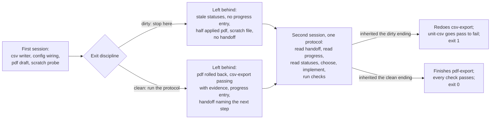

# Lecture 11: Why every session must leave a clean state

A session's last act is the next session's first input. This lecture
defends one claim: the state a session leaves determines what the next
session can do, and a session that ends without an exit protocol makes the
next one redo work that was already finished and break it in the process.
The demo runs the same session twice, changing nothing but its ending, and
lets the session after it show the difference.

## Learning objectives

After this lecture and its exercises you can:

- Show behaviorally, not by assertion, that two sessions doing identical
  work hand their successor different outcomes purely by how they ended.
- Name what a session owes the next one, as items a machine can check,
  and read the ending's verdict from an exit code.
- Choose between the exit protocol's three moves for in-flight work:
  finish it, roll it back, or declare it.
- Build an exit protocol that is safe to re-enter after an interruption.

## Prerequisites

- [Lecture 03](../lecture-03-why-the-repository-must-become-the-system-of-record/):
  the repository as the only thing that survives a session. This lecture
  is about what a session owes that repository before it ends.
- [Lecture 05](../lecture-05-why-initialization-needs-its-own-phase/):
  the readiness gate a session passes before it may start. This lecture
  is the same discipline at the other end of the session, and the two
  meet: a clean ending is what makes the next start cheap.
- [Lecture 08](../lecture-08-why-agents-declare-victory-too-early/): the
  completion claim that outruns its checks. Here the work is genuinely
  finished and verified; what is missing is the record of it.
- A working toolchain (`make setup`, `make doctor`;
  [choosing your track](../../docs/choosing-your-track.md)).
- The glossary's [clean state](../../docs/glossary.md#working-discipline)
  entry and the library's
  [`clean-state-checklist.md`](../../library/templates/clean-state-checklist.md).

## The problem

A session spends an afternoon on a report tool. It implements the csv
writer, wires the export directory, runs the unit check and sees it pass,
opens the pdf feature and drafts its module, and writes a scratch file
while probing a page size. Then it ends. Everything it did was real and
the one check it ran was green.

The next session opens that repository. The progress log says nothing was
verified. The feature list says two features are in progress at once. A
half written pdf module sits next to a scratch probe with no note saying
which is deliberate. Nothing in the workspace distinguishes finished work
from abandoned work, so the next session picks the first thing the record
points at, which is the feature that was already done, and implements it
again.

Anthropic's write-up on long-running agents names the requirement
directly, and defines it in terms of what the code has to be fit for:

> "leave the environment in a clean state at the end of a session. By
> 'clean state' we mean the kind of code that would be appropriate for
> merging to a main branch"
>
> Source: [Anthropic: Effective harnesses for long-running agents](https://www.anthropic.com/engineering/effective-harnesses-for-long-running-agents)

That is a statement about an ending, and endings are cheap to skip. The
work is done, the check was green, the context is nearly spent, and the
exit protocol produces nothing the current session will ever use. Its
entire value accrues to a session that does not exist yet, which is
exactly why it needs to be a gate rather than a habit.

## Concepts

- **Clean state is a property of the ending, not of the code**
  ([glossary](../../docs/glossary.md#working-discipline)). The demo's
  dirty and clean endings contain the same working csv exporter and the
  same passing check. What differs is whether the record says so.
- **The record is the interface between sessions.** A session cannot pass
  the next one a variable, a hunch, or a half-formed intention; it can
  only pass files. `feature_list.json`, `claude-progress.md`, and
  `session-handoff.md` are that interface, and an ending that leaves them
  disagreeing with the workspace has corrupted it.
- **Session integrity: finish, roll back, or declare.** Work in flight at
  the end gets exactly one of three moves. Finish it and record the
  evidence. Roll it back, if this session created everything the revert
  would remove, so the workspace returns to its last consistent state.
  Declare it, when reverting would discard state the session does not
  own, and then the handoff must name the failing check. Exercise 01
  builds the choice; the demo's clean exit makes one rollback.
- **A stale record misleads more than a missing one.** The demo's second
  session is not careless. It reads the handoff, reads the progress log,
  reads the feature list, and applies WIP=1, and every one of those
  defences is either silent or actively wrong after the dirty ending.
  Following the harness's own rules is what lands it on finished work.
- **The exit protocol must be idempotent.** It is the last thing a
  session runs, so it is the thing most likely to be cut off part way. A
  step that acts rather than reconciles turns a retry into a second
  defect. Exercise 02 builds the reconciling version.
- **"Clean up later" is a design heuristic that does not survive contact
  with a session boundary.** The next session has its own goal, does not
  know which leavings were deliberate, and has no budget for archaeology.
  This module treats that as a heuristic, not a measurement: the demo
  shows one instance of the failure rather than a rate.
- **This unit's checks are language-neutral**: each check is an
  executable probe over workspace files, the deterministic stand-in for a
  shell command ([deterministic fake agent](../../docs/glossary.md#core-model)),
  and the same `checks.json` drives both tracks to identical reports.

## Architecture

The mechanism is a fork: one workspace, one first session, two endings,
and then one second-session protocol that receives whichever ending it
was handed. The diagram is that fork, with the leavings on each branch.



Walkthrough: the left half is one session, and its first five steps are
byte-identical on both branches. The fork is the exit discipline alone.
The right half is one protocol, not two: the same reads in the same order,
the same choice rule, the same implementation edit for whichever feature
it picks. Everything that differs between `Bad` and `Good` is downstream
of the branch in the middle. The demo's [SPEC.md](./code/SPEC.md) pins
both session scripts, the exit protocol's five steps, and the check
engine.

## Demo

`code/` contains **session-ending**: one committed workspace and two
surfaces over it. `resume` runs the first session, applies the ending
`--exit` selects, then runs the second session against what it inherited;
**the exit code is the second session's outcome**. `first` stops after the
first session and grades its ending against five items of the clean state
checklist. The workspace is read once and edited in memory, so the
committed fixture never changes and every command below is idempotent.

### The second session after a dirty ending

#### Python

<!-- fence-exit: 1 -->
```sh
L=lectures/lecture-11-why-every-session-must-leave-a-clean-state
uv run python $L/code/python/main.py resume $L/code/fixtures/workspace --exit=dirty
```

#### TypeScript

<!-- fence-exit: 1 -->
```sh
L=lectures/lecture-11-why-every-session-must-leave-a-clean-state
pnpm exec tsx $L/code/typescript/main.ts resume $L/code/fixtures/workspace --exit=dirty
```

Both transcripts, generated from the Python run by `make verify` (the
TypeScript run is held identical by `make conformance`):

<!-- generated-block: uv run python lectures/lecture-11-why-every-session-must-leave-a-clean-state/code/python/main.py resume lectures/lecture-11-why-every-session-must-leave-a-clean-state/code/fixtures/workspace --exit=dirty || true -->
```json
{
  "workspace": "workspace",
  "exit_discipline": "dirty",
  "first_session": {
    "task": "finish csv export, then open pdf export",
    "events": [
      {
        "step": 1,
        "action": "implement the csv writer",
        "outcome": "appended writer=csv to src/export.txt; the file now declares writer once"
      },
      {
        "step": 2,
        "action": "wire the export directory",
        "outcome": "config/app.conf now sets export_dir=out/reports"
      },
      {
        "step": 3,
        "action": "run check unit-csv",
        "outcome": "executed: pass (src/export.txt declares writer once)"
      },
      {
        "step": 4,
        "action": "open pdf-export and draft its module",
        "outcome": "feature_list.json sets pdf-export to in-progress; src/pdf.txt drafted with no writer= line yet"
      },
      {
        "step": 5,
        "action": "probe the pdf page size by hand",
        "outcome": "scratch/probe-pdf.txt written"
      },
      {
        "step": 6,
        "action": "end the session",
        "outcome": "no exit protocol ran: feature_list.json still calls csv-export in-progress, claude-progress.md has no entry for this session, src/pdf.txt is left half applied, scratch/probe-pdf.txt is left in the tree, and no session-handoff.md was written"
      }
    ]
  },
  "second_session": {
    "chose": "csv-export",
    "events": [
      {
        "step": 1,
        "action": "read session-handoff.md",
        "outcome": "absent; the previous session wrote down no next best step"
      },
      {
        "step": 2,
        "action": "read the verified state in claude-progress.md",
        "outcome": "verified now lists nothing; the log carries no entry for the previous session, so its work is invisible from here"
      },
      {
        "step": 3,
        "action": "read feature_list.json",
        "outcome": "csv-export in-progress, pdf-export in-progress; 2 features in flight at once, which breaks WIP=1"
      },
      {
        "step": 4,
        "action": "choose the feature to work on",
        "outcome": "csv-export: no handoff, and no progress entry that would let it be skipped; feature_list.json leaves 2 features in progress, so take the first"
      },
      {
        "step": 5,
        "action": "implement csv-export",
        "outcome": "appended writer=csv to src/export.txt; the file now declares writer 2 times"
      },
      {
        "step": 6,
        "action": "run the declared checks",
        "outcome": "unit-csv fail, wiring-csv pass, unit-pdf fail"
      },
      {
        "step": 7,
        "action": "close the session",
        "outcome": "unit-csv went from pass to fail; the work went into a feature that was already finished, and redoing it broke the check"
      }
    ],
    "checks": [
      {
        "id": "unit-csv",
        "feature": "csv-export",
        "status": "fail",
        "detail": "src/export.txt declares writer 2 times"
      },
      {
        "id": "wiring-csv",
        "feature": "csv-export",
        "status": "pass",
        "detail": "config/app.conf has a line starting with export_dir="
      },
      {
        "id": "unit-pdf",
        "feature": "pdf-export",
        "status": "fail",
        "detail": "src/pdf.txt has no writer= line"
      }
    ]
  },
  "outcome": {
    "completed": [],
    "regressed": [
      "unit-csv"
    ],
    "result": "derailed"
  }
}
```
<!-- /generated-block -->

Interpretation: the first session's steps 1 through 5 are the work, and
they land. Step 6 is the whole of the dirty ending: it records that no
exit protocol ran and names what that leaves. Then the second session
reads the workspace the way any session would. Step 1 finds no handoff.
Step 2 finds a progress log that still describes the empty workspace, so
the previous session's work is invisible from here. Step 3 finds two
features in progress, which breaks WIP=1 and removes the last rule that
could have pointed at the right one. Step 4 therefore takes `csv-export`,
which is finished. Step 5 writes the csv declaration a second time,
because a session that believes a feature is unstarted does not diff
against a file it thinks is a stub. Step 6 is where it becomes visible:
`unit-csv`, green when the previous session ended, now reports
`src/export.txt declares writer 2 times`. The run exits 1 on a regression
the second session caused and the first session made inevitable.

### The same second session after a clean ending

#### Python

```sh
L=lectures/lecture-11-why-every-session-must-leave-a-clean-state
uv run python $L/code/python/main.py resume $L/code/fixtures/workspace --exit=clean
```

#### TypeScript

```sh
L=lectures/lecture-11-why-every-session-must-leave-a-clean-state
pnpm exec tsx $L/code/typescript/main.ts resume $L/code/fixtures/workspace --exit=clean
```

The second session's half of that run (the full report is pinned in
[`code/expected/resume-clean.json`](./code/expected/resume-clean.json)):

<!-- generated-block: uv run python lectures/lecture-11-why-every-session-must-leave-a-clean-state/code/python/main.py resume lectures/lecture-11-why-every-session-must-leave-a-clean-state/code/fixtures/workspace --exit=clean | uv run python -c "import json,sys; r=json.load(sys.stdin); s=r['second_session']; print(json.dumps({'chose': s['chose'], 'events': s['events'], 'checks': [[c['id'], c['status'], c['detail']] for c in s['checks']], 'outcome': r['outcome']}, indent=2))" -->
```json
{
  "chose": "pdf-export",
  "events": [
    {
      "step": 1,
      "action": "read session-handoff.md",
      "outcome": "found; the next best step names pdf-export"
    },
    {
      "step": 2,
      "action": "read the verified state in claude-progress.md",
      "outcome": "verified now lists csv-export"
    },
    {
      "step": 3,
      "action": "read feature_list.json",
      "outcome": "csv-export passing, pdf-export not-started"
    },
    {
      "step": 4,
      "action": "choose the feature to work on",
      "outcome": "pdf-export: named by session-handoff.md"
    },
    {
      "step": 5,
      "action": "implement pdf-export",
      "outcome": "created src/pdf.txt with writer=pdf; the file now declares writer once"
    },
    {
      "step": 6,
      "action": "run the declared checks",
      "outcome": "unit-csv pass, wiring-csv pass, unit-pdf pass"
    },
    {
      "step": 7,
      "action": "close the session",
      "outcome": "pdf-export is finished and verified; nothing the previous session left green went red"
    }
  ],
  "checks": [
    [
      "unit-csv",
      "pass",
      "src/export.txt declares writer once"
    ],
    [
      "wiring-csv",
      "pass",
      "config/app.conf has a line starting with export_dir="
    ],
    [
      "unit-pdf",
      "pass",
      "src/pdf.txt declares writer once"
    ]
  ],
  "outcome": {
    "completed": [
      "pdf-export"
    ],
    "regressed": [],
    "result": "resumed"
  }
}
```
<!-- /generated-block -->

Interpretation: the same seven steps, in the same order, running the same
code. Step 1 finds a next best step and takes it, so steps 2 and 3 are
confirmation rather than inference. Step 5 creates `src/pdf.txt`, which
the clean exit had rolled back to `not-started`, so there is nothing to
duplicate. Step 6 has every check green and step 7 reports a completion
with no regression. The handoff did the choosing here, but it is not the
only thing the clean ending fixed: steps 2 and 3 report a progress log and
a feature list that agree with the workspace, so they confirm the choice
instead of contradicting it. The dirty ending broke all three at once,
which is why its second session had nothing left to steer by.

### Supporting evidence: the two runs share their work phase

The claim above is that the ending is the only variable. The two pinned
first-session transcripts, compared by `make verify`:

<!-- generated-block: uv run python -c "import json; L='lectures/lecture-11-why-every-session-must-leave-a-clean-state/code/expected'; d=json.load(open(L+'/resume-dirty.json'))['first_session']['events']; c=json.load(open(L+'/resume-clean.json'))['first_session']['events']; n=sum(1 for a,b in zip(d,c) if a==b); print(f'first-session events: {len(d)} after the dirty ending, {len(c)} after the clean one'); print(f'identical through step {n}; the transcripts first differ at step {n + 1}')" -->
```text
first-session events: 6 after the dirty ending, 10 after the clean one
identical through step 5; the transcripts first differ at step 6
```
<!-- /generated-block -->

Five steps of work, recorded identically, in both runs. Everything the
second session does differently begins at step 6, and step 6 is the exit
discipline.

### Supporting evidence: the checklist over the dirty ending

A count of what an ending got wrong is not the demonstration, and it comes
after the behavioral runs for that reason. It is still useful, because it
turns the ending into a gate with an exit code.

#### Python

<!-- fence-exit: 1 -->
```sh
L=lectures/lecture-11-why-every-session-must-leave-a-clean-state
uv run python $L/code/python/main.py first $L/code/fixtures/workspace --exit=dirty
```

#### TypeScript

<!-- fence-exit: 1 -->
```sh
L=lectures/lecture-11-why-every-session-must-leave-a-clean-state
pnpm exec tsx $L/code/typescript/main.ts first $L/code/fixtures/workspace --exit=dirty
```

The checklist rows from that run:

<!-- generated-block: uv run python lectures/lecture-11-why-every-session-must-leave-a-clean-state/code/python/main.py first lectures/lecture-11-why-every-session-must-leave-a-clean-state/code/fixtures/workspace --exit=dirty | uv run python -c "import json,sys; r=json.load(sys.stdin); print(r['failed'], 'of 5 clean state items failed'); [print('  ' + i['status'] + '  ' + i['item'] + ': ' + i['detail']) for i in r['clean_state']]" -->
```text
5 of 5 clean state items failed
  fail  verification-recorded: unit-pdf fails on a feature in flight and no session-handoff.md records the failure
  fail  statuses-true: csv-export is in-progress but every check on it passes
  fail  progress-recorded: claude-progress.md does not record csv-export, whose checks all pass
  fail  no-stray-artifacts: scratch/probe-pdf.txt left in the workspace
  fail  next-step-written: no session-handoff.md names a next best step
```
<!-- /generated-block -->

### Supporting evidence: the checklist over the clean ending

#### Python

```sh
L=lectures/lecture-11-why-every-session-must-leave-a-clean-state
uv run python $L/code/python/main.py first $L/code/fixtures/workspace --exit=clean
```

#### TypeScript

```sh
L=lectures/lecture-11-why-every-session-must-leave-a-clean-state
pnpm exec tsx $L/code/typescript/main.ts first $L/code/fixtures/workspace --exit=clean
```

<!-- generated-block: uv run python lectures/lecture-11-why-every-session-must-leave-a-clean-state/code/python/main.py first lectures/lecture-11-why-every-session-must-leave-a-clean-state/code/fixtures/workspace --exit=clean | uv run python -c "import json,sys; r=json.load(sys.stdin); print(r['failed'], 'of 5 clean state items failed'); [print('  ' + i['status'] + '  ' + i['item'] + ': ' + i['detail']) for i in r['clean_state']]" -->
```text
0 of 5 clean state items failed
  pass  verification-recorded: every check on a feature in flight passes, and no failure is left unrecorded
  pass  statuses-true: every feature status agrees with its checks, and every passing status carries evidence
  pass  progress-recorded: claude-progress.md records every feature whose checks all pass
  pass  no-stray-artifacts: no files under scratch/
  pass  next-step-written: session-handoff.md names pdf-export, which is not-started
```
<!-- /generated-block -->

The dirty ending fails every item because it ran no exit protocol at all,
which is the honest shape of the failure: the items are not five
independent risks, they are five outputs of one step that did not happen.
Each failing detail names a file and a disagreement, so a session that
reads this report knows what to fix. The clean ending's rows are the same
five checks over the same workspace after the protocol ran.

## Implementation notes

- **Put the ending in the entry file, next to the definition of done.**
  The demo's five items are the machine-checkable part of the library's
  [`clean-state-checklist.md`](../../library/templates/clean-state-checklist.md);
  this repository's own [AGENTS.md](../../AGENTS.md) carries the same
  discipline as an end-of-session section. A project-level version reads
  like:

  ```text
  ## End of session
  - Every feature status matches what its check reports right now.
  - This session has an entry in claude-progress.md naming what was verified.
  - Work in flight is finished, rolled back, or named in the handoff.
  - No scratch files, and the next best step is written down.
  ```

- **Roll back before you declare.** Declaring a half applied change is
  cheaper to write and more expensive to inherit: the next session finds a
  file that is neither absent nor working and has to reconstruct the
  author's intent. Reverting is available whenever the session created
  everything the revert would remove, which is the test exercise 01
  builds.
- **Make the exit protocol reconcile, not act.** Every step in the demo's
  clean exit describes a wanted state rather than an action, which is what
  lets exercise 02 run it twice with the second pass reporting
  `already-clean`. A protocol that can be re-entered is a protocol that
  survives being interrupted, and the exit is the part of a session most
  likely to be interrupted.
- **A regression is the signal to watch, not a failure count.** The demo's
  verdict compares the checks after the second session against the checks
  the first session handed over. That comparison is what makes the harm
  visible: `unit-csv` did not merely fail, it went from pass to fail
  across a session boundary, which no amount of counting artifacts would
  have shown.
- Track note: both tracks read workspace files line by line, and the
  TypeScript track splits on `/\r?\n/` per the conventions' input
  line-ending rule, so the conformance runner holds the two reports
  byte-identical after normalization.

## Key takeaways

- The value of an exit protocol accrues entirely to a session that does
  not exist yet, so it has to be a gate rather than an intention.
- A record that disagrees with the workspace is worse than a missing one:
  the next session follows it, and following it is what causes the damage.
- Work in flight at the end gets one of three moves. Rolling back what
  this session created is usually better than declaring it, because a
  consistent workspace needs no interpretation.
- The exit protocol is the most interruptible part of a session, so every
  step must reconcile towards a wanted state and be safe to run again.

## Exercises

| Exercise | You build | Difficulty | Time |
| --- | --- | --- | --- |
| [01: rollback-or-finish](./exercises/exercise-01-rollback-or-finish/) | The exit decision that reverts what it created and declares what it did not | Medium | ~30 min |
| [02: idempotent-cleanup](./exercises/exercise-02-idempotent-cleanup/) | The exit protocol that is safe to re-enter after an interruption | Medium | ~25 min |
| [03: handoff-roundtrip](./exercises/exercise-03-handoff-roundtrip/) | The handoff format that round-trips between markdown and JSON byte-identically | Medium | ~30 min |

All three are graded by shared expected output: `./verify.sh --stack=<yours>`
exits 0 when your track's implementation is correct. The closest built
projects are
[Project 03: multi-session continuity](../../projects/project-03-multi-session-continuity/),
whose session handoff and clean-state checklist are the artifacts a clean
ending writes, and
[Project 05: self-verification and role separation](../../projects/project-05-self-verification-and-role-separation/),
whose rubric's fifth item, clean-state, is `kb workspace-check` exiting 0
on the final workspace. No project is dedicated to this lecture.

## Further exploration

- [Anthropic: Effective harnesses for long-running agents](https://www.anthropic.com/engineering/effective-harnesses-for-long-running-agents),
  the clean-state requirement this lecture defends and the progress file
  that carries it
- [Anthropic: Harness design for long-running application development](https://www.anthropic.com/engineering/harness-design-long-running-apps),
  on the structured handoff that carries one agent's state into the next
  across a context reset
- [OpenAI: Harness engineering: leveraging Codex in an agent-first world](https://openai.com/index/harness-engineering/)
