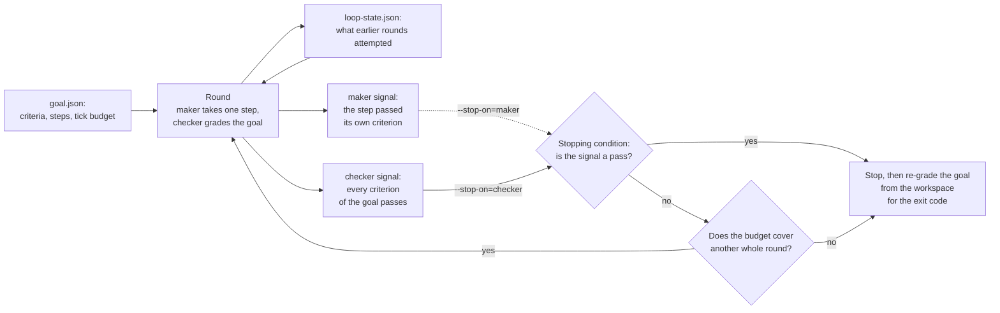

# Lecture 12: Loop engineering

A loop runs until its stopping condition fires, so the signal that
condition reads is the only definition of done the loop actually has. This
lecture defends that single claim with one loop runner over one goal, run
twice with nothing changed but which signal the condition reads: reading
the maker's report about its own step ends the run with two thirds of the
goal unmet, and reading an independent checker's verdict over the whole
goal is what lets the rounds add up to the goal being reached. The
difference is in the report and in the exit code.

## Learning objectives

After this lecture and its exercises you can:

- Show behaviorally, not by assertion, that two loops over one goal,
  differing only in the signal their stopping condition reads, end in
  different states: one with the goal met, one with the goal unmet and a
  report that says the work was finished.
- Name the parts a loop needs before it may run unattended: a goal whose
  criteria are machine-checkable, a maker step, an independent checker, a
  stopping condition, and a clock, with the goal and the loop state on
  disk.
- Say what iteration adds over a single pass, which is state that carries
  between rounds, and what it cannot add, which is a signal nobody
  computes.
- Bound a loop so that a stopping condition which never fires still ends
  the run, and read that ending apart from a successful one.

## Prerequisites

- [Lecture 08](../lecture-08-why-agents-declare-victory-too-early/): the
  completion claim a session makes about its own work. That lecture builds
  the gate that re-executes the checks; this one puts the same claim in a
  load-bearing position, where a loop reads it to decide whether to keep
  going.
- [Lecture 10](../lecture-10-why-observability-belongs-inside-the-harness/):
  the harness record that outlives a session. A loop's state file is that
  record with a second reader, the next round, which is why this lecture
  cares about what the record is used for rather than what it contains.
- [Lecture 11](../lecture-11-why-every-session-must-leave-a-clean-state/):
  the ending that makes the next session cheap. A loop's rounds are
  sessions in a row, and the loop state is the handoff between them,
  written by the runner rather than by the agent.
- A working toolchain (`make setup`, `make doctor`;
  [choosing your track](../../docs/choosing-your-track.md)).
- The glossary's loop vocabulary, `Loop` and `Maker-checker loop`, and its
  [maker/checker split](../../docs/glossary.md#working-discipline) entry
  ([glossary](../../docs/glossary.md#loop-and-graph-vocabulary)).

## The problem

A team turns a task into a loop. The goal is written down: the exporter
declares a writer, the config names an export directory, a test case
exists. The runner is set to work through it unattended, one round at a
time, and the team goes home.

In the morning the run is finished and the report says the goal was
reached. It was reached in one round. The agent added the writer, checked
that the writer was there, said it was done, and the loop believed it. Two
of the three criteria were never touched, and nothing in the transcript
looks like a failure: every step the agent took succeeded, and the loop
ended on a signal that read `pass`.

Nothing here is a capability problem. The remaining work is two more edits
of the same kind the first round already did well, and the budget had nine
of twelve ticks left. What ended the run was the loop's construction: the
stopping condition asked the party that had just done the work whether the
work was finished. Anthropic's guidance on agent loops puts the
requirement on the other side of that line:

> "During execution, it's crucial for the agents to gain 'ground truth'
> from the environment at each step (such as tool call results or code
> execution) to assess its progress."
>
> Source: [Anthropic: Building effective agents](https://www.anthropic.com/engineering/building-effective-agents)

Ground truth is available here. The workspace can be checked against all
three criteria at any moment, and the demo's checker does exactly that in
the same round where the maker declares victory, disagreeing with it in
writing. The loop stopped anyway, because that is not the wire its
stopping condition was attached to.

## Concepts

- **A loop is a goal, a verification step, a stopping condition, and
  externalized loop state** ([glossary](../../docs/glossary.md#loop-and-graph-vocabulary)). The demo
  is that list made runnable: `goal.json`, the checker's turn,
  `--stop-on`, and `loop-state.json`. Nothing else in it is a loop
  primitive, and nothing on that list can be dropped.
- **The stopping condition is the loop's definition of done, and it reads
  exactly one signal.** Everything else the loop produces is commentary.
  This is why the demo's only variable is which signal that is: the two
  runs share their goal, their workspace, their maker, their checker,
  their budget, and their code.
- **The maker's report answers a smaller question than the goal asks.**
  The demo's maker checks the criterion it just worked on, and it is right
  every time it says so. `reports_done` means the step landed, and the
  loop reads it as though it meant the goal was met. An honest signal
  wired to the wrong question is still the wrong stopping condition.
- **A maker-checker loop is the fix, and the split is about questions, not
  suspicion** ([glossary](../../docs/glossary.md#working-discipline)).
  Only a checker pass advances or stops the loop, because only the checker
  grades every criterion of the goal, and it grades the workspace rather
  than the transcript.
- **The loop state is what makes iteration different from repetition.**
  The demo's maker chooses its step from the rounds recorded in
  `loop-state.json`. Delete that memory and round 2 attempts what round 1
  attempted, forever: a loop without carried state is one pass run
  repeatedly.
- **A budget is the stop of last resort, not the stopping condition.** The
  third run's goal contains a criterion whose step cannot satisfy it, so
  the checker's verdict never turns and the condition never fires. The
  clock ends it, and the report says `budget-exhausted` rather than
  `goal-reached`. Anthropic's guidance names the same backstop: "it's also
  common to include stopping conditions (such as a maximum number of
  iterations) to maintain control"
  ([Building effective agents](https://www.anthropic.com/engineering/building-effective-agents)).
- **This unit's checks are language-neutral**: each criterion is an
  executable probe over workspace files, the deterministic stand-in for a
  shell command
  ([deterministic fake agent](../../docs/glossary.md#core-model)), and the
  same `goal.json` drives both tracks to identical reports.

## Architecture

The runner is one round repeated: the maker takes a step, the checker
grades the goal, and the stopping condition reads one of the two signals
they produce. The diagram is the wiring, and the part worth looking at is
that both signals exist in every round while only one of them is
connected.



Walkthrough: `goal.json` and `loop-state.json` are the two files a round
reads, and the state is also written by the round, which is the arrow back
into it. The maker's turn and the checker's turn both run in every round
regardless of `--stop-on`, so the dashed wire is the whole experiment:
moving the connection from one signal to the other is the only difference
between the demo's two behavioural runs. The clock is not part of the
condition; it is the guard in front of the next round, which is why a loop
whose condition never fires still ends. The final re-grade sits after the
stop deliberately: the exit code is the goal's state, never the signal
that ended the run. The demo's [SPEC.md](./code/SPEC.md) pins the check
engine, the maker's step rule, the checker's verdict, and the tick costs.

## Demo

`code/` contains **loop-runner**: one committed loop directory holding
`goal.json`, `loop-state.json`, and a workspace, plus a runner that
repeats rounds over it. `--stop-on` chooses the signal the stopping
condition reads and is the only flag; **the exit code is the goal's state
when the loop stopped**, re-graded from the workspace rather than taken
from whatever signal ended the run. The workspace is read once and edited
in memory, so the committed fixture never changes and every command below
is idempotent.

### The stopping condition reads the maker

#### Python

<!-- fence-exit: 1 -->
```sh
L=lectures/lecture-12-loop-engineering
uv run python $L/code/python/main.py $L/code/fixtures/loop-report-export --stop-on=maker
```

#### TypeScript

<!-- fence-exit: 1 -->
```sh
L=lectures/lecture-12-loop-engineering
pnpm exec tsx $L/code/typescript/main.ts $L/code/fixtures/loop-report-export --stop-on=maker
```

Both transcripts, generated from the Python run by `make verify` (the
TypeScript run is held identical by `make conformance`):

<!-- generated-block: uv run python lectures/lecture-12-loop-engineering/code/python/main.py lectures/lecture-12-loop-engineering/code/fixtures/loop-report-export --stop-on=maker || true -->
```json
{
  "loop": "report-export",
  "goal": "the report exporter declares a writer, names an export directory, and carries a test case",
  "stop_on": "maker",
  "budget_ticks": 12,
  "rounds": [
    {
      "round": 1,
      "clock": 3,
      "maker": {
        "criterion": "writer-implemented",
        "action": "appended writer=csv to src/report.txt",
        "reports_done": true,
        "why": "writer-implemented passes after the edit, and the maker reads the step it just finished as the job being finished"
      },
      "checker": {
        "verdict": "fail",
        "met": [
          "writer-implemented"
        ],
        "unmet": [
          "export-dir-wired",
          "test-case-present"
        ],
        "checked": [
          {
            "criterion": "writer-implemented",
            "status": "pass",
            "detail": "src/report.txt declares writer once"
          },
          {
            "criterion": "export-dir-wired",
            "status": "fail",
            "detail": "config/app.conf has no line starting with export_dir="
          },
          {
            "criterion": "test-case-present",
            "status": "fail",
            "detail": "tests/report-test.txt missing"
          }
        ]
      },
      "stopping_condition": {
        "reads": "maker",
        "signal": "pass",
        "decision": "stop"
      }
    }
  ],
  "stop": {
    "round": 1,
    "clock": 3,
    "fired_on": "maker",
    "reason": "the stopping condition read the maker's signal as pass"
  },
  "loop_state": {
    "loop": "report-export",
    "clock": 3,
    "status": "stopped-early",
    "rounds": [
      {
        "round": 1,
        "criterion": "writer-implemented",
        "maker_reported": "done",
        "checker_verdict": "fail"
      }
    ]
  },
  "unmet": [
    "export-dir-wired",
    "test-case-present"
  ],
  "result": "stopped-early"
}
```
<!-- /generated-block -->

Interpretation: one round, and every part of it is honest. The maker's
step lands, `writer-implemented` passes, and `reports_done` is true
because that one criterion is true. The checker, in the same round, over
the same workspace, reports `export-dir-wired` and `test-case-present`
unmet and names why for each. Then `stopping_condition` reads the maker,
sees a pass, and stops the loop with nine of twelve ticks unspent. The
run exits 1 because `unmet` is re-graded after the stop, which is the only
reason this failure is visible at all: the loop's own account of itself,
in `loop_state.status` and in the transcript, is a maker who said done and
a condition that agreed.

### The same loop, the condition reads the checker

#### Python

```sh
L=lectures/lecture-12-loop-engineering
uv run python $L/code/python/main.py $L/code/fixtures/loop-report-export --stop-on=checker
```

#### TypeScript

```sh
L=lectures/lecture-12-loop-engineering
pnpm exec tsx $L/code/typescript/main.ts $L/code/fixtures/loop-report-export --stop-on=checker
```

The rounds of that run (the full report is pinned in
[`code/expected/stop-on-checker.json`](./code/expected/stop-on-checker.json)):

<!-- generated-block: uv run python lectures/lecture-12-loop-engineering/code/python/main.py lectures/lecture-12-loop-engineering/code/fixtures/loop-report-export --stop-on=checker | uv run python -c "import json,sys; r=json.load(sys.stdin); [print('round ' + str(d['round']) + ' (clock ' + str(d['clock']) + '): ' + d['maker']['action'] + '\n  maker reports done: ' + str(d['maker']['reports_done']).lower() + ' | checker: ' + d['checker']['verdict'] + ' | met [' + ', '.join(d['checker']['met']) + '] | unmet [' + ', '.join(d['checker']['unmet']) + ']\n  stopping condition reads the ' + d['stopping_condition']['reads'] + ': ' + d['stopping_condition']['signal'] + ' -> ' + d['stopping_condition']['decision']) for d in r['rounds']]; print('stop: ' + r['stop']['reason']); print('result: ' + r['result'] + ' | unmet at exit [' + ', '.join(r['unmet']) + ']')" -->
```text
round 1 (clock 3): appended writer=csv to src/report.txt
  maker reports done: true | checker: fail | met [writer-implemented] | unmet [export-dir-wired, test-case-present]
  stopping condition reads the checker: fail -> continue
round 2 (clock 6): appended export_dir=out/reports to config/app.conf
  maker reports done: true | checker: fail | met [writer-implemented, export-dir-wired] | unmet [test-case-present]
  stopping condition reads the checker: fail -> continue
round 3 (clock 9): created tests/report-test.txt with case=export
  maker reports done: true | checker: pass | met [writer-implemented, export-dir-wired, test-case-present] | unmet []
  stopping condition reads the checker: pass -> stop
stop: the stopping condition read the checker's signal as pass
result: goal-reached | unmet at exit []
```
<!-- /generated-block -->

Interpretation: round 1 is the same round as above, down to the maker's
wording and the checker's three details. The loop continues because the
signal it reads is `fail`, and rounds 2 and 3 are what a single pass
cannot produce: each one starts from a workspace the previous round
changed, and picks a step the previous rounds did not attempt, which it
knows only from the loop state. The `met` list grows from one criterion to
two to three, and the condition fires on the round where the last one
turns. The maker said done in all three rounds, so this run and the
previous one had the same maker saying the same thing throughout; the
difference is entirely in which sentence the loop was listening to.

### A goal nothing satisfies, ended by the clock

`fixtures/loop-wrong-target` is the same workspace and the same three
criteria, with one defect seeded in the goal: the step attached to
`test-case-present` appends to `src/report.txt` while the criterion is
checked against `tests/report-test.txt`. No number of rounds makes that
criterion pass, so the checker's verdict never turns and the stopping
condition never fires.

#### Python

<!-- fence-exit: 1 -->
```sh
L=lectures/lecture-12-loop-engineering
uv run python $L/code/python/main.py $L/code/fixtures/loop-wrong-target --stop-on=checker
```

#### TypeScript

<!-- fence-exit: 1 -->
```sh
L=lectures/lecture-12-loop-engineering
pnpm exec tsx $L/code/typescript/main.ts $L/code/fixtures/loop-wrong-target --stop-on=checker
```

<!-- generated-block: uv run python lectures/lecture-12-loop-engineering/code/python/main.py lectures/lecture-12-loop-engineering/code/fixtures/loop-wrong-target --stop-on=checker | uv run python -c "import json,sys; r=json.load(sys.stdin); [print('round ' + str(d['round']) + ' (clock ' + str(d['clock']) + '): ' + d['maker']['action'] + '\n  maker reports done: ' + str(d['maker']['reports_done']).lower() + ' | checker: ' + d['checker']['verdict'] + ' | met [' + ', '.join(d['checker']['met']) + '] | unmet [' + ', '.join(d['checker']['unmet']) + ']\n  stopping condition reads the ' + d['stopping_condition']['reads'] + ': ' + d['stopping_condition']['signal'] + ' -> ' + d['stopping_condition']['decision']) for d in r['rounds']]; print('stop: ' + r['stop']['reason']); print('result: ' + r['result'] + ' | unmet at exit [' + ', '.join(r['unmet']) + ']')" -->
```text
round 1 (clock 3): appended writer=csv to src/report.txt
  maker reports done: true | checker: fail | met [writer-implemented] | unmet [export-dir-wired, test-case-present]
  stopping condition reads the checker: fail -> continue
round 2 (clock 6): appended export_dir=out/reports to config/app.conf
  maker reports done: true | checker: fail | met [writer-implemented, export-dir-wired] | unmet [test-case-present]
  stopping condition reads the checker: fail -> continue
round 3 (clock 9): appended case=export to src/report.txt
  maker reports done: false | checker: fail | met [writer-implemented, export-dir-wired] | unmet [test-case-present]
  stopping condition reads the checker: fail -> continue
round 4 (clock 12): no step taken: every unmet criterion has already been attempted once
  maker reports done: false | checker: fail | met [writer-implemented, export-dir-wired] | unmet [test-case-present]
  stopping condition reads the checker: fail -> continue
stop: round 5 costs 3 ticks and the 12 tick budget has 0 left, so the loop cannot start it
result: budget-exhausted | unmet at exit [test-case-present]
```
<!-- /generated-block -->

Interpretation: round 3 attempts the broken criterion and the maker
reports `not-done`, because its own check still fails after its own edit;
the maker is not the problem in this run. Round 4 has nothing left to try
and takes no step, which is what a loop looks like when it has run out of
plan and does not know it. The clock is the only thing that notices:
round 5 is refused before it starts, and the result is
`budget-exhausted` with `test-case-present` still unmet, exiting 1. The
difference between this and the first run matters more than the shared
exit code. Here the loop reports that it did not reach the goal; there it
reported that it had.

### Supporting evidence: what the two runs of the same loop cost

The rounds and ticks below are a count, so they come after the
behavioural runs and are evidence about them rather than the
demonstration. They are read from the two pinned reports by `make verify`:

<!-- generated-block: uv run python -c "import json; E='lectures/lecture-12-loop-engineering/code/expected/'; m=json.load(open(E+'stop-on-maker.json')); c=json.load(open(E+'stop-on-checker.json')); n=len(c['rounds'][0]['checker']['checked']); f=lambda r: str(len(r['rounds'])) + ' round(s), ' + str(r['stop']['clock']) + ' of ' + str(r['budget_ticks']) + ' ticks spent, ' + str(len(r['unmet'])) + ' of ' + str(n) + ' criteria unmet at exit'; print('stop-on=maker:   ' + f(m)); print('stop-on=checker: ' + f(c)); print('round 1 maker turn and checker verdict identical across the two runs: ' + ('yes' if m['rounds'][0]['maker'] == c['rounds'][0]['maker'] and m['rounds'][0]['checker'] == c['rounds'][0]['checker'] else 'no')); print('rounds of the checker run whose maker reported done: ' + str(sum(1 for d in c['rounds'] if d['maker']['reports_done'])) + ' of ' + str(len(c['rounds'])))" -->
```text
stop-on=maker:   1 round(s), 3 of 12 ticks spent, 2 of 3 criteria unmet at exit
stop-on=checker: 3 round(s), 9 of 12 ticks spent, 0 of 3 criteria unmet at exit
round 1 maker turn and checker verdict identical across the two runs: yes
rounds of the checker run whose maker reported done: 3 of 3
```
<!-- /generated-block -->

The third line is the controlled variable: round 1's maker turn and
checker verdict are identical objects in both reports, so the runs did not
diverge until the condition read them. The fourth is why the failure is
structural rather than unlucky: the maker reported done in every round of
the successful run too, so a loop wired to that signal would have stopped
at round 1 no matter how many rounds the goal needed.

## Implementation notes

- **Put the acceptance criteria in the goal file, not in the prompt.** The
  demo's `goal.json` pairs each criterion with the check that decides it,
  which is what makes a stopping condition possible at all: a goal stated
  only in prose leaves nothing for the checker to run, and the loop is
  then forced back onto the maker's opinion. This is
  [evidence-based completion](../../docs/glossary.md#working-discipline)
  moved one level out, from a session's claim to a loop's exit.
- **Attach the condition to the checker, then keep the maker's report.**
  Deleting `reports_done` would cost the loop its most useful diagnostic:
  a round where the maker says done and the checker says fail is a scope
  misunderstanding, and a round where both say fail is honest slow
  progress. The demo's third run separates them exactly that way. The rule
  is about authority, not about which fields exist.
- **Give every round a cost and check the budget before the round, not
  after.** The demo refuses round 5 rather than starting and abandoning
  it, so the clock never records work that did not happen. Ticks are a
  step counter here; in a real runner the same guard holds turns, tokens,
  or wall time, and its job is unchanged: end a loop whose stopping
  condition cannot.
- **Write the loop state at the end of every round.** The demo carries it
  in memory because a lecture demo must not write to its own fixtures, and
  `loop_state` in the report is what a runner would have persisted. A loop
  interrupted between rounds resumes from that file, which is
  [lecture 11](../lecture-11-why-every-session-must-leave-a-clean-state/)'s
  discipline applied at every round boundary instead of once at the end.
- **Let a criterion the maker cannot satisfy be visible as such.** The
  third run's report says `budget-exhausted` and names the criterion still
  unmet, which is enough to find the defect in the goal file. A loop that
  reported only "stopped" would leave the same defect looking like a
  capability problem.
- Track note: both tracks read workspace files line by line, and the
  TypeScript track splits on `/\r?\n/` per the conventions' input
  line-ending rule, so the conformance runner holds the two reports
  byte-identical after normalization.

## Key takeaways

- A loop has exactly one definition of done, and it is whichever signal
  the stopping condition reads. Everything else the loop prints is
  commentary on a decision that was already made elsewhere.
- The maker's report about its own step can be completely honest and still
  be the wrong signal, because it answers a smaller question than the goal
  asks. Wiring is the defect, not dishonesty.
- What iteration buys is state that carries between rounds: each round
  starts from the workspace and the memory the last one left. Without that
  memory a loop is one pass repeated.
- A budget is not a stopping condition, it is what ends the loops whose
  stopping condition never fires. A run that ends on the clock and a run
  that ends on a pass must not report the same thing.

## Exercises

| Exercise | You build | Difficulty | Time |
| --- | --- | --- | --- |
| [01: stopping-condition](./exercises/exercise-01-stopping-condition/) | The rule that ends a loop: which signal stops it, and the budget that stops it when nothing else does | Medium | ~25 min |

It is graded by shared expected output: `./verify.sh --stack=<yours>`
exits 0 when your track's implementation is correct.

## Further exploration

- [Anthropic: Building effective agents](https://www.anthropic.com/engineering/building-effective-agents),
  the evaluator and optimizer split this lecture's maker and checker are
  built from, and the ground truth an agent needs at each step
- [Anthropic: Effective harnesses for long-running agents](https://www.anthropic.com/engineering/effective-harnesses-for-long-running-agents),
  on incremental progress across many runs and the self-verification a
  later run relies on
- [OpenAI: Harness engineering: leveraging Codex in an agent-first world](https://openai.com/index/harness-engineering/),
  on failure output an unattended run can act on without a human reading it
