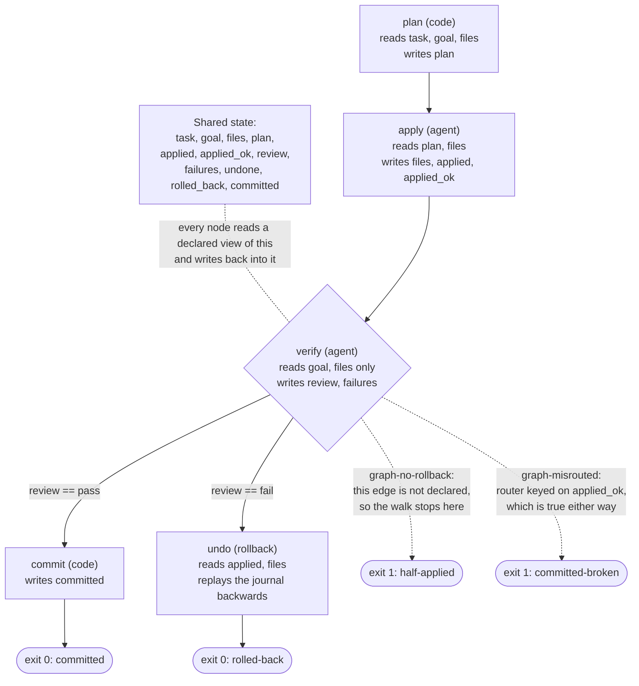

# Lecture 13: Graph engineering

A graph is four things written down: nodes, edges, shared state, and the
rule that picks the next edge from that state. This lecture defends one
claim: a path the graph does not declare is a path the run cannot take,
and when the undeclared path is the one back from a failed check, the run
stops with the work half applied and nobody holding it. The demo runs the
same five nodes over the same workspace under three wirings and lets the
wiring decide the outcome.

## Learning objectives

After this lecture and its exercise you can:

- Read and write a graph as data: named nodes, the shared-state keys each
  node may read, the edges out of each node, and a router that picks
  among them.
- Show behaviorally that the same nodes over the same input reach
  different terminal states purely by how they are wired.
- Declare a rollback edge, and build the node it leads to so the
  workspace comes back rather than partly comes back.
- Tell a graph's shape apart from its correctness: read a completeness
  count as evidence, and know the failure it cannot see.

## Prerequisites

- [Lecture 08](../lecture-08-why-agents-declare-victory-too-early/): why a
  check has to be re-executed by something that did not do the work. In a
  graph that becomes structural, and this demo enforces it: the verify
  node's declared view of shared state contains the workspace and the
  goal, so it physically cannot read the plan or the journal.
- [Lecture 11](../lecture-11-why-every-session-must-leave-a-clean-state/):
  finish, roll back, or declare, and why a half applied change is the
  expensive one to inherit. That lecture makes the choice at the end of a
  session; this one makes it an edge, so the run takes it without being
  asked.
- A working toolchain (`make setup`, `make doctor`;
  [choosing your track](../../docs/choosing-your-track.md)).
- The glossary's [loop and graph vocabulary](../../docs/glossary.md#loop-and-graph-vocabulary):
  graph, node, edge, shared state, router, and rollback edge.

## The problem

A run has a task, a workspace, and four jobs to do: work out what is
missing, apply the edits, check the result, and record it. Wired as one
agent, all four live in one context and the connections between them are
whatever the agent remembers to do next. That works until a check fails,
because the question a failed check asks is a routing question: go back
and try again, undo what was written, or stop and hand it to a person. An
agent that has not been told holds all three answers at once and picks one
silently.

The demo's run is that shape. Its `apply` node appends `export_dir=out/reports`
to a config file, which is exactly right when the key is absent and
exactly wrong when the file already carries `export_dir=out/old`: the file
then declares the key twice and the verify node says so. Every wiring in
the demo reaches that same failed check. What they do next is the whole
lecture.

Anthropic's survey of agent patterns draws the same distinction the
demo's node kinds carry:

> "Workflows are systems where LLMs and tools are orchestrated through
> predefined code paths. Agents, on the other hand, are systems where LLMs
> dynamically direct their own processes and tool usage, maintaining
> control over how they accomplish tasks."
>
> Source: [Anthropic: Building Effective Agents](https://www.anthropic.com/engineering/building-effective-agents)

A graph holds both. Its nodes can be deterministic code or an agent with
its own context, and it is the graph, not the node, that decides what
happens after each one returns.

## Concepts

- **The four parts, and only these four.** The demo's executor is nodes,
  edges, shared state, and a routing rule and nothing else, in the standard
  library of both tracks, so nothing in this lecture depends on a framework.
- **The graph is data, so it is reviewable.** The demo's graphs are
  committed JSON files, and the three of them differ only in the edges out
  of one node. A wiring you can diff is a wiring someone can argue with
  before it runs, which is the practical difference between a decision
  taken in a file and a decision taken in a context window.
- **Routing reads state, not intent.** The router at the verify node names
  one shared-state key and the values it can take. `graph-declared` names
  `review`, the verdict the check wrote. `graph-misrouted` names
  `applied_ok`, which the apply node sets when its own writes land. Both
  are well formed graphs. One of them ships broken work, because the
  question "did the writes go in" is not the question "is the result
  right."
- **A node sees only what its graph entry lists.** Each node declares the
  state keys it reads, and the executor hands it a view of exactly those.
  The verify node's list is the goal and the workspace, so the
  independence lecture 07 argues for is enforced by the executor rather
  than promised in a prompt. Context isolation is a property of the
  wiring here, not of the node's good behavior.
- **A rollback edge is an edge like any other, and its node has to be
  real.** Declaring the edge routes the failure somewhere; what comes back
  depends on the node at the far end. The demo's `undo` node replays the
  apply journal backwards, because an appended line can only be removed
  while it is still the last line of its file. Exercise 01 is that node
  and the order it replays in.
- **Counting a graph's parts is evidence, not a verdict.** The demo's
  second surface reports nodes, edges, conditional edges, rollback edges,
  and any routing value with no edge. It catches the missing rollback edge
  and exits 1. It scores `graph-misrouted` as complete, because a router
  keyed on the wrong field is complete: every declared value has an edge.
- **This unit's nodes are language-neutral.** Each node is a deterministic
  function over the shared state, the stand-in for a model call or a shell
  command ([deterministic fake agent](../../docs/glossary.md#core-model)),
  and the same committed graph files drive both tracks to identical
  reports.

## Architecture

The mechanism is one graph file per wiring over one executor. The diagram
is the declared graph, with the two failure wirings marked at the only
place they differ: the edges out of `verify`.



The solid edges are `graph-declared`. The walk starts at
`plan`, and every node's writes land in the shared state before the router
runs. The router is the diamond: it reads one key of that state and
returns a node name. Both dotted branches are the same four nodes with one
edge changed. `graph-no-rollback` deletes the `fail` edge, so the router
finds nothing to take and the walk ends at `verify` with the apply node's
edits still in the workspace. `graph-misrouted` keeps both edges and
points the router at `applied_ok` instead of `review`, so it takes the
commit edge while the check that failed is sitting unread in the same
state. The demo's [SPEC.md](./code/SPEC.md) pins the graph schema, every
node's contract, the router, and the exit codes.

## Demo

`code/` contains **graph-run**: a graph executor with no dependencies, and
two surfaces over it. `run <graph-file> <workspace-dir>` walks a graph and
reports the path it took, every routing decision, the workspace it left,
and a verdict. `structure <graph-file>` counts the graph's parts. The
workspace is read once and edited in memory, so the committed fixtures
never change and every command below is idempotent.

**The exit code answers whether the graph left the workspace in a state
someone can act on, not whether the task succeeded.** A committed run and
a rolled back run both exit 0; a run that walked away from its own edits
exits 1.

### The declared graph over a workspace where the edit is clean

#### Python

```sh
L=lectures/lecture-13-graph-engineering
uv run python $L/code/python/main.py run \
  $L/code/fixtures/graphs/graph-declared.json \
  $L/code/fixtures/workspaces/workspace-clean
```

#### TypeScript

```sh
L=lectures/lecture-13-graph-engineering
pnpm exec tsx $L/code/typescript/main.ts run \
  $L/code/fixtures/graphs/graph-declared.json \
  $L/code/fixtures/workspaces/workspace-clean
```

The routing decision and what the walk left behind (the full report is
pinned in
[`code/expected/run-committed.json`](./code/expected/run-committed.json)):

<!-- generated-block: uv run python lectures/lecture-13-graph-engineering/code/python/main.py run lectures/lecture-13-graph-engineering/code/fixtures/graphs/graph-declared.json lectures/lecture-13-graph-engineering/code/fixtures/workspaces/workspace-clean | uv run python -c "import json,sys; r=json.load(sys.stdin); print(json.dumps({'path': r['path'], 'routing': r['routing'], 'workspace_after': r['workspace_after'], 'matches_opening_state': r['matches_opening_state'], 'verdict': r['verdict']}, indent=2))" -->
```json
{
  "path": [
    "plan",
    "apply",
    "verify",
    "commit"
  ],
  "routing": [
    {
      "at": "verify",
      "key": "review",
      "value": "pass",
      "edge": "verify -> commit",
      "rollback": false,
      "note": "the router read review=pass and took the edge declared for it"
    }
  ],
  "workspace_after": {
    "config/app.conf": [
      "service=reports",
      "export_dir=out/reports"
    ],
    "scratch/apply-notes.txt": [
      "note=working notes written by the apply node"
    ],
    "src/report.txt": [
      "module=report",
      "writer=csv"
    ]
  },
  "matches_opening_state": false,
  "verdict": "committed"
}
```
<!-- /generated-block -->

Interpretation: four nodes, one routing decision. The router read
`review=pass` out of shared state and took the edge declared for that
value, so the walk ended at `commit` and the workspace kept both edits.
`matches_opening_state` is false because the work landed, which is what a
committed run means.

### The same graph over the workspace where the edit conflicts

#### Python

```sh
L=lectures/lecture-13-graph-engineering
uv run python $L/code/python/main.py run \
  $L/code/fixtures/graphs/graph-declared.json \
  $L/code/fixtures/workspaces/workspace-conflicted
```

#### TypeScript

```sh
L=lectures/lecture-13-graph-engineering
pnpm exec tsx $L/code/typescript/main.ts run \
  $L/code/fixtures/graphs/graph-declared.json \
  $L/code/fixtures/workspaces/workspace-conflicted
```

The whole report, generated from the Python run by `make verify` (the
TypeScript run is held identical by `make conformance`):

<!-- generated-block: uv run python lectures/lecture-13-graph-engineering/code/python/main.py run lectures/lecture-13-graph-engineering/code/fixtures/graphs/graph-declared.json lectures/lecture-13-graph-engineering/code/fixtures/workspaces/workspace-conflicted -->
```json
{
  "graph": "graph-declared",
  "workspace": "workspace-conflicted",
  "task": "declare the csv writer and its export directory",
  "path": [
    "plan",
    "apply",
    "verify",
    "undo"
  ],
  "steps": [
    {
      "step": 1,
      "node": "plan",
      "kind": "code",
      "reads": [
        "task",
        "goal",
        "files"
      ],
      "writes": [
        "plan"
      ],
      "outcome": "2 goals read; 2 need an edit: src/report.txt has no writer= line; config/app.conf declares export_dir=out/old, not export_dir=out/reports"
    },
    {
      "step": 2,
      "node": "apply",
      "kind": "agent",
      "reads": [
        "plan",
        "files"
      ],
      "writes": [
        "applied",
        "applied_ok",
        "files"
      ],
      "outcome": "2 edits applied and scratch/apply-notes.txt written; 3 operations journalled"
    },
    {
      "step": 3,
      "node": "verify",
      "kind": "agent",
      "reads": [
        "goal",
        "files"
      ],
      "writes": [
        "failures",
        "review"
      ],
      "outcome": "review=fail; config/app.conf declares export_dir 2 times"
    },
    {
      "step": 4,
      "node": "undo",
      "kind": "rollback",
      "reads": [
        "applied",
        "files"
      ],
      "writes": [
        "files",
        "rolled_back",
        "undone"
      ],
      "outcome": "3 journalled operations replayed backwards: removed scratch/apply-notes.txt; removed export_dir=out/reports from config/app.conf; removed writer=csv from src/report.txt"
    }
  ],
  "routing": [
    {
      "at": "verify",
      "key": "review",
      "value": "fail",
      "edge": "verify -> undo",
      "rollback": true,
      "note": "the router read review=fail and took the edge declared for it"
    }
  ],
  "final_state": {
    "review": "fail",
    "applied_ok": true,
    "committed": false,
    "rolled_back": true,
    "failures": [
      "config/app.conf declares export_dir 2 times"
    ],
    "undone": [
      "removed scratch/apply-notes.txt",
      "removed export_dir=out/reports from config/app.conf",
      "removed writer=csv from src/report.txt"
    ]
  },
  "workspace_after": {
    "config/app.conf": [
      "service=reports",
      "export_dir=out/old"
    ],
    "src/report.txt": [
      "module=report"
    ]
  },
  "matches_opening_state": true,
  "verdict": "rolled-back"
}
```
<!-- /generated-block -->

Interpretation: the same graph file, the same four node implementations,
and a different path. Step 1 already carries the difference: the plan node
reports `config/app.conf declares export_dir=out/old, not
export_dir=out/reports`, where the clean workspace had no such line at
all. Step 2 appends anyway, which is what an editor that believes a key is
absent does, and step 3 catches it: `config/app.conf declares export_dir 2
times`. Now the router runs on the same key as before and reads a
different value, so it takes the other declared edge, and `rollback: true`
says the edge it took leads to a rollback node.

Step 4 is the edge doing something. The journal is replayed backwards, so
the scratch file goes first, then the config line, then the writer line,
and `workspace_after` shows `config/app.conf` back to
`service=reports, export_dir=out/old` with `scratch/apply-notes.txt` gone
entirely. `matches_opening_state` is true: the workspace is byte for byte
what the run opened. The task did not get done, and the run still exits 0,
because the graph left nothing behind for anyone to untangle.

### The same nodes, without the rollback edge

#### Python

<!-- fence-exit: 1 -->
```sh
L=lectures/lecture-13-graph-engineering
uv run python $L/code/python/main.py run \
  $L/code/fixtures/graphs/graph-no-rollback.json \
  $L/code/fixtures/workspaces/workspace-conflicted
```

#### TypeScript

<!-- fence-exit: 1 -->
```sh
L=lectures/lecture-13-graph-engineering
pnpm exec tsx $L/code/typescript/main.ts run \
  $L/code/fixtures/graphs/graph-no-rollback.json \
  $L/code/fixtures/workspaces/workspace-conflicted
```

<!-- generated-block: uv run python lectures/lecture-13-graph-engineering/code/python/main.py run lectures/lecture-13-graph-engineering/code/fixtures/graphs/graph-no-rollback.json lectures/lecture-13-graph-engineering/code/fixtures/workspaces/workspace-conflicted | uv run python -c "import json,sys; r=json.load(sys.stdin); print(json.dumps({'path': r['path'], 'routing': r['routing'], 'final_state': {k: r['final_state'][k] for k in ('review', 'committed', 'rolled_back')}, 'workspace_after': r['workspace_after'], 'matches_opening_state': r['matches_opening_state'], 'verdict': r['verdict']}, indent=2))" -->
```json
{
  "path": [
    "plan",
    "apply",
    "verify"
  ],
  "routing": [
    {
      "at": "verify",
      "key": "review",
      "value": "fail",
      "edge": null,
      "rollback": false,
      "note": "no edge is declared for review == fail, so the walk stops here"
    }
  ],
  "final_state": {
    "review": "fail",
    "committed": false,
    "rolled_back": false
  },
  "workspace_after": {
    "config/app.conf": [
      "service=reports",
      "export_dir=out/old",
      "export_dir=out/reports"
    ],
    "scratch/apply-notes.txt": [
      "note=working notes written by the apply node"
    ],
    "src/report.txt": [
      "module=report",
      "writer=csv"
    ]
  },
  "matches_opening_state": false,
  "verdict": "half-applied"
}
```
<!-- /generated-block -->

Interpretation: one edge removed from one node, and the path is three
nodes instead of four. The router still runs and still reads `review=fail`
out of the same shared state; there is simply nowhere declared to go, so
the walk stops standing on the apply node's edits. Compare the
`workspace_after` above with the rolled back run's: `config/app.conf` now
carries `export_dir` twice, which is the exact condition the verify node
failed on, and `scratch/apply-notes.txt` is still in the tree. Nothing is
committed, nothing is rolled back, and the run exits 1 on
`half-applied`, which is the state the next person or session has to
reconstruct by hand.

### The same nodes, with the router keyed on the wrong state

#### Python

<!-- fence-exit: 1 -->
```sh
L=lectures/lecture-13-graph-engineering
uv run python $L/code/python/main.py run \
  $L/code/fixtures/graphs/graph-misrouted.json \
  $L/code/fixtures/workspaces/workspace-conflicted
```

#### TypeScript

<!-- fence-exit: 1 -->
```sh
L=lectures/lecture-13-graph-engineering
pnpm exec tsx $L/code/typescript/main.ts run \
  $L/code/fixtures/graphs/graph-misrouted.json \
  $L/code/fixtures/workspaces/workspace-conflicted
```

<!-- generated-block: uv run python lectures/lecture-13-graph-engineering/code/python/main.py run lectures/lecture-13-graph-engineering/code/fixtures/graphs/graph-misrouted.json lectures/lecture-13-graph-engineering/code/fixtures/workspaces/workspace-conflicted | uv run python -c "import json,sys; r=json.load(sys.stdin); print(json.dumps({'path': r['path'], 'routing': r['routing'], 'final_state': {k: r['final_state'][k] for k in ('review', 'committed', 'rolled_back')}, 'workspace_after': r['workspace_after'], 'matches_opening_state': r['matches_opening_state'], 'verdict': r['verdict']}, indent=2))" -->
```json
{
  "path": [
    "plan",
    "apply",
    "verify",
    "commit"
  ],
  "routing": [
    {
      "at": "verify",
      "key": "applied_ok",
      "value": "true",
      "edge": "verify -> commit",
      "rollback": false,
      "note": "the router read applied_ok=true and took the edge declared for it"
    }
  ],
  "final_state": {
    "review": "fail",
    "committed": true,
    "rolled_back": false
  },
  "workspace_after": {
    "config/app.conf": [
      "service=reports",
      "export_dir=out/old",
      "export_dir=out/reports"
    ],
    "scratch/apply-notes.txt": [
      "note=working notes written by the apply node"
    ],
    "src/report.txt": [
      "module=report",
      "writer=csv"
    ]
  },
  "matches_opening_state": false,
  "verdict": "committed-broken"
}
```
<!-- /generated-block -->

Interpretation: this graph has its rollback edge. It never takes it,
because the router is keyed on `applied_ok`, which the apply node sets to
true when its own writes go in, and its writes always go in. Read the
routing entry and the final state together: the router acted on
`applied_ok=true` while `review` sat in the same shared state saying
`fail`. The walk therefore reached `commit`, `committed` is true, and the
workspace still carries the duplicated key. `committed-broken` is a worse
outcome than `half-applied` for the same reason a wrong record is worse
than a missing one: the run now claims the work landed.

### Supporting evidence: the two workspaces differ by one line

The claim above is that the wiring and the state decide everything. The
workspaces are otherwise the same fixture, compared by `make verify`:

<!-- generated-block: uv run python -c "import pathlib; base=pathlib.Path('lectures/lecture-13-graph-engineering/code/fixtures/workspaces'); read=lambda w: {p.relative_to(base / w).as_posix(): p.read_text() for p in sorted((base / w).rglob('*')) if p.is_file()}; a=read('workspace-clean'); b=read('workspace-conflicted'); same=[k for k in a if a[k] == b.get(k)]; differ=[k for k in a if a[k] != b.get(k)]; print(f'{len(a)} fixture files per workspace; {len(same)} byte-identical, {len(differ)} different'); print('\n'.join(k + ': workspace-conflicted adds ' + ', '.join(x for x in b[k].split(chr(10)) if x and x not in a[k].split(chr(10))) for k in differ))" -->
```text
3 fixture files per workspace; 2 byte-identical, 1 different
config/app.conf: workspace-conflicted adds export_dir=out/old
```
<!-- /generated-block -->

One line of one file is the entire difference between the run that
commits and the run that rolls back. The router did not change, the nodes
did not change, and the graph did not change; the state the router read
did.

### Supporting evidence: counting the graph's parts

`structure` turns an undeclared routing path into a failing gate before
anything runs.

#### Python

```sh
L=lectures/lecture-13-graph-engineering
uv run python $L/code/python/main.py structure \
  $L/code/fixtures/graphs/graph-declared.json
```

#### TypeScript

```sh
L=lectures/lecture-13-graph-engineering
pnpm exec tsx $L/code/typescript/main.ts structure \
  $L/code/fixtures/graphs/graph-declared.json
```

The same surface over all three wirings, with each run's exit code:

<!-- generated-block: uv run python -c "import json, subprocess, sys; L='lectures/lecture-13-graph-engineering/code'; ran=[subprocess.run([sys.executable, L + '/python/main.py', 'structure', L + '/fixtures/graphs/' + n + '.json'], capture_output=True, text=True) for n in ('graph-declared', 'graph-no-rollback', 'graph-misrouted')]; rows=[(json.loads(d.stdout), d.returncode) for d in ran]; print('\n'.join(f\"{r['graph']}: exit {c}, {r['nodes']} nodes, {r['edges']} edges, {r['conditional_edges']} conditional, {r['rollback_edges']} rollback\nrouter at {r['routers'][0]['at']} keyed on {r['routers'][0]['key']}; uncovered values: {', '.join(r['routers'][0]['uncovered']) or 'none'}; complete: {json.dumps(r['complete'])}\" for r, c in rows))" -->
```text
graph-declared: exit 0, 5 nodes, 4 edges, 2 conditional, 1 rollback
router at verify keyed on review; uncovered values: none; complete: true
graph-no-rollback: exit 1, 4 nodes, 3 edges, 1 conditional, 0 rollback
router at verify keyed on review; uncovered values: fail; complete: false
graph-misrouted: exit 0, 5 nodes, 4 edges, 2 conditional, 1 rollback
router at verify keyed on applied_ok; uncovered values: none; complete: true
```
<!-- /generated-block -->

`graph-no-rollback` is caught here: it declares that `review` can be
`fail` and then declares no edge for that value, which is a hole a reader
can see and a gate can fail on. `graph-misrouted` is not caught here, and
no count of its parts could catch it. It has five nodes, four edges, one
rollback edge, and no
uncovered routing value; by every count it is the same graph as
`graph-declared`. Only running it shows that the key it routes on is the
wrong one. That is the whole reason the counts sit under this heading and
the runs sit above it.

## Implementation notes

- **Declare the state a node may read, not just the state it writes.** The
  executor builds each node's view from its graph entry's `reads` list, so
  the verify node cannot see the plan or the journal even by accident.
  Making independence a property of the wiring costs one list per node and
  removes a whole class of "the reviewer already knew the answer" bugs.
- **Journal the writes, in order, at the moment you make them.** The
  rollback node reverses a list; it does not diff, guess, or re-derive.
  Everything that makes rollback possible was recorded by the node that
  did the writing, which is why the apply node's return value carries
  `applied` beside `files`.
- **Replay a journal backwards.** An appended line is removable only while
  it is the last line of its file, so the later writes have to come off
  first. Walking forward reverts whatever happens to be at the tip and
  leaves the rest, which is the exercise's seeded mistake and a genuinely
  easy one to ship.
- **Name the routing key's value domain in the graph file.** The demo's
  router declares `{"key": "review", "values": ["pass", "fail"]}`, so a
  value with no edge is a detectable hole rather than a runtime surprise.
  This is the cheapest structural check a graph can carry and it is what
  the `structure` surface reads.
- **Give the exit code one job.** Here it reports workspace integrity:
  committed and rolled back both exit 0, half applied and committed broken
  both exit 1. A rollback is a success of the graph even though the task
  did not land, and conflating "the task succeeded" with "the run left
  something sane" is what makes a `half-applied` run look like an ordinary
  failure.
- Track note: both tracks read workspace files line by line, and the
  TypeScript track splits on `/\r?\n/` per the conventions' input
  line-ending rule; the router compares state values as text (`true`,
  `false`, `none`, or the value itself) so the two runtimes spell every
  comparison the same way, and the conformance runner holds the two
  reports byte-identical after normalization.

## Key takeaways

- A graph is nodes, edges, shared state, and a routing rule. Anything you
  did not declare is a path the run cannot take, and the run will not tell
  you it wanted to.
- The rollback edge is the one most often left out, because the happy path
  is the one you draw first. Its absence does not show up as an error; it
  shows up as a workspace with half the work in it.
- Routing on the wrong state key produces a graph that passes every
  structural check and ships broken work. Ask what each routing key
  actually measures, not whether every value has an edge.
- A rollback edge is only worth as much as the node at the end of it. The
  node needs a journal of what was written, and it has to replay that
  journal backwards.
- Counts about a graph are evidence about its shape. Run the graph.

## Exercises

| Exercise | You build | Difficulty | Time |
| --- | --- | --- | --- |
| [01: routing-and-read-views](./exercises/exercise-01-routing-and-read-views/) | The checks a graph's structure cannot see: whose write a router reads, and whether a node's declared view matches what it reads | Medium | ~30 min |

It is graded by shared expected output: `./verify.sh --stack=<yours>`
exits 0 when your track's implementation is correct.

## Further exploration

- [Anthropic: Building Effective Agents](https://www.anthropic.com/engineering/building-effective-agents),
  the workflow and agent distinction this lecture's node kinds carry, and
  five orchestration patterns that are graphs when you draw them
- [LangGraph: the graph API](https://docs.langchain.com/oss/python/langgraph/graph-api),
  a first-hand definition of the same four parts: state as "a shared data
  structure that represents the current snapshot of your application",
  nodes that "receive the current state as input, perform some computation
  or side-effect, and return an updated state", and edges as "functions
  that determine which Node to execute next based on the current state"
- [Anthropic: Effective harnesses for long-running agents](https://www.anthropic.com/engineering/effective-harnesses-for-long-running-agents),
  on leaving the environment in a clean state, which is what the rollback
  edge exists to guarantee when a check fails
