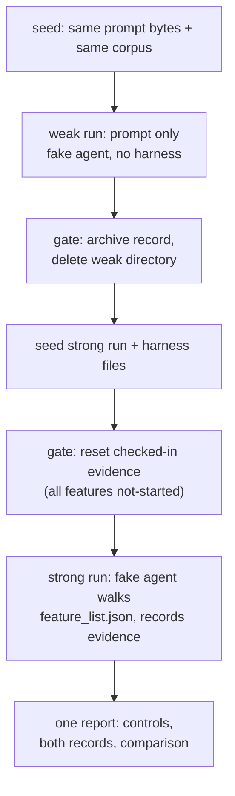

# Project 01: Baseline vs minimal harness

## Overview

The same build task, executed twice by the same deterministic fake agent:
once with nothing but a vague prompt, once with the minimal harness
(AGENTS.md, init.sh, feature_list.json, CLAUDE.md, claude-progress.md,
docs/) pre-placed in the working directory. The difference is measured by
a controlled experiment whose report is pinned byte-for-byte, not
narrated.

The application under the experiment is **kb**, a local knowledge base
delivered as a CLI plus a small loopback HTTP server, in both tracks.
This deviates deliberately from the reference course's Electron desktop
app, for two reasons this course's research recorded:

1. A GUI feature ("a window opens", "a left sidebar renders") cannot be
   asserted headless or expressed in a second language track; a CLI and
   an HTTP endpoint can be, in both tracks, byte-identically.
2. The reference's `feature_list.json` evidence fields were prose
   assertions about source code ("the constructor calls
   ensureDirectories"). Here **every evidence field is a command and its
   captured output**, produced by executing that command, and a test
   asserts the committed evidence equals what the experiment actually
   produces.

The four reference features survive the translation: window launch
becomes `app-starts` (the server binds, answers `/health`, shuts down);
document list, question panel, and data directory become `document-list`,
`question-answer`, and `data-directory`, each with an executable
verification command.

## Learning objectives

After this project you can:

- Run a controlled two-condition experiment on agent behavior and defend
  each control, not just list them.
- Convert GUI-style feature claims into command-assertable features with
  recorded evidence.
- Explain why a vague prompt plus a capable agent still ships unverified
  work, and which harness artifact removes each failure.
- Point at the two seams where a real model plugs into this project (the
  answer composer and the fake agent) without changing any contract.

## Prerequisites

- [Lecture 01](../../lectures/lecture-01-why-capable-agents-still-fail/):
  the claim-without-verification failure this experiment reproduces on
  purpose.
- [Lecture 02](../../lectures/lecture-02-what-a-harness-actually-is/):
  the harness subsystems the strong run receives.
- `make setup` completed at the repository root; your track green in
  `make doctor` ([choosing your track](../../docs/choosing-your-track.md)).

## Architecture

The experiment is an ordered pipeline with gates between the two runs
(archive, delete, reset), and ordering is exactly what the controls
protect, so the diagram is a flowchart with the gates as explicit nodes:



Walkthrough: the weak directory is gone before the strong one exists
(isolation gate), and the strong run starts from a feature list with no
evidence in it (reset gate). Each gate is measured into the report's
`controls` object; a violated control makes the experiment exit 1 rather
than print a compromised comparison. [SPEC.md](./SPEC.md) pins the whole
protocol.

Why each control exists, not just what it is:

- **Isolated working directories, one at a time.** An agent explores its
  filesystem; if the weak run can see the strong harness files, it stops
  being a prompt-only condition. Deleting the weak directory before
  seeding the strong one makes cross-contamination impossible rather than
  discouraged.
- **No git branches for separation.** Branch refs are visible from inside
  a checkout, so a branch-switched "weak" run still has the strong
  harness one `git show` away. This project never uses git for run
  isolation; directories that never coexist do the job. (The experiment
  itself never invokes git at all.)
- **Checked-in evidence reset before the strong run.** The committed
  harness seed carries the reference run's evidence. Without the reset,
  the strong agent would open a feature list where everything already
  passes and correctly do nothing, proving only that finished work looks
  finished. The reset is applied by code and asserted
  (`controls.evidence_reset_applied`).
- **Identical prompts (and corpus) across both runs.** The experiment
  measures what the harness changes, so everything else must not change:
  both runs are seeded from the same prompt bytes
  (`prompt_sha256`) and the same document set, and both facts are
  measured into `controls`.

## Project structure

```text
project-01-baseline-vs-minimal-harness/
  README.md            this file
  SPEC.md              kb surface + experiment protocol (shared contract)
  cases.json           conformance cases (run against both tracks)
  fixtures/kb-data/documents/   the three-document corpus (single copy)
  expected/            pinned outputs incl. the full experiment report
  harness/             the strong-run seed: AGENTS.md, CLAUDE.md, init.sh,
                       feature_list.json (evidence machine-derived),
                       claude-progress.md, docs/
  starter/             the weak-run seed: task-prompt.md only
  solution/python/     kb, Python track (+ tests/)
  solution/typescript/ kb, TypeScript track (+ tests/)
  verify.sh            conformance + both test suites
```

The starter is genuinely the weak condition: a vague prompt and nothing
else. There is no stripped app copy anywhere in it or in its history; the
weak run's working directory is assembled at experiment time from the
prompt and the shared corpus.

## Setup

Everything installs at the repository root; the project adds nothing:

```sh
make setup
```

## Usage

All commands run from this project directory. `kb` is the canonical
command form; expand it per track (the conformance suite proves both
expansions behave identically):

### Python

```sh
uv run python solution/python/main.py init --data-dir kb-data --seed fixtures/kb-data/documents
uv run python solution/python/main.py list --data-dir kb-data
uv run python solution/python/main.py ask --data-dir kb-data "Which lines become citations in the ranking?"
uv run python solution/python/main.py serve --data-dir kb-data --port 8151
```

### TypeScript

```sh
pnpm exec tsx solution/typescript/main.ts init --data-dir kb-data --seed fixtures/kb-data/documents
pnpm exec tsx solution/typescript/main.ts list --data-dir kb-data
pnpm exec tsx solution/typescript/main.ts ask --data-dir kb-data "Which lines become citations in the ranking?"
pnpm exec tsx solution/typescript/main.ts serve --data-dir kb-data --port 8151
```

A grounded answer, generated from the Python run by `make verify` (the
TypeScript run is held identical by `make conformance`):

<!-- generated-block: uv run python projects/project-01-baseline-vs-minimal-harness/solution/python/main.py ask --data-dir projects/project-01-baseline-vs-minimal-harness/fixtures/kb-data "Which lines become citations in the ranking?" -->
```json
{
  "question": "Which lines become citations in the ranking?",
  "citations": [
    {
      "document": "retrieval-plan",
      "title": "Retrieval plan",
      "line": 16,
      "excerpt": "The ranking keeps the two best scoring lines and returns them as citations.",
      "score": 3
    },
    {
      "document": "architecture-notes",
      "title": "Architecture notes",
      "line": 16,
      "excerpt": "Answers carry citations that name the source document and the exact line",
      "score": 1
    }
  ],
  "answer": "Based on \"Retrieval plan\" (line 16): The ranking keeps the two best scoring lines and returns them as citations. See also \"Architecture notes\" (line 16)."
}
```
<!-- /generated-block -->

## Demo flow

Run the experiment (both tracks print the same bytes):

### Python

```sh
uv run python solution/python/main.py experiment
```

### TypeScript

```sh
pnpm exec tsx solution/typescript/main.ts experiment
```

It seeds the weak run, lets the fake agent fail exactly the way lectures
01 and 02 describe (one smoke check exits 1; the agent ships anyway),
archives and deletes it, seeds the strong run, resets the evidence, lets
the agent walk the feature list, and prints one report. The full report
is pinned in [`expected/experiment.json`](./expected/experiment.json);
its shape and every behavior in it are contracts in [SPEC.md](./SPEC.md).

## Testing and validation

```sh
./verify.sh                  # conformance (16 checks) + both test suites
./verify.sh --stack=python   # conformance (python) + pytest only
./verify.sh --stack=typescript
```

Conformance runs eight cases against both tracks and diffs three ways
(python vs expected, typescript vs expected, python vs typescript),
including the full experiment. The test suites (17 pytest, 17 vitest)
cover the retrieval rules, init idempotency, the reset and isolation
controls, and the committed-evidence contract: the evidence in
[`harness/feature_list.json`](./harness/feature_list.json) must equal
what the strong run actually produces, or the build fails.

## Expected output

The experiment's controls and measured comparison, generated from the
Python run by `make verify`:

<!-- generated-block: uv run python projects/project-01-baseline-vs-minimal-harness/solution/python/main.py experiment | uv run python -c "import json,sys; r=json.load(sys.stdin); print(json.dumps({'controls': r['controls'], 'comparison': r['comparison']}, indent=2))" -->
```json
{
  "controls": {
    "isolated_directories": true,
    "weak_deleted_before_strong": true,
    "evidence_reset_applied": true,
    "identical_prompts": true,
    "identical_corpus": true
  },
  "comparison": {
    "features_verified": {
      "weak": 0,
      "strong": 4
    },
    "verification_runs": {
      "weak": 1,
      "strong": 4
    },
    "premature_done": {
      "weak": true,
      "strong": false
    },
    "missing_when_done_declared": {
      "weak": [
        "app-starts",
        "data-directory"
      ],
      "strong": []
    },
    "unverified_but_claimed": {
      "weak": [
        "document-list",
        "question-answer"
      ],
      "strong": []
    }
  }
}
```
<!-- /generated-block -->

Reading it: the weak run verified nothing and declared done anyway
(`premature_done: true`) with two features never even attempted; the
strong run verified all four features with one recorded command each.
The harness did not make the agent smarter; both runs share one
implementation of "smart". It made the same agent *verifiable*, which is
the entire thesis of lectures 01 and 02 in one JSON object.

## Troubleshooting

- `error: data directory ... is not initialized`: run the `init` command
  first (the weak agent in the experiment hits exactly this; for you it
  is a one-command fix).
- `kb serve` port already in use: pass a different `--port`, or omit it
  in `--self-check` mode, which always picks an ephemeral port.
- `pnpm: command not found` or wrong Node version: this repository pins
  Node 20; see [choosing your track](../../docs/choosing-your-track.md).
- Experiment exits 1 with `experiment controls violated`: a `runs/`
  directory from an interrupted run is still present under your
  `--workdir`; delete it and rerun (the default temp workdir cannot
  collide).

## Extension challenges

- Plug a real agent into the seam: replace the fake agent functions with
  calls to your coding agent, keep the controls, and compare its report
  to the committed one.
- Add a stopword list to the tokenizer, re-pin the expected outputs, and
  watch the second citation of the demo question improve or vanish.
- Add a fifth feature (`qa-history`: persist question/answer pairs under
  the data directory) end to end: feature entry, verification command,
  implementation in both tracks, evidence.
- Make the weak agent slightly stronger (let it run `init` first) and
  measure which comparison fields move and which do not.

## Related lectures

- [Lecture 01: Why capable agents still fail](../../lectures/lecture-01-why-capable-agents-still-fail/):
  the weak run is that lecture's transcript, mechanized.
- [Lecture 02: What a harness actually is](../../lectures/lecture-02-what-a-harness-actually-is/):
  the strong run's harness files are that lecture's subsystems, minimal
  edition.
- [Lecture 06: Why initialization needs its own phase](../../lectures/lecture-06-why-initialization-needs-its-own-phase/):
  the weak run's failed smoke check is a preview of its argument.
