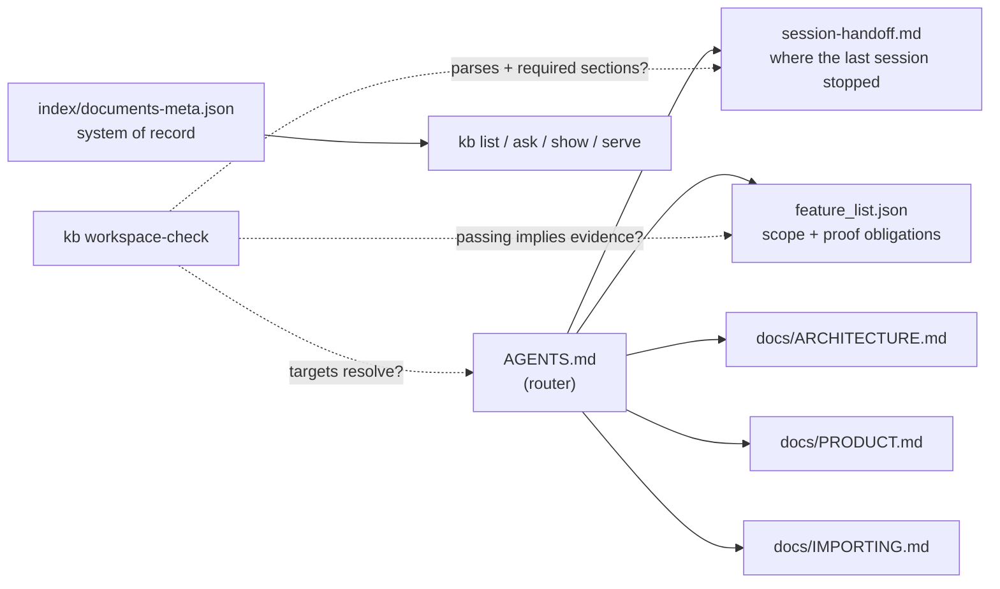

# Project 02: Agent-readable workspace

## Overview

Project 01 proved a minimal harness changes what an agent verifiably
finishes. Project 02 makes the workspace itself the harness: the kb app
gains import, a detail view, and metadata persistence, and the working
copy gains the artifacts that let a **fresh session resume from recorded
state alone**: a router AGENTS.md (lecture 04), a metadata index as the
system of record (lecture 03), a canonical session handoff (lecture 11's
format), and `kb workspace-check`, a doctor that grades the workspace's
readability mechanically.

Two deliberate departures from the reference course's project 02, both
recorded in this course's research notes: the reference **dropped**
CLAUDE.md, init.sh, and the progress log from project 01's harness set at
this stage, and marked four of seven features as passing with the
evidence string "Carried over from P1". Here the artifact set accretes
monotonically (nothing from project 01 is dropped; see SPEC.md's delta
tables), and every feature, carried over or new, is re-verified against
version 2 with a command and its captured output as evidence. The
reference's project 02 page also has no submission protocol at all; this
project's measurable deliverable is pinned instead: the workspace passes
its own doctor, and conformance holds both tracks to the same bytes.

## Learning objectives

After this project you can:

- Turn "the repository is the system of record" from a slogan into a
  mechanism: a metadata index that listing reads instead of rediscovering
  files by scanning.
- Structure instructions as a router (map, not manual) and machine-check
  that every route resolves.
- Write a session handoff in a canonical, parseable format and gate the
  end of a session on a workspace-readability doctor.
- Extend a dual-track product without breaking its earlier contracts: the
  starter is project 01's solution, and every v1 behavior survives in v2.

## Prerequisites

- [Lecture 03](../../lectures/lecture-03-why-the-repository-must-become-the-system-of-record/):
  the system-of-record principle the metadata index implements.
- [Lecture 04](../../lectures/lecture-04-why-one-giant-instruction-file-fails/):
  the router pattern AGENTS.md follows here.
- [Project 01](../project-01-baseline-vs-minimal-harness/), whose solution
  is this project's starter.
- `make setup` completed at the repository root; your track green in
  `make doctor` ([choosing your track](../../docs/choosing-your-track.md)).

## Architecture

The workspace is a routing graph a fresh session walks, so the diagram is
a flowchart: the router fans out to focused docs and state files, and the
doctor checks the graph's integrity:



Walkthrough: a fresh session starts at the router and reads only what its
task needs; the handoff says where to resume; the metadata index answers
"what does the system know" without rescanning files; and the doctor
turns "is this workspace readable" into an exit code
([SPEC.md](./SPEC.md) pins its three checks and the stale fixture's three
seeded defects).

## Project structure

```text
project-02-agent-readable-workspace/
  README.md            this file
  SPEC.md              v2 surface + the explicit delta from project 01
  cases.json           conformance cases (run against both tracks)
  fixtures/kb-data/    corpus + the committed metadata index
  fixtures/imports/    a document to import
  fixtures/workspaces/ workspace-ready and workspace-stale (3 seeded defects)
  expected/            pinned outputs for every case
  harness/             the accreted working-copy harness: router AGENTS.md,
                       CLAUDE.md, init.sh, feature_list.json (7 features,
                       evidence from real command runs), claude-progress.md,
                       session-handoff.md, docs/ (+ IMPORTING.md)
  starter/python/      project 01's solution app (v1), the genuine start
  starter/typescript/  same, TypeScript track
  solution/python/     kb v2 (+ tests/)
  solution/typescript/ kb v2 (+ tests/)
  verify.sh            conformance + starter-must-fail gate + both suites
```

## Setup

Everything installs at the repository root; the project adds nothing:

```sh
make setup
```

## Usage

All commands run from the **repository root** (unit directories carry no
package manifest by design, so `pnpm exec` resolves tools from the root
workspace and fails inside the unit); `kb` expands per track as in
project 01.

### Python

```sh
P=projects/project-02-agent-readable-workspace
uv run python $P/solution/python/main.py init --data-dir $P/kb-data --seed $P/fixtures/kb-data/documents
uv run python $P/solution/python/main.py import --data-dir $P/kb-data $P/fixtures/imports/field-guide.md
uv run python $P/solution/python/main.py show --data-dir $P/kb-data field-guide
uv run python $P/solution/python/main.py workspace-check --workspace $P/harness
```

### TypeScript

```sh
P=projects/project-02-agent-readable-workspace
pnpm exec tsx $P/solution/typescript/main.ts init --data-dir $P/kb-data --seed $P/fixtures/kb-data/documents
pnpm exec tsx $P/solution/typescript/main.ts import --data-dir $P/kb-data $P/fixtures/imports/field-guide.md
pnpm exec tsx $P/solution/typescript/main.ts show --data-dir $P/kb-data field-guide
pnpm exec tsx $P/solution/typescript/main.ts workspace-check --workspace $P/harness
```

The document list, now read from the metadata index alone (generated from
the Python run by `make verify`; the TypeScript run is held identical by
`make conformance`):

<!-- generated-block: uv run python projects/project-02-agent-readable-workspace/solution/python/main.py list --data-dir projects/project-02-agent-readable-workspace/fixtures/kb-data -->
```json
{
  "documents": [
    {
      "id": "architecture-notes",
      "title": "Architecture notes",
      "filename": "architecture-notes.md",
      "lines": 25,
      "origin": "seeded"
    },
    {
      "id": "retrieval-plan",
      "title": "Retrieval plan",
      "filename": "retrieval-plan.md",
      "lines": 24,
      "origin": "seeded"
    },
    {
      "id": "team-meeting",
      "title": "team-meeting.txt",
      "filename": "team-meeting.txt",
      "lines": 18,
      "origin": "seeded"
    }
  ]
}
```
<!-- /generated-block -->

## Demo flow

1. Initialize and import (Usage above): the index records origin
   `seeded` vs `imported`.
2. Kill the process, run `kb list` again: the fresh process answers from
   the index alone; that is metadata persistence.
3. Run the doctor against the committed harness:
   `kb workspace-check --workspace harness` exits 0; the project's own
   workspace passes its own readability check (the test suites assert
   this).
4. Run it against the stale fixture and read the three defects it names
   (Expected output below).

## Testing and validation

```sh
./verify.sh                  # conformance + starter gate + both test suites
./verify.sh --stack=python
./verify.sh --stack=typescript
```

Conformance runs twelve cases against both tracks and diffs three ways.
`verify.sh` additionally asserts the **starter stage fails** the v2
cases: the starter is project 01's solution, and a starter that already
passed would not be a genuine starting point. The test suites (12 pytest,
12 vitest) cover metadata persistence across a fresh process, each
stale-workspace defect in isolation, the handoff parser, the dogfood
check, and the independent evidence check (every evidence command in
`harness/feature_list.json` re-executed through the real CLI and compared
to its recorded output).

## Expected output

The doctor against the stale workspace fixture, generated from the Python
run by `make verify` (exit 1; the trailing `|| true` keeps the generator
running):

<!-- generated-block: uv run python projects/project-02-agent-readable-workspace/solution/python/main.py workspace-check --workspace projects/project-02-agent-readable-workspace/fixtures/workspaces/workspace-stale || true -->
```json
{
  "checks": [
    {
      "id": "router-targets",
      "passed": false,
      "detail": "unresolved router target(s): docs/IMPORTING.md"
    },
    {
      "id": "session-handoff",
      "passed": false,
      "detail": "missing required section(s): Next best step"
    },
    {
      "id": "feature-evidence",
      "passed": false,
      "detail": "passing without evidence: document-import"
    }
  ],
  "ready": false
}
```
<!-- /generated-block -->

Reading it: three artifacts exist and three artifacts lie: a route to a
missing doc, a handoff without a next step, a feature passing on faith.
Existence is not readability; the doctor checks substance, which is the
same move lecture 05's init doctor makes, pointed at the workspace.

## Troubleshooting

- `error: metadata index missing ...`: the data directory predates v2 or
  was built by the starter; run `kb init` again to record the index.
- `import` says `already-imported`: the document id (filename without
  extension) is already in the index; rename the file if it is genuinely
  a different document.
- `workspace-check` exit 2 vs exit 1: 2 means the workspace path itself
  is unreadable; 1 means it was checked and found not ready.
- Node or pnpm resolution problems: `make doctor` from the repository
  root; the Makefile pins Node 20 for every target.

## Extension challenges

- Add a `delete` command that keeps the index consistent, with a case
  proving a deleted id disappears from `list` and `show`.
- Extend `workspace-check` with a staleness rule: fail when
  `session-handoff.md`'s `Verified now` claims disagree with
  `feature_list.json` statuses.
- Give `import` a `--title` override and decide, in the SPEC first, how
  it interacts with the first-heading rule.
- Serve `POST /import` and define what the CLI-only-writes rule becomes
  once the server can write.

## Related lectures

- [Lecture 03: Why the repository must become the system of record](../../lectures/lecture-03-why-the-repository-must-become-the-system-of-record/):
  the metadata index is that lecture's answer file, industrialized.
- [Lecture 04: Why one giant instruction file fails](../../lectures/lecture-04-why-one-giant-instruction-file-fails/):
  AGENTS.md here is that lecture's router, and the doctor checks its
  routes resolve.
- [Lecture 11: Why long-running tasks lose continuity](../../lectures/lecture-11-why-every-session-must-leave-a-clean-state/):
  the session handoff uses its canonical format, so it stays parseable.
