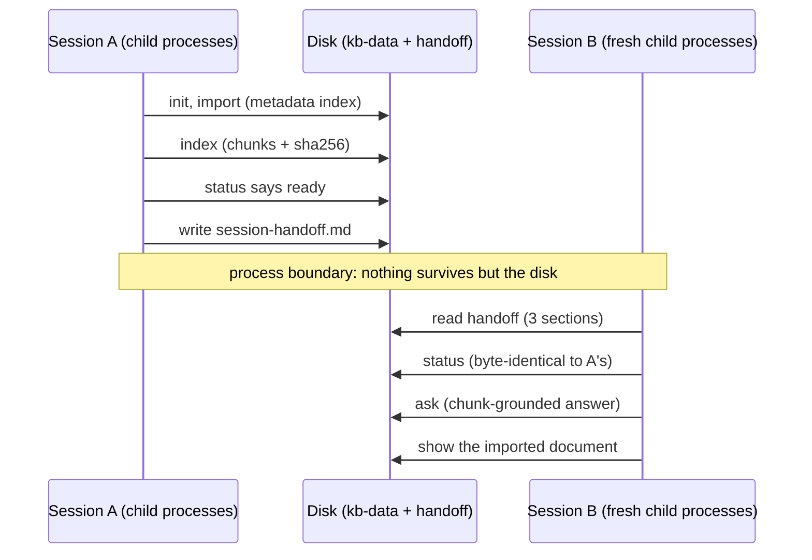

# Project 03: Multi-session continuity

## Overview

Projects 01 and 02 built a verifiable app inside a readable workspace.
Project 03 makes the work survive the thing that actually kills
long-running agent work: the session ending. The kb app gains metadata
extraction, a deterministic chunk index with a status surface, and
chunk-grounded answers that refuse when the index is not current; the
workspace gains `clean-state-checklist.md` and a focused indexing doc;
and the project's study apparatus is `kb continuity`, a two-session
resume proof in which **every step is a fresh child process of the real
CLI**. Session B never shares an interpreter with session A; if it can
still report a ready index and answer a grounded question, the workspace
carried the work, not anyone's memory. That process boundary is a
contract pinned in [SPEC.md](./SPEC.md), not an implementation detail.

Two departures from the reference course's project 03, both recorded in
this module's research notes: the reference's fullest-harness project
still marks seven of eleven features "Carried over from P2" and drops
CLAUDE.md from the artifact set it had two projects earlier. Here every
feature is re-verified against version 3 with a command and its captured
output, and the harness accretes monotonically; SPEC.md's delta tables
say exactly what changed from v2 and what was added, and nothing is
dropped.

## Learning objectives

After this project you can:

- Separate the system of record (the metadata index) from derived state
  (the chunk index) and make staleness detectable from disk alone.
- Build a deterministic chunking pipeline and pin it tightly enough that
  two languages produce byte-identical indexes.
- Make a QA surface refuse honestly when its grounding is stale, instead
  of answering from whatever is lying around.
- Prove session continuity with a real process boundary, and read a
  continuity report the way lecture 11 reads a handoff.

## Prerequisites

- [Lecture 11](../../lectures/lecture-11-why-every-session-must-leave-a-clean-state/):
  the continuity artifacts this project industrializes.
- [Lecture 05](../../lectures/lecture-05-why-initialization-needs-its-own-phase/):
  the init-and-gate discipline `init.sh` and the doctor apply here.
- [Project 02](../project-02-agent-readable-workspace/), whose solution is
  this project's starter.
- `make setup` completed at the repository root; your track green in
  `make doctor` ([choosing your track](../../docs/choosing-your-track.md)).

## Architecture

Continuity is state crossing a process boundary in time, so the diagram
is a sequence: session A writes, the boundary forgets everything except
the disk, session B reads and must reach the same truth:



Walkthrough: every arrow is a separate process; the report derives its
`resumed` verdict from whether B's fresh processes reproduce A's final
status byte for byte and answer with citations. [SPEC.md](./SPEC.md) pins
the protocol, the chunking rule, and the report schema.

## Project structure

```text
project-03-multi-session-continuity/
  README.md            this file
  SPEC.md              v3 surface + the explicit delta from project 02
  cases.json           conformance cases (run against both tracks)
  fixtures/kb-data/    corpus + v3 metadata index (unindexed state)
  fixtures/kb-data-indexed/  the same directory exactly one `kb index` later
  fixtures/imports/    a document to import
  fixtures/workspaces/ workspace-ready and workspace-stale (3 seeded defects)
  expected/            pinned outputs incl. the full continuity report
  harness/             the accreted working-copy harness: router AGENTS.md,
                       CLAUDE.md, init.sh, feature_list.json (11 features,
                       evidence from real command runs), claude-progress.md,
                       session-handoff.md, clean-state-checklist.md,
                       docs/ (+ INDEXING.md)
  starter/python/      project 02's solution app (v2), the genuine start
  starter/typescript/  same, TypeScript track
  solution/python/     kb v3 (+ tests/)
  solution/typescript/ kb v3 (+ tests/)
  verify.sh            conformance + starter-must-fail gate + both suites
```

## Setup

Everything installs at the repository root; the project adds nothing:

```sh
make setup
```

## Usage

All commands run from the **repository root** (unit directories carry no
package manifest by design, so `pnpm exec` resolves tools from the root
workspace and fails inside the unit); `kb` expands per track as in
project 01.

### Python

```sh
P=projects/project-03-multi-session-continuity
uv run python $P/solution/python/main.py init --data-dir $P/kb-data --seed $P/fixtures/kb-data/documents
uv run python $P/solution/python/main.py index --data-dir $P/kb-data
uv run python $P/solution/python/main.py status --data-dir $P/kb-data
uv run python $P/solution/python/main.py ask --data-dir $P/kb-data "Which lines become citations in the ranking?"
```

### TypeScript

```sh
P=projects/project-03-multi-session-continuity
pnpm exec tsx $P/solution/typescript/main.ts init --data-dir $P/kb-data --seed $P/fixtures/kb-data/documents
pnpm exec tsx $P/solution/typescript/main.ts index --data-dir $P/kb-data
pnpm exec tsx $P/solution/typescript/main.ts status --data-dir $P/kb-data
pnpm exec tsx $P/solution/typescript/main.ts ask --data-dir $P/kb-data "Which lines become citations in the ranking?"
```

The chunk-grounded answer against the committed indexed fixture,
generated from the Python run by `make verify` (the TypeScript run is
held identical by `make conformance`):

<!-- generated-block: uv run python projects/project-03-multi-session-continuity/solution/python/main.py ask --data-dir projects/project-03-multi-session-continuity/fixtures/kb-data-indexed "Which lines become citations in the ranking?" -->
```json
{
  "question": "Which lines become citations in the ranking?",
  "citations": [
    {
      "document": "retrieval-plan",
      "title": "Retrieval plan",
      "chunk": 1,
      "excerpt": "The ranking keeps the two best scoring lines and returns them as citations.",
      "score": 3
    },
    {
      "document": "retrieval-plan",
      "title": "Retrieval plan",
      "chunk": 0,
      "excerpt": "# Retrieval plan",
      "score": 2
    }
  ],
  "answer": "Based on \"Retrieval plan\" (chunk 1): The ranking keeps the two best scoring lines and returns them as citations. See also \"Retrieval plan\" (chunk 0)."
}
```
<!-- /generated-block -->

## Demo flow

Run the continuity proof (both tracks print the same bytes; the full
report is pinned in [`expected/continuity.json`](./expected/continuity.json)):

### Python

```sh
P=projects/project-03-multi-session-continuity
uv run python $P/solution/python/main.py continuity
```

### TypeScript

```sh
P=projects/project-03-multi-session-continuity
pnpm exec tsx $P/solution/typescript/main.ts continuity
```

Session A initializes, imports, indexes, checks status, and writes the
handoff; the boundary forgets everything but the disk; session B, in
fresh processes, reparses the handoff, reproduces A's status byte for
byte, answers a grounded question, and shows the imported document. Exit
code 0 IS the resume verdict.

## Testing and validation

```sh
./verify.sh                  # conformance + starter gate + both test suites
./verify.sh --stack=python
./verify.sh --stack=typescript
```

Conformance runs seventeen cases against both tracks and diffs three
ways, including the full continuity proof, and `verify.sh` asserts the
**starter stage fails** the v3 cases (the starter is project 02's
solution, verbatim). The test suites (12 pytest, 13 vitest) cover the
chunking rule, staleness after an edit, the ask refusal, the continuity
report (the Python suite additionally intercepts process creation to
prove all seven steps are real child processes), the dogfood check
(`harness/` passes its own doctor), and the independent evidence check
(every evidence command in `harness/feature_list.json` re-executed
through the real CLI and compared to its recorded output).

## Expected output

The continuity report's resume section, generated from the Python run by
`make verify`:

<!-- generated-block: uv run python projects/project-03-multi-session-continuity/solution/python/main.py continuity | uv run python -c "import json,sys; r=json.load(sys.stdin); print(json.dumps({'protocol': r['protocol'], 'session_b': {'handoff_sections': r['session_b']['handoff_sections'], 'steps': [{'command': s['command'], 'exit': s['exit']} for s in r['session_b']['steps']]}, 'resume': r['resume']}, indent=2))" -->
```json
{
  "protocol": "two sessions; every step is a fresh child process of this track's CLI",
  "session_b": {
    "handoff_sections": 3,
    "steps": [
      {
        "command": "kb status --data-dir kb-data",
        "exit": 0
      },
      {
        "command": "kb ask --data-dir kb-data \"Which lines become citations in the ranking?\"",
        "exit": 0
      },
      {
        "command": "kb show --data-dir kb-data field-guide",
        "exit": 0
      }
    ]
  },
  "resume": {
    "status_matches_session_a": true,
    "state": "ready",
    "documents": 4,
    "answer_grounded": true,
    "resumed": true
  }
}
```
<!-- /generated-block -->

Reading it: session B's three commands ran in processes that had never
seen session A, and its status output matched A's byte for byte
(`status_matches_session_a`), so the resume verdict rests on recorded
state alone. This is lecture 11's claim as a measured fact.

## Troubleshooting

- `error: index not ready ...`: run `kb index`; `kb status` names any
  stale documents when a file changed after indexing.
- `kb continuity` exits 1: read the report's `resume` block; the failing
  step's `observed` names what a fresh process could not reproduce.
- Continuity feels slow on the TypeScript track: each step boots a fresh
  interpreter by design; the process boundary is the point.
- Node or pnpm resolution problems: `make doctor` from the repository
  root; the Makefile pins Node 20 for every target.

## Extension challenges

- Add a `--document ID` flag to `kb index` and decide, SPEC first, how
  partial indexing interacts with the `ready` state.
- Make the continuity proof adversarial: corrupt one state file between
  the sessions and pin the exact failure the report must show.
- Extend `workspace-check` with a fourth check that the clean-state
  checklist's commands all appear in `feature_list.json` verifications.
- Add chunk-level line ranges to citations and re-pin the expected
  outputs in both tracks.

## Related lectures

- [Lecture 11: Why every session must leave a clean state](../../lectures/lecture-11-why-every-session-must-leave-a-clean-state/)
  is not paired with a project, and this is one of the two closest built
  ones: the handoff and clean-state checklist here are the artifacts that
  lecture's exit protocol writes.

- [Lecture 05: Why initialization needs its own phase](../../lectures/lecture-05-why-initialization-needs-its-own-phase/):
  `init.sh` builds the index and gates the session on the doctor, exactly
  that lecture's discipline.
- [Lecture 03: Why the repository must become the system of record](../../lectures/lecture-03-why-the-repository-must-become-the-system-of-record/):
  session B is that lecture's fresh reader, given a workspace that finally
  answers every question.
