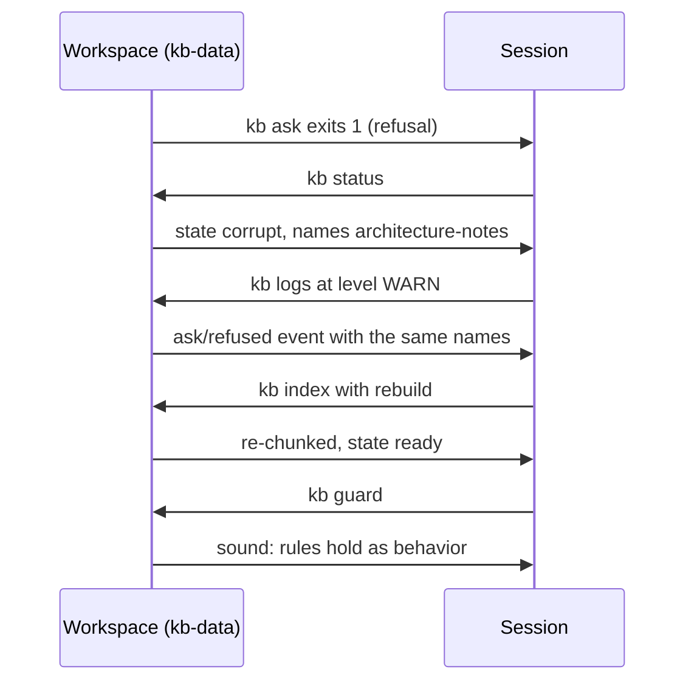

# Project 04: Runtime feedback and scope control

## Overview

Projects 01-03 made the work verifiable, readable, and durable. Project
04 makes it **observable**: when behavior degrades, the workspace itself
says where and why. The kb app gains structured logging with a `kb logs`
surface, a `corrupt` index state for damage the sha gate cannot see,
`kb index --rebuild` as the recovery, `kb guard` (the architecture rules
executed as behavior in a sandbox), a WIP=1 check in the workspace
doctor, and a server that refuses writes with 405.

The reference course's project 04 seeds its chunking bug in the
starter's source, announced by a `// BUG:` comment, and checks its layer
rules by grepping source text. This course keeps the defect but moves it
where seeded defects live: `fixtures/kb-data-corrupt` is the workspace
state that buggy chunker leaves behind (an empty chunk whose recorded
sha still matches, which is exactly why the sha-gated `kb index` cannot
heal it), and the architecture rules are executed rather than grepped:
the guard boots the real server and tries to write, runs a real import
and watches the filesystem, deletes the derived index and demands it
rebuilds. A rule the guard cannot check does not go in ARCHITECTURE.md.

## Learning objectives

After this project you can:

- Make degradation observable: structured events a session reads before
  it re-reads source, with a WARN trail from every refusal.
- Distinguish stale derived state (the sha gate heals it) from corrupt
  derived state (only a forced rebuild does), and name both from disk.
- Turn architecture prose into executable properties and run them as a
  gate.
- Enforce WIP=1 mechanically, so scope control is a doctor verdict
  rather than an intention.

## Prerequisites

- [Lecture 02](../../lectures/lecture-02-what-a-harness-actually-is/):
  the feedback subsystem this project industrializes.
- [Lecture 04](../../lectures/lecture-04-why-one-giant-instruction-file-fails/):
  rules the agent must actually meet; here they become executable checks.
- [Project 03](../project-03-multi-session-continuity/), whose solution is
  this project's starter. (The reference maps this project to its lectures 07
  and 08 on task boundaries and feature lists.)
- `make setup` completed at the repository root; your track green in
  `make doctor` ([choosing your track](../../docs/choosing-your-track.md)).

## Architecture

The mechanism under study is the feedback loop between a degraded
workspace and the session that must repair it, so the diagram is a
sequence:



Walkthrough: the session never reads source to localize the failure; the
refusal, the status verdict, and the WARN trail agree on the same
document, the rebuild recovers it, and the guard closes the loop by
re-executing the architecture rules. [SPEC.md](./SPEC.md) pins the log
schema, the corrupt-state rule, the guard's three checks, and the
four-check doctor.

## Project structure

```text
project-04-runtime-feedback-and-scope-control/
  README.md            this file
  SPEC.md              v4 surface + the explicit delta from project 03
  cases.json           conformance cases (run against both tracks)
  fixtures/kb-data/    corpus + v3-shape metadata index (unindexed state)
  fixtures/kb-data-indexed/  the same directory one `kb index` later
  fixtures/kb-data-corrupt/  the buggy chunker's leavings: an empty chunk,
                       an intact sha, and the WARN a refused ask logged
  fixtures/imports/    a document to import
  fixtures/workspaces/ workspace-ready and workspace-stale (4 seeded defects)
  expected/            pinned outputs for every case
  harness/             the accreted workspace harness: router AGENTS.md,
                       CLAUDE.md, init.sh, feature_list.json (15 features,
                       evidence from real command runs), claude-progress.md,
                       session-handoff.md, clean-state-checklist.md,
                       docs/ (+ OBSERVABILITY.md)
  starter/python/      project 03's solution app (v3), the genuine start
  starter/typescript/  same, TypeScript track
  solution/python/     kb v4 (+ tests/)
  solution/typescript/ kb v4 (+ tests/)
  verify.sh            conformance + starter-must-fail gate + both suites
```

## Setup

Everything installs at the repository root; the project adds nothing:

```sh
make setup
```

## Usage

All commands run from the **repository root** (unit directories carry no
package manifest by design, so `pnpm exec` resolves tools from the root
workspace); `kb` expands per track as in project 01.

### Python

```sh
P=projects/project-04-runtime-feedback-and-scope-control
uv run python $P/solution/python/main.py init --data-dir $P/kb-data --seed $P/fixtures/kb-data/documents
uv run python $P/solution/python/main.py index --data-dir $P/kb-data
uv run python $P/solution/python/main.py logs --data-dir $P/kb-data --level INFO
uv run python $P/solution/python/main.py guard --data-dir $P/kb-data
```

### TypeScript

```sh
P=projects/project-04-runtime-feedback-and-scope-control
pnpm exec tsx $P/solution/typescript/main.ts init --data-dir $P/kb-data --seed $P/fixtures/kb-data/documents
pnpm exec tsx $P/solution/typescript/main.ts index --data-dir $P/kb-data
pnpm exec tsx $P/solution/typescript/main.ts logs --data-dir $P/kb-data --level INFO
pnpm exec tsx $P/solution/typescript/main.ts guard --data-dir $P/kb-data
```

The guard's report, generated from the Python run by `make verify` (the
TypeScript run is held identical by `make conformance`):

<!-- generated-block: uv run python projects/project-04-runtime-feedback-and-scope-control/solution/python/main.py guard --data-dir projects/project-04-runtime-feedback-and-scope-control/fixtures/kb-data-indexed 2>/dev/null -->
```json
{
  "checks": [
    {
      "id": "server-read-only",
      "passed": true,
      "detail": "POST refused with 405 and the data directory is bit-identical"
    },
    {
      "id": "storage-containment",
      "passed": true,
      "detail": "an import wrote only inside the data directory"
    },
    {
      "id": "derived-rebuildable",
      "passed": true,
      "detail": "deleting the chunk index loses nothing; kb index restored state ready"
    }
  ],
  "sound": true
}
```
<!-- /generated-block -->

## Demo flow

The debugging story, against a copy of the committed corrupt fixture
(run from the repository root; work on the copy, never the fixture,
because a refused ask writes its WARN into the workspace it was refused
in; the final exit 1 IS the story starting):

### Python

<!-- fence-exit: 1 -->
```sh
P=projects/project-04-runtime-feedback-and-scope-control
rm -rf $P/kb-data && cp -R $P/fixtures/kb-data-corrupt $P/kb-data
uv run python $P/solution/python/main.py status --data-dir $P/kb-data
uv run python $P/solution/python/main.py ask --data-dir $P/kb-data "Which lines become citations in the ranking?"
```

### TypeScript

<!-- fence-exit: 1 -->
```sh
P=projects/project-04-runtime-feedback-and-scope-control
rm -rf $P/kb-data && cp -R $P/fixtures/kb-data-corrupt $P/kb-data
pnpm exec tsx $P/solution/typescript/main.ts status --data-dir $P/kb-data
pnpm exec tsx $P/solution/typescript/main.ts ask --data-dir $P/kb-data "Which lines become citations in the ranking?"
```

Status names the corrupt document; the refused ask leaves a WARN saying
the same thing (Expected output below); `kb index --rebuild` recovers to
a byte-identical clean index (the `rebuild-recovers-the-corrupt-index`
case proves it against the committed clean fixture). To watch the v3
starter get this wrong, run the same status against
`starter/`: it reports `ready` on the corrupt directory and answers from
the broken index, which is why v4 exists.

## Testing and validation

```sh
./verify.sh                  # conformance + starter gate + both test suites
./verify.sh --stack=python
./verify.sh --stack=typescript
```

Conformance runs twenty cases against both tracks and diffs three ways,
including the corrupt-state cases and the full continuity proof;
`verify.sh` asserts the **starter stage fails** the v4 cases (the v3
starter passes exactly the ten carried cases and, tellingly, answers
from the corrupt index where v4 refuses). The test suites (12 pytest, 10
vitest) cover the log rules, corrupt-over-stale precedence, rebuild
recovery, each guard check against an injected violation (Python, via
monkeypatched seams; conformance carries the proof to the TypeScript
track by byte-equality), the WIP limit, the dogfood check, and the
independent evidence check over all fifteen features.

## Expected output

The WARN a refused ask left in the corrupt fixture's log, generated from
the Python run by `make verify`:

<!-- generated-block: uv run python projects/project-04-runtime-feedback-and-scope-control/solution/python/main.py logs --data-dir projects/project-04-runtime-feedback-and-scope-control/fixtures/kb-data-corrupt --level WARN -->
```json
{
  "entries": [
    {
      "seq": 1,
      "level": "WARN",
      "command": "ask",
      "event": "refused",
      "detail": {
        "state": "corrupt",
        "corrupt": [
          "architecture-notes"
        ],
        "stale": []
      }
    }
  ],
  "total": 1
}
```
<!-- /generated-block -->

Reading it: the log entry and `kb status` name the same document, so the
session repairs instead of rediscovering. The sequence number where a
timestamp would be is this course's determinism rule made visible; a
real deployment adds clocks at exactly that seam.

## Troubleshooting

- `state: corrupt` after your own edits: you probably wrote `chunks.json`
  by hand; delete it and run `kb index`, or run `kb index --rebuild`.
- `kb logs` exits 1: the data directory is missing or uninitialized; the
  log lives inside it.
- `405 read-only` from the server: by design; writes go through the CLI.
- The guard fails `derived-rebuildable`: your chunker changed; make
  `kb index` reproduce a `ready` state from documents alone before
  anything else.
- Node or pnpm resolution problems: `make doctor` from the repository
  root; the Makefile pins Node 20 for every target.

## Extension challenges

- Add an `ERROR` level and decide, SPEC first, which failures deserve it
  over exit codes alone.
- Give `kb logs` a `--since SEQ` flag and use it to build a "what
  happened while I was gone" session-start report.
- Extend the guard with a fourth executable rule (for example: `logs`
  never mutates the log it reads) and pin its report.
- Teach `kb status` to estimate the blast radius of `corrupt` (which
  questions would silently lose their best citation) using only the
  chunk index.

## Related lectures

- [Lecture 02: What a harness actually is](../../lectures/lecture-02-what-a-harness-actually-is/):
  the feedback subsystem, industrialized into logs, states, and a guard.
- [Lecture 04: Why one giant instruction file fails](../../lectures/lecture-04-why-one-giant-instruction-file-fails/):
  rules that matter must be met mechanically; the guard executes what
  ARCHITECTURE.md claims.
- [Lecture 06: Why initialization needs its own phase](../../lectures/lecture-06-why-initialization-needs-its-own-phase/):
  `init.sh` now gates on the guard too; the doctor family grows a
  fourth check.
