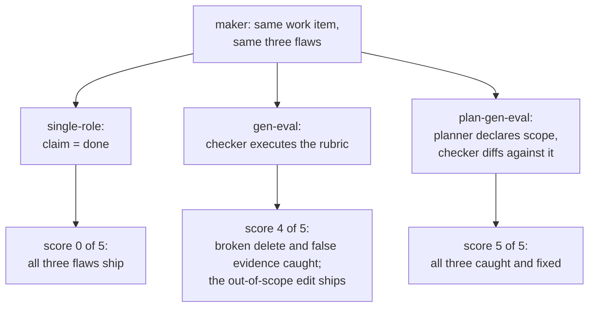

# Project 05: Self-verification and role separation

## Overview

Projects 01-04 gave the workspace verification, readability, continuity,
and observability. Project 05 asks the question those mechanisms build
toward: **who checks the work, and what difference does the checking
make?** The kb app gains an honest `kb delete` (file, index entry, chunk
record, log line, with orphan detection and reconciliation for the
half-done version). The study apparatus replays one scripted work item,
with the same maker making the same three flaws every time, under three
role configurations: nobody checks; a checker executes the rubric; a
planner declares scope and the checker diffs against it. The transcripts
show each flaw escaping or being caught, and `kb ladder` requires the
rubric scores to strictly climb.

The reference course's project 05 grades its three configurations 1.6,
3.3, and 4.9, numbers that exist nowhere but its prose. Here the ladder
is 0, 4, and 5 because those are **counted results of five executable
predicates**, pinned in expected output, regenerable by anyone running
the unit, with a conformance case asserting the climb itself. The
transcripts are the demonstration; the scores are the supporting metric.

## Learning objectives

After this project you can:

- Separate maker, checker, and planner roles mechanically, and show with
  a transcript what each additional role catches.
- Write a rubric where every item is an executable predicate, and refuse
  rubric items that are not.
- Explain why fabricated evidence, missing evidence, and out-of-scope
  work need three different catchers.
- Delete state honestly: the half-done delete is this project's product
  lesson, detected as corruption and reconciled by the index.

## Prerequisites

- [Lecture 01](../../lectures/lecture-01-why-capable-agents-still-fail/):
  claim-without-verification, the failure the single-role run replays.
- [Lecture 02](../../lectures/lecture-02-what-a-harness-actually-is/):
  the feedback subsystem; here it grows a second pair of eyes.
- [Project 04](../project-04-runtime-feedback-and-scope-control/), whose
  solution is this project's starter.
- `make setup` completed at the repository root; your track green in
  `make doctor` ([choosing your track](../../docs/choosing-your-track.md)).

## Architecture

The mechanism under study is what stands between "the maker claims" and
"the work ships", so the diagram is the ladder itself:



Walkthrough: the maker never gets smarter; only the checking changes.
The one rung gen-eval cannot climb is scope, because scope violations
are invisible without a declaration to diff against, which is exactly
what the planner adds. [SPEC.md](./SPEC.md) pins the flaws, the
configurations, the transcript format, and the rubric.

## Project structure

```text
project-05-self-verification-and-role-separation/
  README.md            this file
  SPEC.md              v5 surface + the explicit delta from project 04
  cases.json           conformance cases (run against both tracks)
  fixtures/kb-data*/   the carried corpus states + kb-data-orphan
                       (the half-done delete's leavings)
  fixtures/scoreruns/  five score-run fixtures, each violating exactly
                       one rubric item (seeded defects)
  fixtures/workspaces/ workspace-ready and workspace-stale (carried)
  expected/            pinned outputs incl. all three workrun transcripts
                       and the ladder
  harness/             the accreted workspace harness (17 features,
                       evidence from real command runs) + evaluator-rubric.md
  starter/python/      project 04's solution app (v4), the genuine start
  starter/typescript/  same, TypeScript track
  solution/python/     kb v5 (+ tests/)
  solution/typescript/ kb v5 (+ tests/)
  verify.sh            conformance + starter-must-fail gate + both suites
```

## Setup

Everything installs at the repository root; the project adds nothing:

```sh
make setup
```

## Usage

All commands run from the **repository root** (unit directories carry no
package manifest by design, so `pnpm exec` resolves tools from the root
workspace); `kb` expands per track as in project 01.

### Python

<!-- fence-exit: 1 -->
```sh
P=projects/project-05-self-verification-and-role-separation
uv run python $P/solution/python/main.py workrun --config single-role --workdir $P/kb-data
uv run python $P/solution/python/main.py score --workdir $P/kb-data
uv run python $P/solution/python/main.py ladder
```

### TypeScript

<!-- fence-exit: 1 -->
```sh
P=projects/project-05-self-verification-and-role-separation
pnpm exec tsx $P/solution/typescript/main.ts workrun --config single-role --workdir $P/kb-data
pnpm exec tsx $P/solution/typescript/main.ts score --workdir $P/kb-data
pnpm exec tsx $P/solution/typescript/main.ts ladder
```

(The single-role score exits 1 at 0 of 5, so the stanza stops there
under strict shells; that is the point. Run the ladder line on its own:
it replays all three configurations in a private temp directory and
prints the whole comparison.)

The ladder's summary, generated from the Python run by `make verify`
(the TypeScript run is held identical by `make conformance`):

<!-- generated-block: uv run python projects/project-05-self-verification-and-role-separation/solution/python/main.py ladder 2>/dev/null | uv run python -c "import json,sys; r=json.load(sys.stdin); print(json.dumps({'scores': r['scores'], 'monotonic': r['monotonic'], 'failed_items': {c: [i['id'] for i in r['runs'][c]['items'] if not i['passed']] for c in r['runs']}}, indent=2))" -->
```json
{
  "scores": [
    0,
    4,
    5
  ],
  "monotonic": true,
  "failed_items": {
    "single-role": [
      "verification-before-done",
      "evidence-true",
      "findings-addressed",
      "scope-fidelity",
      "clean-state"
    ],
    "gen-eval": [
      "scope-fidelity"
    ],
    "plan-gen-eval": []
  }
}
```
<!-- /generated-block -->

## Demo flow

Run the ladder (Usage above), then read the three transcripts it leaves
under its workdir when you give it one
(`kb ladder --workdir $P/kb-data`): `single-role`'s transcript ends with
`"done"` checked by nobody, two features passing on a fabricated and a
missing evidence entry, and an orphaned chunk record nobody noticed;
`gen-eval`'s shows the checker's verification runs failing, the findings,
the fixes, and the re-verification; `plan-gen-eval`'s adds the plan event
and the finding that names the out-of-scope edit. The flaws are
identical in all three; only the checking differs.

## Testing and validation

```sh
./verify.sh                  # conformance + starter gate + both test suites
./verify.sh --stack=python
./verify.sh --stack=typescript
```

Conformance runs thirty-three cases against both tracks and diffs three
ways, including all three workrun transcripts, the ladder, and the five
rubric-violation fixtures; `verify.sh` asserts the **starter stage
fails** the v5 cases. The test suites (8 pytest, 6 vitest) cover delete
end to end, orphan reconciliation, each rubric item against its
violation fixture, scoring's no-mutation guarantee, the pinned 0/4/5
ladder, the dogfood check, and the independent evidence check over all
seventeen features.

## Expected output

The rubric catching fabricated evidence, generated from the Python run
by `make verify` (exit 1; the trailing `|| true` keeps the generator
running):

<!-- generated-block: uv run python projects/project-05-self-verification-and-role-separation/solution/python/main.py score --workdir projects/project-05-self-verification-and-role-separation/fixtures/scoreruns/violates-r2 || true -->
```json
{
  "items": [
    {
      "id": "verification-before-done",
      "passed": true,
      "detail": "every feature verified with exit 0 before done"
    },
    {
      "id": "evidence-true",
      "passed": false,
      "detail": "evidence not true for: listing (does not reproduce)"
    },
    {
      "id": "findings-addressed",
      "passed": true,
      "detail": "every finding has a later fix and a later passing verification"
    },
    {
      "id": "scope-fidelity",
      "passed": true,
      "detail": "every edit inside the declared scope (or flagged and reverted)"
    },
    {
      "id": "clean-state",
      "passed": true,
      "detail": "the workspace passes its own doctor"
    }
  ],
  "score": 4,
  "max": 5
}
```
<!-- /generated-block -->

Reading it: the recorded evidence says `exit 0: (assumed)`; the rubric
re-executed the recorded command in a sandbox and the output did not
reproduce. Four items pass, one fails, score 4 of 5, exit 1. Evidence
that cannot be re-executed is not evidence, which has been this module's
rule since project 01; here it becomes a checker's verdict.

## Troubleshooting

- `score` exits 2: the workdir has no `workspace/transcript.jsonl`;
  point it at a directory a `workrun` produced.
- The ladder is not monotonic after your changes: read the per-config
  `items`; you probably taught a lower rung to catch something, which is
  a finding about your change, not a bug in the ladder.
- `status` names an orphan after your own delete experiments: that is
  the half-done delete's signature; `kb index` reconciles it.
- Node or pnpm resolution problems: `make doctor` from the repository
  root; the Makefile pins Node 20 for every target.

## Extension challenges

- Add a sixth rubric item (for example: every WARN in the log is
  referenced by a later transcript event) and re-pin the ladder.
- Give the maker a fourth flaw the current rubric cannot catch, then
  extend the rubric until it can, SPEC first.
- Make the checker a second process instead of a role label: run the
  verification commands through the real CLI as project 03's continuity
  does, and compare the transcripts.
- Write a fourth configuration (checker-first: the checker writes the
  failing verifications before the maker starts) and place it on the
  ladder.

## Related lectures

- [Lecture 01: Why capable agents still fail](../../lectures/lecture-01-why-capable-agents-still-fail/):
  the single-role transcript is that lecture's claim-without-verification
  event, replayed under a microscope.
- [Lecture 02: What a harness actually is](../../lectures/lecture-02-what-a-harness-actually-is/):
  role separation is the feedback subsystem grown into a second pair of
  eyes.
- [Lecture 05: Why initialization needs its own phase](../../lectures/lecture-05-why-initialization-needs-its-own-phase/):
  the same doctor discipline, pointed at finished work instead of a
  starting repository.
- [Lecture 08: Why agents declare victory too early](../../lectures/lecture-08-why-agents-declare-victory-too-early/):
  the premature claim caught by re-execution; the gen-eval checker here
  is that lecture's gate given a rubric and a second role.
- [Lecture 09: Why end-to-end testing changes results](../../lectures/lecture-09-why-end-to-end-testing-changes-results/):
  why this project's checker runs each feature's verification command
  against the working application rather than reading the code.
- [Lecture 11: Why every session must leave a clean state](../../lectures/lecture-11-why-every-session-must-leave-a-clean-state/)
  is not paired with a project, and this is one of the two closest built
  ones: the rubric's fifth item is that lecture's exit protocol reduced
  to one executable predicate.
